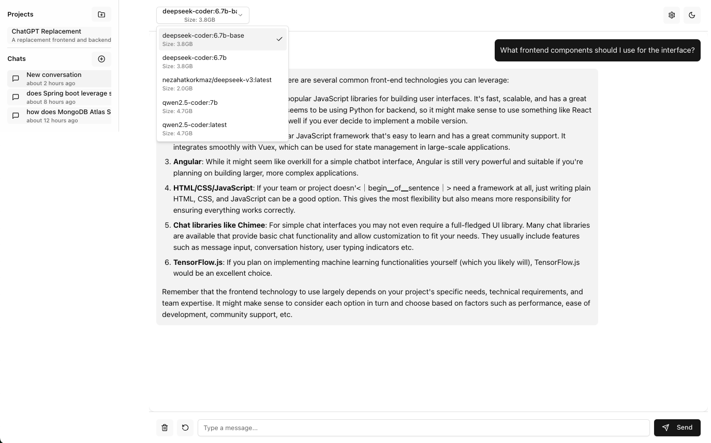

# LocalGPT Chat UI

A modern chat interface for Ollama, featuring a clean UI with project management capabilities, dark mode support, and markdown rendering.

[](https://opensource.org/licenses/MIT)
[](https://reactjs.org/)
[](https://vitejs.dev/)
[](https://nodejs.org/)
[](https://ollama.ai/)
[](https://www.mongodb.com/)
[](https://github.com/deepseek-ai/DeepSeek-Coder)
[](http://makeapullrequest.com)
[](https://github.com/mrlynn/deepseek-chat/graphs/contributors)
[](https://github.com/mrlynn/deepseek-chat/commits/main)

## Screenshot



## Features

- 🤖 Full integration with Ollama
- 💬 Clean, modern chat interface
- 📁 Project management with custom configurations
- 🌓 Dark mode support
- ✨ Markdown and code syntax highlighting
- 📊 Context-aware chat history
- 🎨 Customizable chat styles and preferences

## Prerequisites

Before you begin, ensure you have the following installed:
- [Node.js](https://nodejs.org/) (v16 or newer)
- [npm](https://www.npmjs.com/) or [yarn](https://yarnpkg.com/)
- [Ollama](https://ollama.ai)

### Installing Ollama

1. **macOS / Linux**:
   ```bash
   curl -fsSL https://ollama.ai/install.sh | sh
   ```

2. **Windows**:
   - Download the installer from [Ollama's Windows installation page](https://ollama.ai/download/windows)
   - Follow the installation wizard

3. **Verify Installation**:
   ```bash
   ollama --version
   ```

### Setting up Ollama

1. Start the Ollama service:
   ```bash
   ollama serve
   ```

2. Pull the DeepSeek Coder model:
   ```bash
   ollama pull deepseek-coder:6.7b
   ```
   This may take several minutes depending on your internet connection.

## Installation

1. Clone the repository:
   ```bash
   git clone https://github.com/yourusername/deepseek-chat.git
   cd deepseek-chat
   ```

2. Install dependencies for both frontend and backend:
   ```bash
   # Install backend dependencies
   cd backend
   npm install

   # Install frontend dependencies
   cd ../frontend
   npm install
   ```

3. Create a `.env` file in the backend directory:
   ```bash
   # backend/.env
   PORT=3000
   OLLAMA_HOST=http://localhost:11434
   MODEL_NAME=deepseek-coder:6.7b
   MONGODB_URI=mongodb://localhost:27017/deepseek-chat
   MONGODB_DB_NAME=deepseek-chat
   ```

4. Set up MongoDB:
   - Install MongoDB locally or use MongoDB Atlas
   - Update the `MONGODB_URI` in your `.env` file accordingly

## Running the Application

1. Start the backend server:
   ```bash
   cd backend
   npm run dev
   ```

2. In a new terminal, start the frontend:
   ```bash
   cd frontend
   npm run dev
   ```

3. Open your browser and navigate to:
   ```
   http://localhost:5173
   ```

## Project Structure

```
.
├── backend/                 # Backend server
│   ├── models/             # MongoDB models
│   ├── services/           # Business logic
│   ├── server.js          # Express server setup
│   └── package.json       # Backend dependencies
│
└── frontend/               # React frontend
    ├── src/
    │   ├── components/    # React components
    │   ├── hooks/        # Custom React hooks
    │   └── lib/          # Utility functions
    └── package.json      # Frontend dependencies
```

## Using Projects

Projects help organize your conversations and maintain context:

1. **Creating a Project**:
   - Click the "New Project" button in the sidebar
   - Enter project name and description
   - Configure project settings:
     - Communication style
     - Technical level
     - Code style preferences
     - Context settings

2. **Project Settings**:
   - Style: Define tone and technical level
   - Context: Control conversation context
   - Knowledge Base: Add terminology and code examples
   - Requirements: Set mandatory elements and technologies
   - Output: Configure response format

3. **Managing Conversations**:
   - Each project maintains its own chat history
   - Conversations inherit project settings
   - Switch between projects using the sidebar

## Features in Detail

### Chat Interface

- **Code Highlighting**: Supports multiple programming languages
- **Markdown Rendering**: Rich text formatting
- **Message Actions**: Copy, regenerate, and delete messages
- **Context Awareness**: Maintains conversation flow

### Project Management

- **Custom Configurations**: Per-project settings
- **Context Control**: Define how much context to maintain
- **Style Settings**: Customize interaction style
- **Knowledge Base**: Store project-specific information

### Environmental Settings

- **Dark Mode**: Toggle between light and dark themes
- **Model Selection**: Choose different Ollama models
- **Connection Status**: Monitor Ollama connectivity

## Troubleshooting

### Common Issues

1. **Ollama Connection Failed**:
   - Ensure Ollama is running (`ollama serve`)
   - Check OLLAMA_HOST in `.env`
   - Verify no firewall blocking

2. **MongoDB Connection Issues**:
   - Verify MongoDB is running
   - Check MONGODB_URI in `.env`
   - Ensure database permissions

3. **Model Loading Failed**:
   - Re-pull the model: `ollama pull deepseek-coder:6.7b`
   - Check available disk space
   - Verify model name in `.env`

### Getting Help

1. Check the [Issues](https://github.com/yourusername/deepseek-chat/issues) page
2. Review Ollama's [documentation](https://ollama.ai/docs)
3. Join our [Discord community](https://discord.gg/yourdiscord)

## Contributing

1. Fork the repository
2. Create a feature branch
3. Commit your changes
4. Push to the branch
5. Create a Pull Request

## License

This project is licensed under the MIT License - see the [LICENSE](LICENSE) file for details.