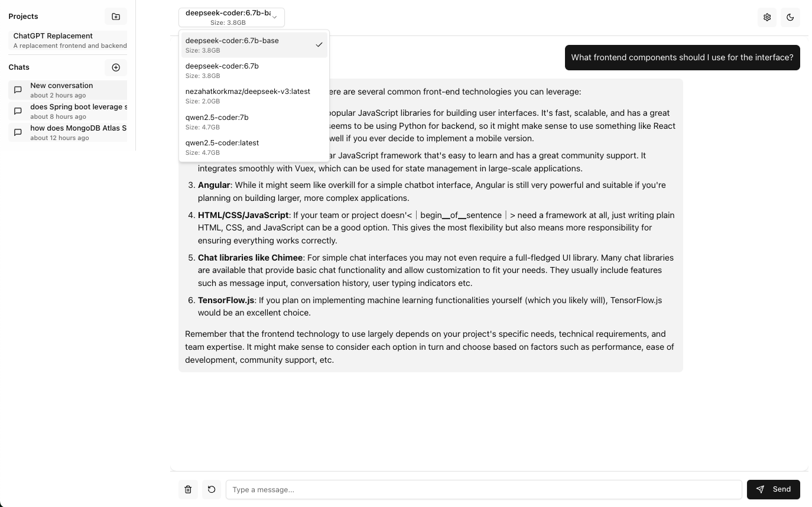

# .aidigestignore

```
node_modules
build
dist

```

# .gitignore

```
# Dependencies
node_modules
.pnp
.pnp.js

# Testing
coverage

# Production
build
dist

# Misc
.DS_Store
.env.local
.env.development.local
.env.test.local
.env.production.local
.env

npm-debug.log*
yarn-debug.log*
yarn-error.log*

# Editor directories and files
.vscode/*
!.vscode/extensions.json
.idea
*.suo
*.ntvs*
*.njsproj
*.sln
*.sw?

# Logs
logs
*.log
codebase.md

```

# backend/config/environments.js

```js
// /backend/config/environments.js
export const environments = {
    development: {
      allowEmptyMessages: true,
      validateBeforeSave: false
    },
    staging: {
      allowEmptyMessages: true, 
      validateBeforeSave: true
    },
    production: {
      allowEmptyMessages: false,
      validateBeforeSave: true
    }
  };
```

# backend/examples/githubPrTask.js

```js
// /backend/examples/tasks/githubPrTask.js
export const createGitHubPRTask = (repoUrl, prTitle, prBody, head, base) => ({
    title: `Create PR: ${prTitle}`,
    description: `Create a pull request in ${repoUrl}`,
    priority: 3,
    requiredCapabilities: ['github_access'],
    requiredResources: [{
      type: 'github',
      permissions: ['write']
    }],
    config: {
      type: 'github',
      action: 'createPullRequest',
      repoUrl,
      prTitle,
      prBody,
      head,
      base
    }
  });
```

# backend/models/Agent.js

```js
// /backend/models/Agent.js
import mongoose from "mongoose";

const skillSchema = new mongoose.Schema({
  name: {
    type: String,
    required: true,
    trim: true,
  },
  proficiency: {
    type: String,
    enum: ["beginner", "intermediate", "expert"],
    default: "intermediate",
  },
  description: String,
});

const resourceAccessSchema = new mongoose.Schema({
  type: {
    type: String,
    enum: ["github", "filesystem", "command"],
    required: true,
  },
  config: {
    // GitHub specific
    repoAccess: [
      {
        repoUrl: String,
        permissions: [
          {
            type: String,
            enum: ["read", "write", "admin"],
          },
        ],
      },
    ],
    // Filesystem specific
    allowedPaths: [
      {
        path: String,
        permissions: [
          {
            type: String,
            enum: ["read", "write", "execute"],
          },
        ],
      },
    ],
    // Command specific
    allowedCommands: [
      {
        command: String,
        arguments: [String],
        description: String,
      },
    ],
  },
  // For encrypted credentials like GitHub tokens
  credentials: {
    type: Map,
    of: String,
  },
});

const agentSchema = new mongoose.Schema({
  name: {
    type: String,
    required: true,
    trim: true,
    unique: true,
  },
  description: {
    type: String,
    trim: true,
  },
  status: {
    type: String,
    enum: ["available", "busy", "offline"],
    default: "available",
  },
  type: {
    type: String,
    enum: ["task", "assistant", "system"],
    default: "task",
  },
  skills: [skillSchema],
  capabilities: [{
    type: String,
    enum: ['github_access', 'filesystem_access', 'command_execution', 'web_access']  // Added web_access
  }],
  resources: [
    {
      resourceId: {
        type: mongoose.Schema.Types.ObjectId,
        ref: "Resource",
        required: true,
      },
      type: {
        type: String,
        required: true,
        enum: ['github', 'filesystem', 'command', 'web']  // Added 'web'
      },
      permissions: {
        type: String,
        enum: ["read", "write", "admin", "full"],
        default: "read",
      },
    },
  ],
  config: {
    maxConcurrentTasks: {
      type: Number,
      default: 1,
    },
    timeout: {
      type: Number, // in milliseconds
      default: 30000,
    },
    retryAttempts: {
      type: Number,
      default: 3,
    },
  },
  metadata: {
    type: Map,
    of: mongoose.Schema.Types.Mixed,
  },
  lastActive: {
    type: Date,
    default: Date.now,
  },
  createdAt: {
    type: Date,
    default: Date.now,
  },
  updatedAt: {
    type: Date,
    default: Date.now,
  },
});

// Middleware to update timestamps
agentSchema.pre("save", function (next) {
  this.updatedAt = new Date();
  next();
});

// Method to check if agent can execute a specific task
agentSchema.methods.canExecuteTask = function (task) {
  // Check if agent has required capabilities
  const hasRequiredCapabilities = task.requiredCapabilities.every((cap) =>
    this.capabilities.includes(cap)
  );

  // Check if agent has required skills at sufficient proficiency
  const hasRequiredSkills = task.requiredSkills.every((required) => {
    const agentSkill = this.skills.find((s) => s.name === required.name);
    return (
      agentSkill &&
      this.checkProficiencySufficient(
        agentSkill.proficiency,
        required.minProficiency
      )
    );
  });

  return (
    hasRequiredCapabilities && hasRequiredSkills && this.status === "available"
  );
};

// Method to validate resource access
agentSchema.methods.hasResourceAccess = function (resourceType, action, path) {
  const resource = this.resources.find((r) => r.type === resourceType);
  if (!resource) return false;

  switch (resourceType) {
    case "filesystem":
      return resource.config.allowedPaths.some(
        (p) => path.startsWith(p.path) && p.permissions.includes(action)
      );
    case "github":
      return resource.config.repoAccess.some(
        (repo) => repo.repoUrl === path && repo.permissions.includes(action)
      );
    case "command":
      return resource.config.allowedCommands.some(
        (cmd) => cmd.command === path
      );
    default:
      return false;
  }
};

// Helper for checking skill proficiency levels
agentSchema.methods.checkProficiencySufficient = function (
  agentProficiency,
  requiredProficiency
) {
  const levels = ["beginner", "intermediate", "expert"];
  const agentLevel = levels.indexOf(agentProficiency);
  const requiredLevel = levels.indexOf(requiredProficiency);
  return agentLevel >= requiredLevel;
};

export const Agent = mongoose.model("Agent", agentSchema);

```

# backend/models/Chat.js

```js
// /backend/models/Chat.js
import mongoose from 'mongoose';

const messageSchema = new mongoose.Schema({
  role: {
    type: String,
    required: true,
    enum: ['user', 'assistant']
  },
  content: {
    type: String,
    required: true
  },
  timestamp: {
    type: Date,
    default: Date.now
  }
});

const chatSchema = new mongoose.Schema({
    sessionId: {
        type: String,
        required: true,
        unique: true
      },
      projectId: {
        type: mongoose.Schema.Types.ObjectId,
        ref: 'Project'
      },
    title: {
      type: String,
      default: 'New conversation'
    },
    messages: [messageSchema],
    createdAt: {
      type: Date,
      default: Date.now
    },
    updatedAt: {
      type: Date,
      default: Date.now
    }
  });

// Add debug logging to the pre-save middleware
chatSchema.pre('save', async function(next) {
  console.log('Pre-save middleware triggered for Chat document');
  console.log('Document contents:', JSON.stringify(this.toJSON(), null, 2));
  this.updatedAt = new Date();
  next();
});

// Add error handling to catch save failures
chatSchema.post('save', function(doc, next) {
  console.log('Document saved successfully:', doc.sessionId);
  next();
});

chatSchema.post('save', function(error, doc, next) {
  if (error) {
    console.error('Error saving Chat document:', error);
    console.error('Failed document:', JSON.stringify(doc, null, 2));
  }
  next(error);
});

export const Chat = mongoose.model('Chat', chatSchema);
```

# backend/models/Project.js

```js
// /backend/models/Project.js
import mongoose from 'mongoose';

const projectSchema = new mongoose.Schema({
  name: {
    type: String,
    required: true,
    trim: true
  },
  description: {
    type: String,
    trim: true
  },
  // Enhanced configuration for prompt control
  config: {
    // Base system prompt for all interactions in this project
    systemPrompt: {
      type: String,
      default: ""
    },
    // Style and tone settings
    style: {
      tone: {
        type: String,
        enum: ['formal', 'technical', 'casual', 'friendly'],
        default: 'formal'
      },
      languageLevel: {
        type: String,
        enum: ['beginner', 'intermediate', 'expert'],
        default: 'intermediate'
      },
      codeStyle: {
        type: String,
        enum: ['descriptive', 'concise', 'documented'],
        default: 'documented'
      }
    },
    // Context window configuration
    context: {
      includeProjectDescription: {
        type: Boolean,
        default: true
      },
      maxPreviousMessages: {
        type: Number,
        default: 5
      },
      includeInsights: {
        type: Boolean,
        default: true
      }
    },
    // Knowledge base configuration
    knowledgeBase: {
      // Key terms and their definitions
      terminology: [{
        term: String,
        definition: String,
        aliases: [String]
      }],
      // Reference documents
      references: [{
        title: String,
        content: String,
        type: {
          type: String,
          enum: ['documentation', 'code', 'requirements', 'guidelines']
        },
        priority: {
          type: Number,
          default: 1
        }
      }],
      // Code snippets or examples
      codeExamples: [{
        title: String,
        code: String,
        language: String,
        description: String
      }]
    },
    // Project-specific requirements or constraints
    requirements: {
      // Mandatory elements that must be included
      mandatoryElements: [{
        type: String,
        description: String
      }],
      // Elements to avoid or exclude
      restrictions: [{
        type: String,
        description: String
      }],
      // Specific frameworks or technologies to use
      technologies: [{
        name: String,
        version: String,
        required: Boolean
      }]
    },
    // Output formatting preferences
    outputPreferences: {
      format: {
        type: String,
        enum: ['markdown', 'plain', 'structured'],
        default: 'markdown'
      },
      includeExamples: {
        type: Boolean,
        default: true
      },
      codeBlockStyle: {
        type: String,
        enum: ['minimal', 'documented', 'verbose'],
        default: 'documented'
      }
    }
  },
  // Track important insights and decisions
  insights: [{
    content: String,
    date: {
      type: Date,
      default: Date.now
    },
    source: String,
    type: {
      type: String,
      enum: ['automatic', 'manual', 'decision'],
      default: 'automatic'
    },
    tags: [String]
  }],
  createdAt: {
    type: Date,
    default: Date.now
  },
  updatedAt: {
    type: Date,
    default: Date.now
  }
});

// Pre-save middleware to update timestamps
projectSchema.pre('save', function(next) {
  this.updatedAt = new Date();
  next();
});

export const Project = mongoose.model('Project', projectSchema);

// Helper function to build context string from project configuration
export const buildProjectContext = (project) => {
  const contextParts = [];

  // Add base information if configured
  if (project.config.context.includeProjectDescription && project.description) {
    contextParts.push(`Project Description: ${project.description}`);
  }

  // Add style guidance
  const { style } = project.config;
  if (style) {
    contextParts.push(`Style Guide:
- Tone: ${style.tone}
- Technical Level: ${style.languageLevel}
- Code Style: ${style.codeStyle}`);
  }

  // Add relevant terminology
  const terms = project.config.knowledgeBase.terminology;
  if (terms && terms.length > 0) {
    contextParts.push(`Key Terms:
${terms.map(t => `- ${t.term}: ${t.definition}`).join('\n')}`);
  }

  // Add mandatory requirements
  const mandatory = project.config.requirements.mandatoryElements;
  if (mandatory && mandatory.length > 0) {
    contextParts.push(`Requirements:
${mandatory.map(r => `- ${r.description}`).join('\n')}`);
  }

  // Add restrictions
  const restrictions = project.config.requirements.restrictions;
  if (restrictions && restrictions.length > 0) {
    contextParts.push(`Restrictions:
${restrictions.map(r => `- ${r.description}`).join('\n')}`);
  }

  // Add recent insights if configured
  if (project.config.context.includeInsights && project.insights?.length > 0) {
    const recentInsights = project.insights
      .sort((a, b) => b.date - a.date)
      .slice(0, 3)
      .map(i => `- ${i.content}`)
      .join('\n');
    
    contextParts.push(`Recent Insights:\n${recentInsights}`);
  }

  return contextParts.join('\n\n');
};
```

# backend/models/Resource.js

```js
// /backend/models/Resource.js
import mongoose from 'mongoose';
import { encryptFields, decryptFields } from '../utils/dbHelpers.js';

const resourceSchema = new mongoose.Schema({
  type: {
    type: String,
    enum: ['github', 'filesystem', 'command', 'web'], // Added 'web'
    required: true
  },
  name: {
    type: String,
    required: true,
    trim: true
  },
  description: {
    type: String,
    trim: true
  },
  config: {
    // GitHub specific
    githubToken: String,
    repoUrl: String,
    repositories: [{
      url: String,
      permissions: [{
        type: String,
        enum: ['read', 'write', 'admin']
      }]
    }],
    // Filesystem specific
    basePath: String,
    allowedPaths: [{
      path: String,
      permissions: [{
        type: String,
        enum: ['read', 'write', 'execute']  // Added execute to allowed values
      }]
    }],
    // For direct permissions array if used
    permissions: [{
      type: String,
      enum: ['read', 'write', 'execute']  // Made consistent with filesystem permissions
    }],
    // Command specific
    allowedCommands: [{
      command: String,
      arguments: [String],
      description: String
    }]
  },
  credentials: {
    type: Map,
    of: String
  },
  createdAt: {
    type: Date,
    default: Date.now
  },
  updatedAt: {
    type: Date,
    default: Date.now
  }
});

// Middleware to update timestamps
resourceSchema.pre('save', async function(next) {
  this.updatedAt = new Date();
  if (this.isModified('config') || this.isModified('credentials')) {
    await encryptFields(this, ['config.githubToken', 'credentials']);
  }
  next();
});

resourceSchema.post('find', async function(docs) {
    for (const doc of docs) {
      await decryptFields(doc, ['config.githubToken', 'credentials']);
    }
  });

  resourceSchema.post('findOne', async function(doc) {
    if (doc) {
      await decryptFields(doc, ['config.githubToken', 'credentials']);
    }
  });

export const Resource = mongoose.model('Resource', resourceSchema);
```

# backend/models/Task.js

```js
// /backend/models/Task.js
import mongoose from 'mongoose';

const taskSchema = new mongoose.Schema({
  title: {
    type: String,
    required: true
  },
  description: String,
  type: {
    type: String,
    enum: [
      'analyze',      // Analyze data, code, text
      'monitor',      // Monitor websites, APIs, systems
      'summarize',    // Summarize content
      'report',       // Generate reports
      'alert'         // Send alerts based on conditions
    ],
    required: true
  },
  schedule: {
    frequency: {
      type: String,
      enum: ['once', 'hourly', 'daily', 'weekly'],
      default: 'once'
    },
    startDate: {
      type: Date,
      default: Date.now
    },
    endDate: Date,
    timeOfDay: String,    // For daily/weekly tasks (HH:mm format)
    daysOfWeek: [Number]  // 0-6 for weekly tasks
  },
  input: {
    type: Map,
    of: mongoose.Schema.Types.Mixed
  },
  status: {
    type: String,
    enum: ['scheduled', 'running', 'completed', 'failed'],
    default: 'scheduled'
  },
  lastRun: Date,
  nextRun: Date,
  results: [{
    timestamp: {
      type: Date,
      default: Date.now
    },
    output: mongoose.Schema.Types.Mixed,
    error: String
  }],
  projectId: {
    type: mongoose.Schema.Types.ObjectId,
    ref: 'Project'
  },
  createdAt: {
    type: Date,
    default: Date.now
  },
  updatedAt: {
    type: Date,
    default: Date.now
  }
});

// Update timestamps and calculate next run on save
taskSchema.pre('save', function(next) {
  this.updatedAt = new Date();
  
  // Calculate next run based on schedule
  if (this.schedule && this.schedule.frequency !== 'once') {
    const now = new Date();
    
    switch (this.schedule.frequency) {
      case 'hourly':
        this.nextRun = new Date(now.setHours(now.getHours() + 1));
        break;
      case 'daily':
        if (this.schedule.timeOfDay) {
          const [hours, minutes] = this.schedule.timeOfDay.split(':');
          const next = new Date();
          next.setHours(parseInt(hours), parseInt(minutes), 0, 0);
          if (next <= now) next.setDate(next.getDate() + 1);
          this.nextRun = next;
        }
        break;
      case 'weekly':
        if (this.schedule.daysOfWeek?.length && this.schedule.timeOfDay) {
          const [hours, minutes] = this.schedule.timeOfDay.split(':');
          const next = new Date();
          next.setHours(parseInt(hours), parseInt(minutes), 0, 0);
          
          // Find next scheduled day
          while (!this.schedule.daysOfWeek.includes(next.getDay())) {
            next.setDate(next.getDate() + 1);
          }
          
          if (next <= now) next.setDate(next.getDate() + 7);
          this.nextRun = next;
        }
        break;
    }
  }
  
  next();
});

// Find tasks that need to be run
taskSchema.statics.findDue = function() {
  return this.find({
    status: 'scheduled',
    nextRun: { $lte: new Date() }
  }).sort('nextRun');
};

// Basic indexes for performance
taskSchema.index({ status: 1, nextRun: 1 });
taskSchema.index({ projectId: 1 });
taskSchema.index({ type: 1 });
taskSchema.index({ createdAt: -1 });

export const Task = mongoose.model('Task', taskSchema);
```

# backend/package.json

```json
{
  "name": "deepseek-chat-backend",
  "version": "1.0.0",
  "type": "module",
  "scripts": {
    "start": "node server.js",
    "dev": "nodemon server.js",
    "test": "echo \"Error: no test specified\" && exit 1"
  },
  "dependencies": {
    "cors": "^2.8.5",
    "dotenv": "^16.4.7",
    "express": "^4.18.2",
    "mongoose": "^8.9.4",
    "uuid": "^11.0.5"
  },
  "devDependencies": {
    "nodemon": "^3.0.3"
  }
}

```

# backend/server.js

```js
// /backend/server.js
import express from "express";
import cors from "cors";
import mongoose from "mongoose";
import dotenv from "dotenv";
import { v4 as uuidv4 } from "uuid";
import { Chat } from "./models/Chat.js"; // Make sure we import Chat model
import ProjectService from './services/projectService.js';
import { Project } from './models/Project.js';  // Add this line

// Load environment variables before anything else
dotenv.config();
import ChatService from "./services/chatService.js"; // Import the class, not the instance
const chatService = new ChatService({
  mongodbUri: process.env.MONGODB_URI,
  mongodbName: process.env.MONGODB_DB_NAME,
});

const projectService = new ProjectService({
    mongodbUri: process.env.MONGODB_URI,
    mongodbName: process.env.MONGODB_DB_NAME
  });

const app = express();
const port = process.env.PORT || 3000;
const ollamaHost = process.env.OLLAMA_HOST || "http://localhost:11434";
const modelName = process.env.MODEL_NAME || "deepseek-coder:6.7b";

app.use(cors());
app.use(express.json());

// MongoDB Connection (if configured)
if (process.env.MONGODB_URI) {
  console.log("Attempting to connect to MongoDB...");

  mongoose.set("debug", true);

  mongoose
    .connect(process.env.MONGODB_URI, {
      dbName: process.env.MONGODB_DB_NAME || "deepseek-chat",
      retryWrites: true,
      w: "majority",
    })
    .then(async () => {
      console.log("MongoDB connected successfully");
      console.log("Database:", process.env.MONGODB_DB_NAME || "deepseek-chat");

      // Test the connection with explicit error handling
      try {
        const testDoc = await new Chat({
          sessionId: "test-connection",
          title: "Test Connection",
          messages: [],
        }).save();

        console.log("Successfully created test document:", testDoc._id);
        await Chat.deleteOne({ sessionId: "test-connection" });
        console.log("Successfully cleaned up test document");
      } catch (error) {
        console.error("Error during connection test:", error);
        console.error("Full error:", JSON.stringify(error, null, 2));
      }
    })
    .catch((err) => {
      console.error("MongoDB connection error:", err);
      console.error("Full connection error:", JSON.stringify(err, null, 2));
      console.error("Stack trace:", err.stack);
    });
} else {
  console.warn(
    "WARNING: MONGODB_URI not found in environment variables. Running with in-memory storage."
  );
}

// Middleware to ensure session ID
app.use((req, res, next) => {
  req.sessionId = req.headers["x-session-id"] || uuidv4();
  res.setHeader("X-Session-ID", req.sessionId);
  next();
});

app.get("/api/env-check", (req, res) => {
    const envVars = {
      PORT: process.env.PORT || '3000 (default)',
      OLLAMA_HOST: process.env.OLLAMA_HOST || 'http://localhost:11434 (default)',
      MODEL_NAME: process.env.MODEL_NAME || 'deepseek-coder:6.7b (default)',
      MONGODB_URI: process.env.MONGODB_URI ? 'Set' : 'Not Set',
      MONGODB_DB_NAME: process.env.MONGODB_DB_NAME || 'deepseek-chat (default)'
    };
  
    // Check if required environment variables are set
    const requiredVars = ['MONGODB_URI'];
    const missingVars = requiredVars.filter(varName => !process.env[varName]);
  
    res.json({
      status: missingVars.length === 0 ? 'ok' : 'error',
      envVars,
      missingVars,
      message: missingVars.length > 0 
        ? `Missing required environment variables: ${missingVars.join(', ')}` 
        : 'All required environment variables are set'
    });
  });

app.get("/api/models", async (req, res) => {
    try {
      const response = await fetch(`${ollamaHost}/api/tags`);
      if (!response.ok) {
        throw new Error(`Ollama responded with status ${response.status}`);
      }
      const data = await response.json();
      res.json(data.models || []);
    } catch (error) {
      console.error("Error fetching models:", error);
      res.status(500).json({ error: error.message });
    }
  });

app.post("/api/chat", async (req, res) => {
    try {
      const { message } = req.body;
      const { sessionId } = req;
      const projectId = req.headers['x-project-id'];
  
      // Check if Ollama is running first
      try {
        const healthCheck = await fetch(`${ollamaHost}/api/version`);
        if (!healthCheck.ok) {
          throw new Error("Ollama service is not responding");
        }
      } catch (error) {
        console.error("Ollama health check failed:", error);
        throw new Error("Ollama is not running. Please start Ollama with `ollama serve`");
      }
  
      // Set headers for SSE
      res.setHeader("Content-Type", "text/event-stream");
      res.setHeader("Cache-Control", "no-cache");
      res.setHeader("Connection", "keep-alive");
  
      let fullResponse = "";
      let contextualPrompt = message;
      let systemInstructions = [];
  
      // If within a project, build enhanced context
      if (projectId) {
        try {
          // Update chat with project association
          await Chat.findOneAndUpdate(
            { sessionId },
            { projectId },
            { upsert: true }
          );
  
          // Get project details
          const project = await Project.findById(projectId);
          if (project) {
            // Build base project context
            const contextParts = [
              `Project: ${project.name}`,
              project.description ? `Description: ${project.description}` : null,
            ].filter(Boolean);
  
            // Add style guidance if configured
            if (project.config?.style) {
              systemInstructions.push(
                `Use a ${project.config.style.tone} tone and assume ${project.config.style.languageLevel} technical level.`,
                `Write code in a ${project.config.style.codeStyle} style.`
              );
            }
  
            // Add terminology if available
            if (project.config?.knowledgeBase?.terminology?.length > 0) {
              contextParts.push(
                "Project Terminology:",
                ...project.config.knowledgeBase.terminology
                  .map(t => `- ${t.term}: ${t.definition}`)
              );
            }
  
            // Add relevant code examples based on the query
            if (project.config?.knowledgeBase?.codeExamples) {
              const relevantExamples = project.config.knowledgeBase.codeExamples
                .filter(example => 
                  example.title.toLowerCase().includes(message.toLowerCase()) ||
                  example.description.toLowerCase().includes(message.toLowerCase())
                )
                .slice(0, 2);  // Limit to 2 most relevant examples
  
              if (relevantExamples.length > 0) {
                contextParts.push(
                  "Relevant Code Examples:",
                  ...relevantExamples.map(ex => (
                    `${ex.title}:\n\`\`\`${ex.language}\n${ex.code}\n\`\`\`\n${ex.description}`
                  ))
                );
              }
            }
  
            // Add project requirements if configured
            if (project.config?.requirements) {
              const { requirements } = project.config;
              
              if (requirements.mandatoryElements?.length > 0) {
                systemInstructions.push(
                  "Required elements:",
                  ...requirements.mandatoryElements.map(r => `- ${r.description}`)
                );
              }
  
              if (requirements.restrictions?.length > 0) {
                systemInstructions.push(
                  "Restrictions:",
                  ...requirements.restrictions.map(r => `- ${r.description}`)
                );
              }
  
              if (requirements.technologies?.length > 0) {
                const requiredTech = requirements.technologies
                  .filter(t => t.required)
                  .map(t => `${t.name}${t.version ? ` v${t.version}` : ''}`);
                
                if (requiredTech.length > 0) {
                  systemInstructions.push(
                    `Use the following technologies: ${requiredTech.join(', ')}`
                  );
                }
              }
            }
  
            // Add output preferences if configured
            if (project.config?.outputPreferences) {
              const { outputPreferences } = project.config;
              systemInstructions.push(
                `Format output in ${outputPreferences.format} style.`,
                outputPreferences.includeExamples ? 'Include practical examples when relevant.' : 'Focus on concise explanations.',
                `Provide code blocks in ${outputPreferences.codeBlockStyle} style.`
              );
            }
  
            // Add recent insights if configured and available
            if (project.config?.context?.includeInsights && project.insights?.length > 0) {
              const recentInsights = project.insights
                .sort((a, b) => b.date - a.date)
                .slice(0, 3)
                .map(i => `- ${i.content}`)
                .join('\n');
              
              contextParts.push("Recent Project Insights:", recentInsights);
            }
  
            // Build the final contextual prompt
            contextualPrompt = [
              "[Project Context]",
              contextParts.join('\n'),
              "",
              "[User Query]",
              message
            ].join('\n');
          }
        } catch (error) {
          console.error("Error building project context:", error);
          // Continue with original message if project context fails
          contextualPrompt = message;
        }
      }
  
      // Prepare messages array with system instructions if available
      const messagesArray = [...(await chatService.getMessages(sessionId))];
      
      if (systemInstructions.length > 0) {
        messagesArray.unshift({
          role: "system",
          content: systemInstructions.join('\n')
        });
      }
  
      messagesArray.push({
        role: "user",
        content: contextualPrompt
      });
  
      const response = await fetch(`${ollamaHost}/api/chat`, {
        method: "POST",
        headers: {
          "Content-Type": "application/json",
        },
        body: JSON.stringify({
          model: modelName,
          messages: messagesArray,
          stream: true,
        }),
      });
  
      if (!response.ok) {
        throw new Error(`Ollama responded with status ${response.status}`);
      }
  
      // Create a readable stream from the response
      const reader = response.body.getReader();
      const decoder = new TextDecoder();
  
      while (true) {
        const { value, done } = await reader.read();
        if (done) break;
  
        const chunk = decoder.decode(value);
        const lines = chunk.split("\n").filter((line) => line.trim());
  
        for (const line of lines) {
          try {
            const data = JSON.parse(line);
            if (data.message?.content) {
              fullResponse += data.message.content;
              // Send the chunk to the client
              res.write(`data: ${JSON.stringify({ chunk: data.message.content })}\n\n`);
            }
          } catch (e) {
            console.error("Error parsing JSON:", e);
          }
        }
      }
  
      // Save the complete conversation to the database
      await chatService.addMessages(sessionId, message, fullResponse);
  
      // Automated insight detection for project chats
      if (projectId && fullResponse.length > 0) {
        try {
          // Enhanced insight detection with more sophisticated patterns
          const insightPatterns = [
            { pattern: /important to note|key insight|crucial finding|significantly/i, weight: 1 },
            { pattern: /best practice|recommended approach|common pitfall/i, weight: 1.2 },
            { pattern: /must remember|critical consideration|essential factor/i, weight: 1.5 },
            { pattern: /discovered that|realized that|found that|concluded that/i, weight: 0.8 }
          ];
  
          let insightScore = 0;
          for (const { pattern, weight } of insightPatterns) {
            if (pattern.test(fullResponse)) {
              insightScore += weight;
            }
          }
  
          // If the cumulative score exceeds threshold, save as insight
          if (insightScore >= 1.5) {
            const insightContent = fullResponse.length > 500 
              ? fullResponse.substring(0, 500) + '...' // Truncate long insights
              : fullResponse;
  
            await Project.findByIdAndUpdate(projectId, {
              $push: {
                insights: {
                  content: insightContent,
                  date: new Date(),
                  source: sessionId,
                  type: 'automatic',
                  tags: ['auto-detected']
                }
              }
            });
          }
        } catch (error) {
          console.error("Error saving project insight:", error);
          // Don't fail the response if insight saving fails
        }
      }
  
      // Send the end message
      res.write(`data: ${JSON.stringify({ done: true })}\n\n`);
      res.end();
    } catch (error) {
      console.error("Error:", error);
      res.write(`data: ${JSON.stringify({ error: error.message })}\n\n`);
      res.end();
    }
  });

// Get chat history endpoint
app.get("/api/history/:sessionId?", async (req, res) => {
  try {
    const sessionId = req.params.sessionId || req.sessionId;
    const messages = await chatService.getMessages(sessionId);
    res.json({ messages, sessionId });
  } catch (error) {
    res.status(500).json({ error: "Failed to fetch chat history" });
  }
});

// Clear chat history endpoint
app.post("/api/clear/:sessionId?", async (req, res) => {
  try {
    const sessionId = req.params.sessionId || req.sessionId;
    await chatService.clearChat(sessionId);
    res.json({ message: "Chat history cleared", sessionId });
  } catch (error) {
    res.status(500).json({ error: "Failed to clear chat history" });
  }
});

// Get all chat sessions
app.get("/api/sessions", async (req, res) => {
  try {
    const sessions = await chatService.getAllSessions();
    res.json({ sessions });
  } catch (error) {
    res.status(500).json({ error: "Failed to fetch sessions" });
  }
});

// Debug endpoint to check MongoDB contents
app.get("/api/debug/chats", async (req, res) => {
  try {
    if (!process.env.MONGODB_URI) {
      return res.json({
        error: "MongoDB not configured",
        inMemoryChats: chatService.inMemoryChats,
      });
    }
    const chats = await Chat.find({});
    res.json({
      totalChats: chats.length,
      chats: chats.map((chat) => ({
        sessionId: chat.sessionId,
        title: chat.title,
        messageCount: chat.messages.length,
        createdAt: chat.createdAt,
        updatedAt: chat.updatedAt,
      })),
    });
  } catch (error) {
    res.status(500).json({ error: error.message });
  }
});

// Test endpoint for Ollama connectivity
app.get("/api/test-ollama", async (req, res) => {
  try {
    const response = await fetch(`${ollamaHost}/api/version`);
    const data = await response.json();
    res.json({
      status: "ok",
      version: data.version,
      storage: process.env.MONGODB_URI ? "mongodb" : "in-memory",
    });
  } catch (error) {
    console.error("Ollama test failed:", error);
    res.status(500).json({
      status: "error",
      message: "Could not connect to Ollama",
      error: error.message,
    });
  }
});

app.post('/api/projects', async (req, res) => {
    try {
      const { name, description } = req.body;
      const project = new Project({ name, description });
      await project.save();
      res.json(project);
    } catch (error) {
      console.error('Error creating project:', error);
      res.status(500).json({ error: error.message });
    }
  });

  app.get('/api/projects', async (req, res) => {
    try {
      const projects = await Project.find().sort({ updatedAt: -1 });
      res.json(projects);
    } catch (error) {
      console.error('Error fetching projects:', error);
      res.status(500).json({ error: error.message });
    }
  });

  app.get('/api/projects/:projectId', async (req, res) => {
    try {
      const project = await Project.findById(req.params.projectId);
      if (!project) {
        return res.status(404).json({ error: 'Project not found' });
      }
      res.json(project);
    } catch (error) {
      console.error('Error fetching project:', error);
      res.status(500).json({ error: error.message });
    }
  });

  app.put('/api/projects/:projectId', async (req, res) => {
    try {
      const project = await Project.findByIdAndUpdate(
        req.params.projectId,
        { ...req.body, updatedAt: new Date() },
        { new: true }
      );
      res.json(project);
    } catch (error) {
      console.error('Error updating project:', error);
      res.status(500).json({ error: error.message });
    }
  });

  app.put('/api/projects/:projectId/config', async (req, res) => {
    try {
      const project = await Project.findById(req.params.projectId);
      if (!project) {
        return res.status(404).json({ error: 'Project not found' });
      }
      
      project.config = {
        ...project.config,
        ...req.body
      };
      await project.save();
      res.json(project);
    } catch (error) {
      res.status(500).json({ error: error.message });
    }
  });
  
  app.post('/api/projects/:projectId/insights', async (req, res) => {
    try {
      const { content } = req.body;
      const project = await Project.findById(req.params.projectId);
      if (!project) {
        return res.status(404).json({ error: 'Project not found' });
      }
      
      project.insights.push({
        content,
        date: new Date(),
        source: req.body.source || 'manual'
      });
      await project.save();
      res.json(project);
    } catch (error) {
      res.status(500).json({ error: error.message });
    }
  });

  app.delete('/api/projects/:projectId', async (req, res) => {
    try {
      await Project.findByIdAndDelete(req.params.projectId);
      // Also delete associated chats
      await Chat.deleteMany({ projectId: req.params.projectId });
      res.json({ message: 'Project deleted successfully' });
    } catch (error) {
      console.error('Error deleting project:', error);
      res.status(500).json({ error: error.message });
    }
  });

  app.delete('/api/sessions/:sessionId', async (req, res) => {
    try {
      const { sessionId } = req.params;
      await Chat.deleteOne({ sessionId });
      res.json({ message: 'Chat deleted successfully' });
    } catch (error) {
      console.error('Error deleting chat:', error);
      res.status(500).json({ error: error.message });
    }
  });
  
  app.get('/api/projects/:projectId/chats', async (req, res) => {
    try {
      const chats = await Chat.find({ projectId: req.params.projectId })
        .sort({ updatedAt: -1 });
      res.json({ sessions: chats }); // Match the format expected by frontend
    } catch (error) {
      console.error('Error fetching project chats:', error);
      res.status(500).json({ error: error.message });
    }
  });

app.listen(port, () => {
  console.log(`Server running at http://localhost:${port}`);
  console.log(
    `Storage mode: ${process.env.MONGODB_URI ? "MongoDB" : "In-Memory"}`
  );
});

```

# backend/services/AgentOrchestrationService.js

```js
// /backend/services/AgentOrchestrationService.js
import EventEmitter from "events";
import { Agent } from "../models/Agent.js";
import { Task } from "../models/Task.js";
import { Resource } from "../models/Resource.js";
import { executionFramework } from "./executionFramework.js";

// /backend/services/AgentOrchestrationService.js

class AgentOrchestrationService extends EventEmitter {
  constructor() {
    super();
    this.runningAgents = new Map();
    this.executionFramework = executionFramework;
    this.pollingInterval = 5000;
    this.taskCheckInterval = null;
    this.initialized = false;
  }

  async start() {
    if (this.initialized) {
      return;
    }

    console.log("Starting Agent Orchestration Service...");

    try {
      // Find all agents that should be available
      const agents = await Agent.find({}).populate("resources.resourceId");
      console.log(`Found ${agents.length} agents to initialize`);

      // Start each agent
      for (const agent of agents) {
        const agentContext = {
          id: agent._id,
          name: agent.name,
          capabilities: agent.capabilities,
          resources: agent.resources,
          tasks: new Set(),
          status: "available",
        };

        this.runningAgents.set(agent._id.toString(), agentContext);

        // Update agent status
        await Agent.findByIdAndUpdate(agent._id, {
          status: "available",
          lastActive: new Date(),
        });

        console.log(`Started agent: ${agent.name} (${agent._id})`);
      }

      // Start task polling
      this.taskCheckInterval = setInterval(
        () => this.checkForTasks(),
        this.pollingInterval
      );

      console.log("Agent Orchestration Service started with agents:", {
        count: this.runningAgents.size,
        agents: Array.from(this.runningAgents.values()).map((a) => ({
          id: a.id,
          name: a.name,
          capabilities: a.capabilities,
        })),
      });

      this.initialized = true;
      this.emit("started");
    } catch (error) {
      console.error("Failed to start Agent Orchestration Service:", error);
      this.emit("error", error);
    }
  }

  async checkForTasks() {
    try {
      // Find pending tasks
      const pendingTasks = await Task.find({
        status: "pending",
        nextAttempt: { $lte: new Date() },
      }).sort({ priority: -1, createdAt: 1 });

      console.log(
        `Checking ${pendingTasks.length} pending tasks against ${this.runningAgents.size} agents`
      );

      for (const task of pendingTasks) {
        await this.matchTaskToAgent(task);
      }
    } catch (error) {
      console.error("Error checking for tasks:", error);
    }
  }

  async matchTaskToAgent(task) {
    console.log(`Matching task ${task._id}:`, {
      type: task.type,
      capabilities: task.requiredCapabilities,
    });

    // Find an agent with matching capabilities
    for (const [agentId, agent] of this.runningAgents.entries()) {
      const hasCapabilities = task.requiredCapabilities.every((cap) =>
        agent.capabilities.includes(cap)
      );

      if (hasCapabilities) {
        console.log(`Found matching agent ${agent.name} for task ${task._id}`);

        // Assign task to agent
        task.status = "assigned";
        task.assignedTo = agentId;
        await task.save();

        // Add to agent's tasks
        agent.tasks.add(task._id.toString());

        // Execute the task
        this.executeTask(agentId, task._id);
        return true;
      }
    }

    console.log(`No matching agent found for task ${task._id}`);
    return false;
  }

  async executeTask(agentId, task) {
    const agent = this.runningAgents.get(agentId);
    if (!agent) {
      throw new Error('Agent not found');
    }
  
    try {
      console.log(`Executing task ${task._id} with agent ${agent.name}:`, {
        taskType: task.type,
        taskConfig: task.config
      });
  
      // Execute task with full task config
      const result = await this.executionFramework.executeTask(agentId, {
        type: task.type,
        ...task.config
      });
  
      // Update task
      task.status = 'completed';
      task.result = result;
      task.completedAt = new Date();
      await task.save();
  
      // Remove from agent's tasks
      agent.tasks.delete(task._id.toString());
  
      console.log(`Task ${task._id} completed successfully`);
  
    } catch (error) {
      console.error(`Error executing task ${task._id}:`, error);
      
      // Update task status
      task.status = 'failed';
      task.error = { 
        message: error.message,
        stack: error.stack
      };
      await task.save();
  
      agent.tasks.delete(task._id.toString());
    }
  }
}

const agentOrchestrationService = new AgentOrchestrationService();
export default agentOrchestrationService;

```

# backend/services/agentService.js

```js
// /backend/services/agentService.js
import { Agent } from '../models/Agent.js';
import { encryptCredentials, decryptCredentials } from '../utils/encryption.js';

class AgentService {
  constructor() {
    this.activeAgents = new Map();
  }

  async createAgent(agentData) {
    try {
      // Encrypt any sensitive credentials before saving
      if (agentData.resources) {
        for (const resource of agentData.resources) {
          if (resource.credentials) {
            resource.credentials = await encryptCredentials(resource.credentials);
          }
        }
      }

      const agent = new Agent(agentData);
      await agent.save();
      return agent;
    } catch (error) {
      console.error('Error creating agent:', error);
      throw error;
    }
  }

  async getAgent(agentId) {
    try {
      const agent = await Agent.findById(agentId);
      if (!agent) {
        throw new Error('Agent not found');
      }
      return agent;
    } catch (error) {
      console.error('Error getting agent:', error);
      throw error;
    }
  }

  async updateAgentStatus(agentId, status) {
    try {
      const agent = await Agent.findByIdAndUpdate(
        agentId,
        { 
          status,
          lastActive: new Date()
        },
        { new: true }
      );
      return agent;
    } catch (error) {
      console.error('Error updating agent status:', error);
      throw error;
    }
  }

  async addResourceAccess(agentId, resourceData) {
    try {
      const agent = await Agent.findById(agentId);
      if (!agent) {
        throw new Error('Agent not found');
      }

      // Encrypt credentials if present
      if (resourceData.credentials) {
        resourceData.credentials = await encryptCredentials(resourceData.credentials);
      }

      agent.resources.push(resourceData);
      await agent.save();
      return agent;
    } catch (error) {
      console.error('Error adding resource access:', error);
      throw error;
    }
  }

  async removeResourceAccess(agentId, resourceType) {
    try {
      const agent = await Agent.findById(agentId);
      if (!agent) {
        throw new Error('Agent not found');
      }

      agent.resources = agent.resources.filter(r => r.type !== resourceType);
      await agent.save();
      return agent;
    } catch (error) {
      console.error('Error removing resource access:', error);
      throw error;
    }
  }

  async validateResourceAccess(agentId, resourceType, action, path) {
    try {
      const agent = await Agent.findById(agentId);
      if (!agent) {
        throw new Error('Agent not found');
      }

      return agent.hasResourceAccess(resourceType, action, path);
    } catch (error) {
      console.error('Error validating resource access:', error);
      throw error;
    }
  }

  async findAvailableAgentForTask(task) {
    try {
      const agents = await Agent.find({ status: 'available' });
      for (const agent of agents) {
        if (agent.canExecuteTask(task)) {
          return agent;
        }
      }
      return null;
    } catch (error) {
      console.error('Error finding available agent:', error);
      throw error;
    }
  }

  async getAgentMetrics(agentId) {
    try {
      const agent = await Agent.findById(agentId);
      if (!agent) {
        throw new Error('Agent not found');
      }

      // Calculate various metrics
      const metrics = {
        tasksCompleted: await this.getCompletedTaskCount(agentId),
        averageTaskDuration: await this.calculateAverageTaskDuration(agentId),
        successRate: await this.calculateSuccessRate(agentId),
        lastActiveTime: agent.lastActive
      };

      return metrics;
    } catch (error) {
      console.error('Error getting agent metrics:', error);
      throw error;
    }
  }
}

export default new AgentService();
```

# backend/services/chatService.js

```js
// /backend/services/chatService.js
import { Chat } from "../models/Chat.js";
import { v4 as uuidv4 } from "uuid";

class ChatService {
  constructor(config = {}) {
    this.inMemoryChats = new Map();

    this.isMongoDBEnabled = !!(config.mongodbUri || process.env.MONGODB_URI);
    this.mongodbUri = config.mongodbUri || process.env.MONGODB_URI;
    this.mongodbName = config.mongodbName || process.env.MONGODB_DB_NAME;

    this.isMongoDBEnabled = !!(config.mongodbUri || process.env.MONGODB_URI);
    this.mongodbUri = config.mongodbUri || process.env.MONGODB_URI;
    this.mongodbName = config.mongodbName || process.env.MONGODB_DB_NAME;
    console.log("ChatService initialized with MongoDB:", this.isMongoDBEnabled);
    console.log(
      "MongoDB URI:",
      process.env.MONGODB_URI
        ? process.env.MONGODB_URI.replace(
            /mongodb\+srv:\/\/([^:]+):([^@]+)@/,
            "mongodb+srv://[username]:[password]@"
          )
        : "Not configured"
    );
    console.log("MongoDB Database:", process.env.MONGODB_DB_NAME || "default");
  }

  async initializeChat(sessionId) {
    console.log("Initializing chat for session:", sessionId);
    if (this.isMongoDBEnabled) {
      try {
        const chat = await Chat.findOne({ sessionId });
        if (!chat) {
          console.log("Creating new chat in MongoDB for session:", sessionId);
          return await Chat.create({ sessionId, messages: [] });
        }
        console.log("Found existing chat in MongoDB for session:", sessionId);
        return chat;
      } catch (error) {
        console.error("Error initializing chat in MongoDB:", error);
        throw error;
      }
    } else {
      console.log("Using in-memory storage for session:", sessionId);
      if (!this.inMemoryChats.has(sessionId)) {
        this.inMemoryChats.set(sessionId, []);
      }
      return { messages: this.inMemoryChats.get(sessionId) };
    }
  }

  async getMessages(sessionId) {
    console.log("Getting messages for session:", sessionId);
    if (this.isMongoDBEnabled) {
      try {
        const chat = await Chat.findOne({ sessionId });
        console.log(`Found ${chat?.messages?.length || 0} messages in MongoDB`);
        return chat ? chat.messages : [];
      } catch (error) {
        console.error("Error getting messages from MongoDB:", error);
        throw error;
      }
    } else {
      return this.inMemoryChats.get(sessionId) || [];
    }
  }

  async addMessages(sessionId, userMessage, assistantMessage, projectId = null) {
    try {
      if (this.isMongoDBEnabled) {
        let chat = await Chat.findOne({ sessionId });
        
        if (!chat) {
          chat = new Chat({
            sessionId,
            messages: [],
            title: userMessage.slice(0, 50) + (userMessage.length > 50 ? "..." : ""),
            projectId // Add project ID if available
          });
        }
        
        chat.messages.push(
          { role: "user", content: userMessage },
          { role: "assistant", content: assistantMessage }
        );
        
        return await chat.save();
      } else {
        // Existing in-memory logic
      }
    } catch (error) {
      console.error("Error adding messages:", error);
      throw error;
    }
  }

  async clearChat(sessionId) {
    console.log("Clearing chat for session:", sessionId);
    if (this.isMongoDBEnabled) {
      try {
        const result = await Chat.findOneAndUpdate(
          { sessionId },
          { $set: { messages: [], updatedAt: new Date() } },
          { upsert: true, new: true }
        );
        console.log("Successfully cleared chat in MongoDB");
        return result;
      } catch (error) {
        console.error("Error clearing chat in MongoDB:", error);
        throw error;
      }
    } else {
      this.inMemoryChats.set(sessionId, []);
    }
  }

  async getAllSessions() {
    console.log("Getting all sessions");
    if (this.isMongoDBEnabled) {
      try {
        const chats = await Chat.find(
          {},
          "sessionId title createdAt updatedAt messages"
        ).sort({ updatedAt: -1 });
        console.log(`Found ${chats.length} sessions in MongoDB`);
        return chats.map((chat) => ({
          sessionId: chat.sessionId,
          title: chat.title || "New conversation",
          createdAt: chat.createdAt,
          updatedAt: chat.updatedAt,
          messageCount: chat.messages.length,
        }));
      } catch (error) {
        console.error("Error getting sessions from MongoDB:", error);
        throw error;
      }
    } else {
      return Array.from(this.inMemoryChats.keys()).map((sessionId) => ({
        sessionId,
        title: "New conversation",
        createdAt: new Date(),
        updatedAt: new Date(),
        messageCount: this.inMemoryChats.get(sessionId).length,
      }));
    }
  }
}

export default ChatService;

```

# backend/services/executionFramework.js

```js
// /backend/services/executionFramework.js
import { spawn } from 'child_process';
import { Octokit } from '@octokit/rest';
import fs from 'fs/promises';
import path from 'path';
import { webExecutionService } from './webExecutionService.js';
import { Agent } from '../models/Agent.js';
import { Resource } from '../models/Resource.js';

export class ExecutionFramework {
  constructor() {
    this.runningTasks = new Map();
  }

  async executeTask(agentId, taskConfig) {
    try {
        console.log('Executing task:', {
            agentId,
            taskType: taskConfig.type,
            action: taskConfig.action
          });
      const resources = await Resource.find({ agentId });
      
      // Validate resource permissions
      this.validateResourceAccess(taskConfig, resources);

      // Execute based on task type
      switch (taskConfig.type) {
        case 'github':
          return await this.executeGitHubTask(taskConfig, resources);
        case 'filesystem':
          return await this.executeFileSystemTask(taskConfig, resources);
        case 'command':
          return await this.executeCommandTask(taskConfig, resources);
        case 'web':
            return await webExecutionService.executeWebTask(taskConfig); 
        default:
          throw new Error(`Unsupported task type: ${taskConfig.type}`);
      }
    } catch (error) {
      console.error('Task execution failed:', error);
      throw error;
    }
  }

  async validateResourceAccess(agentId, taskConfig) {
    // Skip validation for web tasks
    if (taskConfig.type === 'web') {
      return true;
    }

    try {
      // Get agent with populated resources
      const agent = await Agent.findById(agentId).populate('resources.resourceId');
      if (!agent || !agent.resources) {
        console.log('No agent or resources found:', { agentId });
        return false;
      }

      console.log('Validating resources for agent:', {
        agentId,
        resourceCount: agent.resources.length
      });

      // Check for matching resource type
      const matchingResource = agent.resources.find(r => 
        r && r.type === taskConfig.type
      );

      if (!matchingResource) {
        console.log(`No matching resource found for type: ${taskConfig.type}`);
        return false;
      }

      return true;

    } catch (error) {
      console.error('Error validating resource access:', error);
      return false;
    }
  }

  async executeGitHubTask(taskConfig, resources) {
    const githubResource = resources.find(r => r.type === 'github');
    if (!githubResource) {
      throw new Error('GitHub resource not found');
    }

    const octokit = new Octokit({
      auth: githubResource.config.githubToken 
    });

    switch (taskConfig.action) {
      case 'createPullRequest':
        return await this.createGitHubPR(octokit, taskConfig);
      case 'clone':
        return await this.cloneRepository(taskConfig.repoUrl, githubResource);
      default:
        throw new Error(`Unsupported GitHub action: ${taskConfig.action}`);
    }
  }

  async executeFileSystemTask(taskConfig, resources) {
    const fsResource = resources.find(r => r.type === 'filesystem');
    if (!fsResource) {
      throw new Error('Filesystem resource not found');
    }

    // Validate path is within allowed paths
    const targetPath = path.resolve(taskConfig.path);
    const isAllowed = fsResource.config.allowedPaths.some(allowedPath => 
      targetPath.startsWith(path.resolve(allowedPath))
    );

    if (!isAllowed) {
      throw new Error('Path access denied');
    }

    switch (taskConfig.action) {
      case 'read':
        return await fs.readFile(targetPath, 'utf8');
      case 'write':
        return await fs.writeFile(targetPath, taskConfig.content);
      case 'delete':
        return await fs.unlink(targetPath);
      default:
        throw new Error(`Unsupported filesystem action: ${taskConfig.action}`);
    }
  }

  async executeCommandTask(taskConfig, resources) {
    const commandResource = resources.find(r => r.type === 'command');
    if (!commandResource) {
      throw new Error('Command execution resource not found');
    }

    // Validate command is whitelisted
    const isAllowed = commandResource.config.allowedCommands.some(allowed =>
      taskConfig.command.startsWith(allowed)
    );

    if (!isAllowed) {
      throw new Error('Command not in whitelist');
    }

    return new Promise((resolve, reject) => {
      const process = spawn(taskConfig.command, taskConfig.args || [], {
        shell: true,
        cwd: taskConfig.cwd || undefined
      });

      let stdout = '';
      let stderr = '';

      process.stdout.on('data', (data) => {
        stdout += data;
      });

      process.stderr.on('data', (data) => {
        stderr += data; 
      });

      process.on('close', (code) => {
        if (code === 0) {
          resolve({ stdout, stderr });
        } else {
          reject(new Error(`Command failed with code ${code}: ${stderr}`));
        }
      });
    });
  }

  async executeWebTask(taskConfig) {
    try {
      return await webExecutionService.executeWebTask(taskConfig);
    } catch (error) {
      console.error('Web task execution failed:', error);
      throw error;
    }
  }

  // Helper methods for GitHub operations
  async createGitHubPR(octokit, config) {
    const [owner, repo] = config.repoUrl.split('/').slice(-2);
    
    return await octokit.pulls.create({
      owner,
      repo,
      title: config.prTitle,
      body: config.prBody,
      head: config.head,
      base: config.base
    });
  }

  async cloneRepository(repoUrl, resource) {
    const cloneDir = path.join(os.tmpdir(), 'agent-workspace', uuidv4());
    await fs.mkdir(cloneDir, { recursive: true });

    return await this.executeCommand({
      command: 'git',
      args: ['clone', repoUrl, cloneDir],
      cwd: cloneDir
    });
  }
}

// Export singleton instance
export const executionFramework = new ExecutionFramework();
```

# backend/services/projectService.js

```js
class ProjectService {
    constructor(config = {}) {
      this.isMongoDBEnabled = !!(config.mongodbUri || process.env.MONGODB_URI);
    }
  
    async createProject(name, description = '') {
      if (!this.isMongoDBEnabled) {
        throw new Error('MongoDB is required for project support');
      }
  
      const project = new Project({
        name,
        description
      });
  
      return await project.save();
    }
  
    async getAllProjects() {
      if (!this.isMongoDBEnabled) {
        throw new Error('MongoDB is required for project support');
      }
  
      return await Project.find().sort({ updatedAt: -1 });
    }
  
    async getProject(projectId) {
      if (!this.isMongoDBEnabled) {
        throw new Error('MongoDB is required for project support');
      }
  
      return await Project.findById(projectId);
    }
  
    async updateProject(projectId, updates) {
      if (!this.isMongoDBEnabled) {
        throw new Error('MongoDB is required for project support');
      }
  
      return await Project.findByIdAndUpdate(
        projectId,
        { ...updates, updatedAt: new Date() },
        { new: true }
      );
    }
  
    async deleteProject(projectId) {
      if (!this.isMongoDBEnabled) {
        throw new Error('MongoDB is required for project support');
      }
  
      // Delete the project and all associated chats
      await Chat.deleteMany({ projectId });
      return await Project.findByIdAndDelete(projectId);
    }
  }
  
  export default ProjectService;
```

# backend/services/taskExecutionService.js

```js
// /backend/services/taskExecutionService.js
import fetch from 'node-fetch';

class TaskExecutionService {
  constructor() {
    this.ollamaHost = process.env.OLLAMA_HOST || "http://localhost:11434";
    this.modelName = process.env.MODEL_NAME || "deepseek-coder:6.7b";
  }

  async executeTask(task) {
    console.log(`Executing ${task.type} task: ${task.title}`);

    try {
      let prompt = '';
      let result = null;

      switch (task.type) {
        case 'summarize':
          prompt = this.buildSummarizationPrompt(task);
          result = await this.callLLM(prompt);
          break;
        case 'analyze':
          prompt = this.buildAnalysisPrompt(task);
          result = await this.callLLM(prompt);
          break;
        case 'monitor':
          result = await this.handleMonitoringTask(task);
          break;
        case 'report':
          prompt = this.buildReportPrompt(task);
          result = await this.callLLM(prompt);
          break;
        case 'alert':
          result = await this.handleAlertTask(task);
          break;
        default:
          throw new Error(`Unsupported task type: ${task.type}`);
      }

      return result;
    } catch (error) {
      console.error(`Task execution failed: ${error.message}`);
      throw error;
    }
  }

  buildSummarizationPrompt(task) {
    return `Summarize the following content:
Context: ${task.description}
Content: ${task.input.get('content')}
Instructions: ${task.input.get('instructions') || 'Provide a concise summary'}

Please provide a summary that:
1. Captures the main points
2. Is clear and concise
3. Follows any specific instructions provided`;
  }

  buildAnalysisPrompt(task) {
    return `Analyze the following:
Context: ${task.description}
Content: ${task.input.get('content')}
Analysis Type: ${task.input.get('analysisType') || 'general'}
Instructions: ${task.input.get('instructions') || 'Provide a detailed analysis'}

Please provide an analysis that:
1. Identifies key patterns or insights
2. Supports findings with evidence
3. Follows any specific instructions provided`;
  }

  buildReportPrompt(task) {
    return `Generate a report based on the following:
Context: ${task.description}
Data: ${task.input.get('data')}
Format: ${task.input.get('format') || 'markdown'}
Instructions: ${task.input.get('instructions') || 'Generate a comprehensive report'}`;
  }

  async handleMonitoringTask(task) {
    const url = task.input.get('url');
    const response = await fetch(url);
    const content = await response.text();
    
    // Use LLM to analyze changes if needed
    if (task.input.get('analyzeChanges')) {
      const prompt = `Analyze the following webpage content for significant changes:
Content: ${content}
Previous State: ${task.input.get('previousState') || 'None'}
Criteria: ${task.input.get('criteria') || 'Look for any significant changes'}`;
      
      return await this.callLLM(prompt);
    }

    return { 
      timestamp: new Date(),
      content,
      url 
    };
  }

  async handleAlertTask(task) {
    const condition = task.input.get('condition');
    const data = task.input.get('data');
    
    const prompt = `Evaluate the following condition and determine if an alert should be triggered:
Condition: ${condition}
Data: ${data}
Instructions: ${task.input.get('instructions') || 'Evaluate if the condition is met'}

Please provide:
1. Whether the condition is met (true/false)
2. A brief explanation of why
3. Recommended actions if applicable`;

    const evaluation = await this.callLLM(prompt);
    
    return {
      timestamp: new Date(),
      alert: evaluation.includes('true'),
      evaluation
    };
  }

  async callLLM(prompt) {
    try {
      const response = await fetch(`${this.ollamaHost}/api/chat`, {
        method: 'POST',
        headers: {
          'Content-Type': 'application/json'
        },
        body: JSON.stringify({
          model: this.modelName,
          messages: [
            {
              role: 'system',
              content: 'You are a helpful assistant that performs various tasks like summarization, analysis, and report generation.'
            },
            {
              role: 'user',
              content: prompt
            }
          ]
        })
      });

      if (!response.ok) {
        throw new Error(`LLM request failed: ${response.statusText}`);
      }

      const data = await response.json();
      return data.message?.content || data;

    } catch (error) {
      console.error('LLM call failed:', error);
      throw error;
    }
  }
}

export const taskExecutionService = new TaskExecutionService();
```

# backend/services/taskScheduler.js

```js
// /backend/services/taskScheduler.js
import { Task } from '../models/Task.js';
import { taskExecutionService } from './taskExecutionService.js';

class TaskScheduler {
  constructor() {
    this.interval = null;
  }

  start() {
    // Check for tasks every minute
    this.interval = setInterval(() => this.checkTasks(), 60000);
    console.log('Task scheduler started');
  }

  stop() {
    if (this.interval) {
      clearInterval(this.interval);
      this.interval = null;
    }
    console.log('Task scheduler stopped');
  }

  async checkTasks() {
    try {
      const dueTasks = await Task.findDue();
      
      for (const task of dueTasks) {
        this.executeTask(task);
      }
    } catch (error) {
      console.error('Error checking tasks:', error);
    }
  }

  async executeTask(task) {
    try {
      // Update task status
      task.status = 'running';
      task.lastRun = new Date();
      await task.save();

      // Execute the task
      const result = await taskExecutionService.executeTask(task);

      // Update task with results
      task.status = 'completed';
      task.results.push({
        timestamp: new Date(),
        output: result
      });

      // Calculate next run if scheduled
      if (task.schedule.frequency !== 'once') {
        // The pre-save middleware will calculate the next run time
        task.markModified('schedule');
      }

      await task.save();

    } catch (error) {
      console.error(`Task execution failed: ${error.message}`);
      
      task.status = 'failed';
      task.results.push({
        timestamp: new Date(),
        error: error.message
      });
      await task.save();
    }
  }
}

export const taskScheduler = new TaskScheduler();
```

# backend/services/webExecutionService.js

```js
// /backend/services/webExecutionService.js

import fetch from 'node-fetch';
import * as cheerio from 'cheerio';

class WebExecutionService {
  constructor() {
    this.userAgent = 'Mozilla/5.0 (compatible; LocalAIBot/1.0)';
  }

  async executeWebTask(taskConfig) {
    console.log('Executing web task:', taskConfig);

    try {
      switch (taskConfig.action) {
        case 'search':
          return await this.performSearch(taskConfig);
        case 'scrape':
          return await this.scrapePage(taskConfig);
        case 'monitor':
          return await this.monitorPage(taskConfig);
        default:
          throw new Error(`Unsupported web action: ${taskConfig.action}`);
      }
    } catch (error) {
      console.error('Web task execution failed:', error);
      throw error;
    }
  }

  async performSearch(config) {
    const { query, engine = 'google', numResults = 5 } = config;

    // For demonstration, return mock search results
    // In production, integrate with actual search APIs
    return {
      engine,
      query,
      timestamp: new Date(),
      results: [
        {
          title: 'Example Search Result 1',
          url: 'https://example.com/1',
          snippet: 'Example search result content...'
        },
        {
          title: 'Example Search Result 2',
          url: 'https://example.com/2',
          snippet: 'Example search result content...'
        }
      ]
    };
  }

  async scrapePage(config) {
    const { url, selectors } = config;

    try {
      console.log('Scraping URL:', url);
      const response = await fetch(url, {
        headers: { 'User-Agent': this.userAgent }
      });

      if (!response.ok) {
        throw new Error(`Failed to fetch page: ${response.statusText}`);
      }

      const html = await response.text();
      const $ = cheerio.load(html);
      const results = {};

      // Process each selector
      for (const [key, selector] of Object.entries(selectors)) {
        if (typeof selector === 'string') {
          results[key] = $(selector).text().trim();
        } else if (selector.type === 'list') {
          results[key] = $(selector.selector)
            .map((i, el) => $(el).text().trim())
            .get();
        }
      }

      return {
        url,
        timestamp: new Date(),
        results
      };

    } catch (error) {
      console.error('Scraping failed:', error);
      throw error;
    }
  }

  async monitorPage(config) {
    const { url, conditions } = config;
    
    try {
      const response = await fetch(url, {
        headers: { 'User-Agent': this.userAgent }
      });

      if (!response.ok) {
        throw new Error(`Failed to fetch page: ${response.statusText}`);
      }

      const html = await response.text();
      const $ = cheerio.load(html);

      const results = {
        url,
        timestamp: new Date(),
        conditions: {}
      };

      for (const [key, condition] of Object.entries(conditions)) {
        const element = $(condition.selector);
        const value = element.text().trim();
        
        results.conditions[key] = {
          met: this.evaluateCondition(value, condition),
          value,
          expected: condition.value
        };
      }

      return results;

    } catch (error) {
      console.error('Monitoring failed:', error);
      throw error;
    }
  }

  evaluateCondition(actual, condition) {
    switch (condition.operator) {
      case 'equals':
        return actual === condition.value;
      case 'contains':
        return actual.includes(condition.value);
      case 'greaterThan':
        return parseFloat(actual) > parseFloat(condition.value);
      case 'lessThan':
        return parseFloat(actual) < parseFloat(condition.value);
      default:
        throw new Error(`Unsupported condition operator: ${condition.operator}`);
    }
  }
}

export const webExecutionService = new WebExecutionService();
```

# backend/tests/chat.test.js

```js
// /backend/tests/chat.test.js
describe('Chat Flow', () => {
    const testCases = [
      {
        name: 'Basic user/assistant message exchange',
        userMessage: 'Hello',
        assistantMessage: 'Hi there',
        expected: { success: true }
      },
      {
        name: 'Empty assistant message during streaming',
        userMessage: 'Hello',
        assistantMessage: '',
        expected: { success: true } 
      },
      {
        name: 'Multiple message accumulation',
        userMessage: 'Hi',
        assistantMessageChunks: ['H', 'e', 'l', 'l', 'o'],
        expected: { success: true }
      }
    ];
  });
```

# backend/utils/dbHelpers.js

```js
// /backend/utils/dbHelpers.js
import { encryptCredentials, decryptCredentials, shouldEncrypt } from './encryption.js';

export const encryptFields = async (doc, fields) => {
  for (const field of fields) {
    const value = doc[field];
    if (value && shouldEncrypt(value)) {
      doc[field] = await encryptCredentials(value);
    }
  }
  return doc;
};

export const decryptFields = async (doc, fields) => {
  for (const field of fields) {
    const value = doc[field];
    if (value) {
      try {
        doc[field] = await decryptCredentials(value);
      } catch (error) {
        console.warn(`Failed to decrypt field ${field}:`, error);
      }
    }
  }
  return doc;
};
```

# backend/utils/encryption.js

```js
// /backend/utils/encryption.js
import crypto from 'crypto';

// In a production environment, these should be secure environment variables
const ENCRYPTION_KEY = process.env.ENCRYPTION_KEY || 'your-secret-encryption-key-32-chars-!!'; // 32 bytes
const IV_LENGTH = 16; // For AES-256-CBC

export const encryptCredentials = async (data) => {
  try {
    if (!data) return null;

    // Convert object to string if necessary
    const text = typeof data === 'object' ? JSON.stringify(data) : data.toString();
    
    const iv = crypto.randomBytes(IV_LENGTH);
    const cipher = crypto.createCipheriv('aes-256-cbc', Buffer.from(ENCRYPTION_KEY), iv);
    
    let encrypted = cipher.update(text);
    encrypted = Buffer.concat([encrypted, cipher.final()]);
    
    return iv.toString('hex') + ':' + encrypted.toString('hex');
  } catch (error) {
    console.error('Encryption error:', error);
    throw new Error('Failed to encrypt data');
  }
};

export const decryptCredentials = async (text) => {
  try {
    if (!text) return null;

    const parts = text.split(':');
    if (parts.length !== 2) throw new Error('Invalid encrypted data format');

    const iv = Buffer.from(parts[0], 'hex');
    const encryptedText = Buffer.from(parts[1], 'hex');
    
    const decipher = crypto.createDecipheriv('aes-256-cbc', Buffer.from(ENCRYPTION_KEY), iv);
    
    let decrypted = decipher.update(encryptedText);
    decrypted = Buffer.concat([decrypted, decipher.final()]);
    
    const result = decrypted.toString();

    // Try to parse as JSON if possible
    try {
      return JSON.parse(result);
    } catch {
      return result;
    }
  } catch (error) {
    console.error('Decryption error:', error);
    throw new Error('Failed to decrypt data');
  }
};

// Helper to test if data needs encryption (contains sensitive information)
export const shouldEncrypt = (data) => {
  const sensitiveKeys = ['token', 'key', 'password', 'secret', 'credential'];
  if (typeof data === 'object') {
    return Object.keys(data).some(key => 
      sensitiveKeys.some(sensitive => key.toLowerCase().includes(sensitive))
    );
  }
  return false;
};
```

# frontend/components.json

```json
{
  "$schema": "https://ui.shadcn.com/schema.json",
  "style": "new-york",
  "rsc": false,
  "tsx": false,
  "tailwind": {
    "config": "tailwind.config.js",
    "css": "src/index.css",
    "baseColor": "neutral",
    "cssVariables": true,
    "prefix": ""
  },
  "aliases": {
    "components": "@/components",
    "utils": "@/lib/utils",
    "ui": "@/components/ui",
    "lib": "@/lib",
    "hooks": "@/hooks"
  },
  "iconLibrary": "lucide"
}
```

# frontend/eslint.config.js

```js
import js from '@eslint/js'
import globals from 'globals'
import react from 'eslint-plugin-react'
import reactHooks from 'eslint-plugin-react-hooks'
import reactRefresh from 'eslint-plugin-react-refresh'

export default [
  { ignores: ['dist'] },
  {
    files: ['**/*.{js,jsx}'],
    languageOptions: {
      ecmaVersion: 2020,
      globals: globals.browser,
      parserOptions: {
        ecmaVersion: 'latest',
        ecmaFeatures: { jsx: true },
        sourceType: 'module',
      },
    },
    settings: { react: { version: '18.3' } },
    plugins: {
      react,
      'react-hooks': reactHooks,
      'react-refresh': reactRefresh,
    },
    rules: {
      ...js.configs.recommended.rules,
      ...react.configs.recommended.rules,
      ...react.configs['jsx-runtime'].rules,
      ...reactHooks.configs.recommended.rules,
      'react/jsx-no-target-blank': 'off',
      'react-refresh/only-export-components': [
        'warn',
        { allowConstantExport: true },
      ],
    },
  },
]

```

# frontend/index.html

```html
<!doctype html>
<html lang="en">
  <head>
    <meta charset="UTF-8" />
    <link rel="icon" type="image/svg+xml" href="/vite.svg" />
    <meta name="viewport" content="width=device-width, initial-scale=1.0" />
    <title>Vite + React</title>
  </head>
  <body>
    <div id="root"></div>
    <script type="module" src="/src/main.jsx"></script>
  </body>
</html>

```

# frontend/jsconfig.json

```json
{
    "compilerOptions": {
      "baseUrl": ".",
      "paths": {
        "@/*": ["./src/*"]
      }
    }
  }
```

# frontend/package.json

```json
{
  "name": "deepseek-chat-frontend",
  "private": true,
  "version": "1.0.0",
  "type": "module",
  "scripts": {
    "dev": "vite",
    "build": "vite build",
    "lint": "eslint . --ext js,jsx --report-unused-disable-directives --max-warnings 0",
    "preview": "vite preview",
    "start": "vite",
    "clean": "rm -rf dist node_modules .turbo",
    "format": "prettier --write \"**/*.{js,jsx,css,md,json}\"",
    "format:check": "prettier --check \"**/*.{js,jsx,css,md,json}\""
  },
  "dependencies": {
    "@radix-ui/react-scroll-area": "^1.0.5",
    "@radix-ui/react-slot": "^1.0.2",
    "class-variance-authority": "^0.7.0",
    "clsx": "^2.1.0",
    "date-fns": "^3.6.0",
    "lucide-react": "^0.330.0",
    "radix-ui": "^1.0.1",
    "react": "^18.2.0",
    "react-dom": "^18.2.0",
    "react-markdown": "^9.0.3",
    "react-syntax-highlighter": "^15.6.1",
    "remark-gfm": "^4.0.0",
    "tailwind-merge": "^2.2.1",
    "tailwindcss-animate": "^1.0.7"
  },
  "devDependencies": {
    "@tailwindcss/typography": "^0.5.16",
    "@types/node": "^20.11.16",
    "@vitejs/plugin-react": "^4.2.1",
    "autoprefixer": "^10.4.17",
    "eslint": "^8.55.0",
    "eslint-plugin-react": "^7.33.2",
    "eslint-plugin-react-hooks": "^4.6.0",
    "eslint-plugin-react-refresh": "^0.4.5",
    "postcss": "^8.4.34",
    "prettier": "^3.2.5",
    "tailwindcss": "^3.4.1",
    "vite": "^5.0.8"
  }
}

```

# frontend/postcss.config.js

```js
export default {
  plugins: {
    tailwindcss: {},
    autoprefixer: {},
  },
}

```

# frontend/public/favicon.ico

This is a binary file of the type: Binary

# frontend/public/vite.svg

This is a file of the type: SVG Image

# frontend/README.md

```md
# Dependencies
node_modules
.pnp
.pnp.js

# Testing
coverage

# Production
build
dist

# Misc
.DS_Store
.env.local
.env.development.local
.env.test.local
.env.production.local
.env

npm-debug.log*
yarn-debug.log*
yarn-error.log*

# Editor directories and files
.vscode/*
!.vscode/extensions.json
.idea
*.suo
*.ntvs*
*.njsproj
*.sln
*.sw?

# Logs
logs
*.log
```

# frontend/src/App.css

```css
#root {
  max-width: 1280px;
  margin: 0 auto;
  padding: 2rem;
  text-align: center;
}

.logo {
  height: 6em;
  padding: 1.5em;
  will-change: filter;
  transition: filter 300ms;
}
.logo:hover {
  filter: drop-shadow(0 0 2em #646cffaa);
}
.logo.react:hover {
  filter: drop-shadow(0 0 2em #61dafbaa);
}

@keyframes logo-spin {
  from {
    transform: rotate(0deg);
  }
  to {
    transform: rotate(360deg);
  }
}

@media (prefers-reduced-motion: no-preference) {
  a:nth-of-type(2) .logo {
    animation: logo-spin infinite 20s linear;
  }
}

.card {
  padding: 2em;
}

.read-the-docs {
  color: #888;
}

```

# frontend/src/App.jsx

```jsx
// /frontend/src/App.jsx
import { useState, useEffect, useRef } from "react";
import ChatMessage from "./components/ChatMessage";
import { Button } from "@/components/ui/button";
import { Input } from "@/components/ui/input";
import { ScrollArea } from "@/components/ui/scroll-area";
import { Card } from "@/components/ui/card";
import { Separator } from "@/components/ui/separator";
import { Sidebar } from "./components/Sidebar";
import { ProjectDialog } from "./components/projects/ProjectDialog";
import { Menu } from "./components/Menu";
import { ModelSelector } from "./components/ModelSelector";

import {
  Dialog,
  DialogContent,
  DialogHeader,
  DialogTitle,
} from "@/components/ui/dialog";
import {
  DropdownMenu,
  DropdownMenuContent,
  DropdownMenuItem,
  DropdownMenuLabel,
  DropdownMenuSeparator,
  DropdownMenuTrigger,
} from "@/components/ui/dropdown-menu";
import {
  Send,
  Trash2,
  MoreVertical,
  Copy,
  CheckCircle2,
  RotateCcw,
  Settings,
  MessageSquare,
  Moon,
  Sun,
  FolderPlus,
} from "lucide-react";
import EnvironmentCheck from "./components/EnvironmentCheck";

function App() {
  const [messages, setMessages] = useState([]);
  const [input, setInput] = useState("");
  const [isLoading, setIsLoading] = useState(false);
  const [isDarkMode, setIsDarkMode] = useState(false);
  const [copySuccess, setCopySuccess] = useState(null);
  const [chats, setChats] = useState([]);
  const [activeChat, setActiveChat] = useState(null);
  const [showEnvCheck, setShowEnvCheck] = useState(false);
  const [projects, setProjects] = useState([]);
  const [activeProject, setActiveProject] = useState(null);
  const [showProjectDialog, setShowProjectDialog] = useState(false);
  const [selectedModel, setSelectedModel] = useState(null);
  const messagesEndRef = useRef(null);
  const inputRef = useRef(null);
  const [editingProject, setEditingProject] = useState(null);

  // Load projects
  useEffect(() => {
    fetchProjects();
  }, []);

  // Load chat sessions
  useEffect(() => {
    fetchChats();
  }, [activeProject]); // Refetch chats when active project changes

  // Load messages when active chat changes
  useEffect(() => {
    if (activeChat) {
      fetchMessages(activeChat);
    }
  }, [activeChat]);

  const fetchProjects = async () => {
    try {
      const response = await fetch("http://localhost:3000/api/projects");
      if (response.ok) {
        const data = await response.json();
        setProjects(data);
        // If we have an active project, refresh its data
        if (activeProject) {
          const updatedProject = data.find((p) => p._id === activeProject._id);
          if (updatedProject) {
            setActiveProject(updatedProject);
          }
        }
      }
    } catch (error) {
      console.error("Error fetching projects:", error);
    }
  };

  const fetchChats = async () => {
    try {
      let url = "http://localhost:3000/api/sessions";
      if (activeProject) {
        url = `http://localhost:3000/api/projects/${activeProject._id}/chats`;
      }
      const response = await fetch(url);
      if (response.ok) {
        const data = await response.json();
        setChats(data.sessions || data);
        // Set first chat as active if none selected
        if (!activeChat && data.sessions?.length > 0) {
          setActiveChat(data.sessions[0].sessionId);
        }
      }
    } catch (error) {
      console.error("Error fetching chats:", error);
    }
  };

  const fetchMessages = async (sessionId) => {
    try {
      const response = await fetch(
        `http://localhost:3000/api/history/${sessionId}`
      );
      if (response.ok) {
        const data = await response.json();
        setMessages(data.messages);
      }
    } catch (error) {
      console.error("Error fetching messages:", error);
    }
  };

  const handleNewChat = async () => {
    setActiveChat(null);
    setMessages([]);
    await fetchChats();
  };

  const handleModelChange = (model) => {
    setSelectedModel(model);
  };

  const handleProjectSettingsUpdate = async (updatedProject) => {
    try {
      // Refresh the projects list
      await fetchProjects();
      // Update active project if it's the one that was modified
      if (activeProject?._id === updatedProject._id) {
        setActiveProject(updatedProject);
      }
    } catch (error) {
      console.error("Error updating project settings:", error);
    }
  };

  const handleCreateProject = async (projectData) => {
    try {
      const response = await fetch("http://localhost:3000/api/projects", {
        method: "POST",
        headers: {
          "Content-Type": "application/json",
        },
        body: JSON.stringify(projectData),
      });

      if (response.ok) {
        const newProject = await response.json();
        // Refresh projects list
        await fetchProjects();
      }
    } catch (error) {
      console.error("Error creating project:", error);
    }
  };

  useEffect(() => {
    if (isDarkMode) {
      document.documentElement.classList.add("dark");
    } else {
      document.documentElement.classList.remove("dark");
    }
  }, [isDarkMode]);

  const scrollToBottom = () => {
    messagesEndRef.current?.scrollIntoView({ behavior: "smooth" });
  };

  useEffect(() => {
    scrollToBottom();
  }, [messages]);

  const handleSubmit = async (e) => {
    e.preventDefault();
    if (!input.trim() || isLoading) return;

    setIsLoading(true);
    const userMessage = input.trim();
    setInput("");

    try {
      // Add user message immediately
      setMessages((prev) => [...prev, { role: "user", content: userMessage }]);

      const response = await fetch("http://localhost:3000/api/chat", {
        method: "POST",
        headers: {
          "Content-Type": "application/json",
          "X-Session-ID": activeChat || "",
          ...(activeProject && { "X-Project-ID": activeProject._id }),
        },
        body: JSON.stringify({ 
          message: userMessage,
          model: selectedModel 
        }),
      });

      if (!response.ok) {
        throw new Error("Failed to get response");
      }

      // Create a new message for the assistant's response
      setMessages((prev) => [...prev, { role: "assistant", content: "" }]);

      const reader = response.body.getReader();
      const decoder = new TextDecoder();

      while (true) {
        const { value, done } = await reader.read();
        if (done) break;

        const chunk = decoder.decode(value);
        const lines = chunk.split("\n").filter((line) => line.trim());

        for (const line of lines) {
          if (line.startsWith("data: ")) {
            try {
              const data = JSON.parse(line.slice(5));

              if (data.error) {
                throw new Error(data.error);
              }

              if (data.chunk) {
                // Update the last message with the new chunk
                setMessages((prev) => {
                  const newMessages = [...prev];
                  const lastMessage = newMessages[newMessages.length - 1];
                  lastMessage.content += data.chunk;
                  return newMessages;
                });
              }

              if (data.done) {
                // The stream is complete
                await fetchChats(); // Refresh chat list
                break;
              }
            } catch (e) {
              console.error("Error parsing SSE data:", e);
            }
          }
        }
      }
    } catch (error) {
      console.error("Error:", error);
      setMessages((prev) => [
        ...prev,
        {
          role: "assistant",
          content: "Sorry, I encountered an error. Please try again.",
        },
      ]);
    } finally {
      setIsLoading(false);
      inputRef.current?.focus();
    }
  };

  const clearChat = async () => {
    try {
      await fetch(`http://localhost:3000/api/clear/${activeChat || ""}`, {
        method: "POST",
      });
      setMessages([]);
      await fetchChats();
    } catch (error) {
      console.error("Error clearing chat:", error);
    }
  };

  const copyMessage = async (content) => {
    try {
      await navigator.clipboard.writeText(content);
      setCopySuccess(content);
      setTimeout(() => setCopySuccess(null), 2000);
    } catch (err) {
      console.error("Failed to copy:", err);
    }
  };

  const handleProjectSubmit = async (projectData) => {
    try {
      if (projectData._id) {
        // Update existing project
        const response = await fetch(
          `http://localhost:3000/api/projects/${projectData._id}`,
          {
            method: "PUT",
            headers: {
              "Content-Type": "application/json",
            },
            body: JSON.stringify(projectData),
          }
        );

        if (response.ok) {
          await fetchProjects();
        }
      } else {
        // Create new project
        const response = await fetch("http://localhost:3000/api/projects", {
          method: "POST",
          headers: {
            "Content-Type": "application/json",
          },
          body: JSON.stringify(projectData),
        });

        if (response.ok) {
          const newProject = await response.json();
          await fetchProjects();
          setActiveProject(newProject); // Automatically select the new project
        }
      }
    } catch (error) {
      console.error("Error saving project:", error);
    }
  };

  const regenerateLastResponse = async () => {
    if (messages.length < 2) return;

    const lastUserMessage = [...messages]
      .reverse()
      .find((msg) => msg.role === "user")?.content;

    if (lastUserMessage) {
      setInput(lastUserMessage);
      setMessages(messages.slice(0, -2));
      setTimeout(
        () => handleSubmit({ preventDefault: () => {}, target: null }),
        0
      );
    }
  };

  const handleDeleteProject = async (projectId) => {
    if (
      !confirm(
        "Are you sure you want to delete this project? This will also delete all associated chats."
      )
    ) {
      return;
    }

    try {
      const response = await fetch(
        `http://localhost:3000/api/projects/${projectId}`,
        {
          method: "DELETE",
        }
      );

      if (response.ok) {
        // Update local state
        setProjects(projects.filter((p) => p._id !== projectId));
        if (activeProject?._id === projectId) {
          setActiveProject(null);
          setActiveChat(null);
          setMessages([]);
        }
      }
    } catch (error) {
      console.error("Error deleting project:", error);
    }
  };

  const handleDeleteChat = async (sessionId) => {
    if (!confirm("Are you sure you want to delete this chat?")) {
      return;
    }

    try {
      const response = await fetch(
        `http://localhost:3000/api/sessions/${sessionId}`,
        {
          method: "DELETE",
        }
      );

      if (response.ok) {
        // Update local state
        setChats(chats.filter((chat) => chat.sessionId !== sessionId));
        if (activeChat === sessionId) {
          setActiveChat(null);
          setMessages([]);
        }
      }
    } catch (error) {
      console.error("Error deleting chat:", error);
    }
  };

  return (
    <div className="flex min-h-screen max-h-screen bg-background">
      <div className="w-80 flex-shrink-0">
        <div className="flex flex-col h-full">
          <Sidebar
            chats={chats}
            activeChat={activeChat}
            onChatSelect={setActiveChat}
            onDeleteChat={handleDeleteChat}
            onNewChat={handleNewChat}
            projects={projects}
            activeProject={activeProject}
            onProjectSelect={setActiveProject}
            onDeleteProject={handleDeleteProject}
            onProjectSubmit={handleProjectSubmit}
          />
        </div>
      </div>

      <main className="flex-1 flex flex-col min-w-[600px] max-w-[1200px]">
        <div className="border-b">
          <div className="flex items-center justify-between p-4">
            <div className="flex items-center gap-4">
              <Menu onNewChat={handleNewChat} />
              <ModelSelector onModelChange={setSelectedModel} />
              </div>
            <div className="flex items-center gap-2">
              <Button
                variant="ghost"
                size="icon"
                onClick={() => setShowEnvCheck(true)}
                title="Environment Status"
              >
                <Settings className="w-5 h-5" />
              </Button>
              <Button
                variant="ghost"
                size="icon"
                onClick={() => setIsDarkMode(!isDarkMode)}
              >
                {isDarkMode ? (
                  <Sun className="w-5 h-5" />
                ) : (
                  <Moon className="w-5 h-5" />
                )}
              </Button>
            </div>
          </div>
        </div>

        <Dialog open={showEnvCheck} onOpenChange={setShowEnvCheck}>
          <DialogContent className="max-w-3xl max-h-[80vh] overflow-y-auto">
            <DialogHeader>
              <DialogTitle>Environment Status</DialogTitle>
            </DialogHeader>
            <EnvironmentCheck />
          </DialogContent>
        </Dialog>

        <ProjectDialog
          open={showProjectDialog}
          onOpenChange={setShowProjectDialog}
          project={editingProject} // Pass project for editing, null for new
          onSubmit={handleCreateProject}
        />

        <div className="flex-1 overflow-hidden">
          <Card className="h-full border-0">
            <ScrollArea className="h-[calc(100vh-200px)]">
              <div className="flex flex-col gap-4 p-4">
                {messages.map((message, index) => (
                  <div
                    key={index}
                    className={`flex gap-2 ${
                      message.role === "assistant"
                        ? "justify-start"
                        : "justify-end"
                    }`}
                  >
                    {message.role === "assistant" && (
                      <div className="relative flex flex-col w-full max-w-[85%] gap-2">
                        <div className="flex items-start gap-2 group">
                          <div className="bg-muted rounded-lg p-3">
                            <ChatMessage
                              message={message.content}
                              isDarkMode={isDarkMode}
                            />
                          </div>
                          <Button
                            variant="ghost"
                            size="icon"
                            className="opacity-0 group-hover:opacity-100 transition-opacity"
                            onClick={() => copyMessage(message.content)}
                          >
                            {copySuccess === message.content ? (
                              <CheckCircle2 className="w-4 h-4" />
                            ) : (
                              <Copy className="w-4 h-4" />
                            )}
                          </Button>
                        </div>
                      </div>
                    )}
                    {message.role === "user" && (
                      <div className="bg-primary text-primary-foreground rounded-lg p-3 max-w-[85%]">
                        {message.content}
                      </div>
                    )}
                  </div>
                ))}
                <div ref={messagesEndRef} />
              </div>
            </ScrollArea>
          </Card>
        </div>

        <div className="p-4 border-t">
          <div className="flex gap-2">
            <div className="flex gap-2">
              <Button
                variant="ghost"
                size="icon"
                disabled={messages.length === 0}
                onClick={clearChat}
              >
                <Trash2 className="w-4 h-4" />
              </Button>
              <Button
                variant="ghost"
                size="icon"
                disabled={messages.length === 0}
                onClick={regenerateLastResponse}
              >
                <RotateCcw className="w-4 h-4" />
              </Button>
            </div>
            <form onSubmit={handleSubmit} className="flex flex-1 gap-2">
              <Input
                ref={inputRef}
                value={input}
                onChange={(e) => setInput(e.target.value)}
                placeholder="Type a message..."
                disabled={isLoading}
                className="flex-1"
              />
              <Button type="submit" disabled={isLoading}>
                <Send className="w-4 h-4 mr-2" />
                Send
              </Button>
            </form>
          </div>
        </div>
      </main>
    </div>
  );
}

export default App;

```

# frontend/src/assets/react.svg

This is a file of the type: SVG Image

# frontend/src/components/agents/AddAgentDialog.jsx

```jsx
// /frontend/src/components/agents/AddAgentDialog.jsx
import React, { useState } from 'react';
import { Button } from "@/components/ui/button";
import { Input } from "@/components/ui/input";
import { Label } from "@/components/ui/label";
import { Textarea } from "@/components/ui/textarea";
import {
  Dialog,
  DialogContent,
  DialogHeader,
  DialogTitle,
  DialogFooter,
} from "@/components/ui/dialog";
import {
  Select,
  SelectContent,
  SelectItem,
  SelectTrigger,
  SelectValue,
} from "@/components/ui/select";
import {
  Tabs,
  TabsContent,
  TabsList,
  TabsTrigger,
} from "@/components/ui/tabs";
import { Badge } from "@/components/ui/badge";
import { Bot, Trash2, Plus, ShieldCheck } from "lucide-react";

const AGENT_TYPES = {
  task: {
    name: "Task Agent",
    description: "Executes specific tasks with defined resources",
    capabilities: ["file_access", "github_access", "command_execution", "web_access"]  // Added web_access
  },
  assistant: {
    name: "Assistant Agent",
    description: "Provides conversational assistance and guidance",
    capabilities: ["file_access", "github_access"]
  },
  system: {
    name: "System Agent",
    description: "Manages system-level operations and monitoring",
    capabilities: ["command_execution", "system_monitoring"]
  }
};

export function AddAgentDialog({ open, onOpenChange, onSubmit, availableResources = [] }) {
  const [currentStep, setCurrentStep] = useState(0);
  const [formData, setFormData] = useState({
    name: "",
    description: "",
    type: "task",
    skills: [],
    capabilities: [],
    selectedResources: [],
    config: {
      maxConcurrentTasks: 1,
      timeout: 30000,
      retryAttempts: 3
    }
  });

  const [newSkill, setNewSkill] = useState({
    name: "",
    proficiency: "intermediate"
  });

  const handleSubmit = (e) => {
    e.preventDefault();
    onSubmit(formData);
  };

  const updateForm = (field, value) => {
    setFormData(prev => ({
      ...prev,
      [field]: value
    }));
  };

  const addSkill = () => {
    if (newSkill.name) {
      setFormData(prev => ({
        ...prev,
        skills: [...prev.skills, { ...newSkill }]
      }));
      setNewSkill({ name: "", proficiency: "intermediate" });
    }
  };

  const removeSkill = (skillName) => {
    setFormData(prev => ({
      ...prev,
      skills: prev.skills.filter(skill => skill.name !== skillName)
    }));
  };

  const toggleResource = (resourceId) => {
    setFormData(prev => ({
      ...prev,
      selectedResources: prev.selectedResources.includes(resourceId)
        ? prev.selectedResources.filter(id => id !== resourceId)
        : [...prev.selectedResources, resourceId]
    }));
  };

  const steps = [
    {
      title: "Basic Information",
      content: (
        <div className="space-y-4">
          <div>
            <Label>Agent Name</Label>
            <Input
              value={formData.name}
              onChange={(e) => updateForm("name", e.target.value)}
              placeholder="Enter agent name"
            />
          </div>

          <div>
            <Label>Description</Label>
            <Textarea
              value={formData.description}
              onChange={(e) => updateForm("description", e.target.value)}
              placeholder="Describe the agent's purpose"
            />
          </div>

          <div>
            <Label>Agent Type</Label>
            <Select
              value={formData.type}
              onValueChange={(value) => updateForm("type", value)}
            >
              <SelectTrigger>
                <SelectValue />
              </SelectTrigger>
              <SelectContent>
                {Object.entries(AGENT_TYPES).map(([type, config]) => (
                  <SelectItem key={type} value={type}>
                    <div className="flex flex-col">
                      <span>{config.name}</span>
                      <span className="text-xs text-muted-foreground">
                        {config.description}
                      </span>
                    </div>
                  </SelectItem>
                ))}
              </SelectContent>
            </Select>
          </div>
        </div>
      )
    },
    {
      title: "Skills & Capabilities",
      content: (
        <div className="space-y-6">
          {/* Skills Section */}
          <div className="space-y-4">
            <Label>Skills</Label>
            <div className="flex gap-2">
              <Input
                placeholder="Skill name"
                value={newSkill.name}
                onChange={(e) => setNewSkill(prev => ({
                  ...prev,
                  name: e.target.value
                }))}
              />
              <Select
                value={newSkill.proficiency}
                onValueChange={(value) => setNewSkill(prev => ({
                  ...prev,
                  proficiency: value
                }))}
              >
                <SelectTrigger className="w-[180px]">
                  <SelectValue />
                </SelectTrigger>
                <SelectContent>
                  <SelectItem value="beginner">Beginner</SelectItem>
                  <SelectItem value="intermediate">Intermediate</SelectItem>
                  <SelectItem value="expert">Expert</SelectItem>
                </SelectContent>
              </Select>
              <Button type="button" onClick={addSkill}>
                <Plus className="h-4 w-4" />
              </Button>
            </div>

            <div className="flex flex-wrap gap-2">
              {formData.skills.map(skill => (
                <Badge
                  key={skill.name}
                  variant="secondary"
                  className="flex items-center gap-2"
                >
                  {skill.name} ({skill.proficiency})
                  <Button
                    variant="ghost"
                    size="sm"
                    className="h-4 w-4 p-0"
                    onClick={() => removeSkill(skill.name)}
                  >
                    <Trash2 className="h-3 w-3" />
                  </Button>
                </Badge>
              ))}
            </div>
          </div>

          {/* Capabilities Section */}
          <div className="space-y-4">
            <Label>Capabilities</Label>
            <div className="flex flex-wrap gap-2">
              {AGENT_TYPES[formData.type].capabilities.map(capability => (
                <Button
                  key={capability}
                  variant={formData.capabilities.includes(capability) ? "default" : "outline"}
                  onClick={() => {
                    updateForm("capabilities", 
                      formData.capabilities.includes(capability)
                        ? formData.capabilities.filter(c => c !== capability)
                        : [...formData.capabilities, capability]
                    );
                  }}
                >
                  {capability.replace('_', ' ')}
                </Button>
              ))}
            </div>
          </div>
        </div>
      )
    },
    {
      title: "Resource Access",
      content: (
        <div className="space-y-6">
          <div className="bg-muted/50 p-4 rounded-lg">
            <div className="flex items-center gap-2 text-sm">
              <ShieldCheck className="h-4 w-4" />
              Select resources this agent can access
            </div>
          </div>

          {availableResources.length === 0 ? (
            <div className="text-center p-8 text-muted-foreground">
              No resources available. Create resources first.
            </div>
          ) : (
            <div className="space-y-4">
              {availableResources.map(resource => (
                <div
                  key={resource._id}
                  className="flex items-center gap-4 p-4 border rounded-lg hover:bg-accent cursor-pointer"
                  onClick={() => toggleResource(resource._id)}
                >
                  <input
                    type="checkbox"
                    checked={formData.selectedResources.includes(resource._id)}
                    onChange={() => toggleResource(resource._id)}
                  />
                  <div className="flex-1">
                    <div className="font-medium">{resource.name}</div>
                    <div className="text-sm text-muted-foreground">
                      {resource.type}
                    </div>
                  </div>
                  <Badge>
                    {Object.keys(resource.config || {}).length} configurations
                  </Badge>
                </div>
              ))}
            </div>
          )}
        </div>
      )
    }
  ];

  return (
    <Dialog open={open} onOpenChange={onOpenChange}>
      <DialogContent className="max-w-2xl max-h-[80vh] overflow-y-auto">
        <DialogHeader>
          <DialogTitle className="flex items-center gap-2">
            <Bot className="h-5 w-5" />
            Create New Agent
          </DialogTitle>
        </DialogHeader>

        <div className="mb-4">
          <div className="flex justify-between mb-8">
            {steps.map((step, index) => (
              <div
                key={index}
                className={`flex-1 text-center ${
                  index < steps.length - 1 ? 'border-r border-border' : ''
                }`}
              >
                <div
                  className={`text-sm font-medium ${
                    currentStep === index
                      ? 'text-primary'
                      : 'text-muted-foreground'
                  }`}
                >
                  Step {index + 1}
                </div>
                <div
                  className={`text-xs ${
                    currentStep === index
                      ? 'text-primary'
                      : 'text-muted-foreground'
                  }`}
                >
                  {step.title}
                </div>
              </div>
            ))}
          </div>

          {steps[currentStep].content}
        </div>

        <DialogFooter>
          <div className="flex justify-between w-full">
            <Button
              type="button"
              variant="outline"
              onClick={() => currentStep > 0 && setCurrentStep(current => current - 1)}
              disabled={currentStep === 0}
            >
              Previous
            </Button>
            <div className="flex gap-2">
              <Button
                type="button"
                variant="outline"
                onClick={() => onOpenChange(false)}
              >
                Cancel
              </Button>
              {currentStep < steps.length - 1 ? (
                <Button
                  type="button"
                  onClick={() => setCurrentStep(current => current + 1)}
                >
                  Next
                </Button>
              ) : (
                <Button type="button" onClick={handleSubmit}>
                  Create Agent
                </Button>
              )}
            </div>
          </div>
        </DialogFooter>
      </DialogContent>
    </Dialog>
  );
}
```

# frontend/src/components/agents/AgentForm.jsx

```jsx
// /frontend/src/components/agents/AgentForm.jsx
import React, { useState } from 'react';
import { Button } from "@/components/ui/button";
import { Input } from "@/components/ui/input";
import { Label } from "@/components/ui/label";
import { Textarea } from "@/components/ui/textarea";
import { Dialog, DialogContent, DialogHeader, DialogTitle } from "@/components/ui/dialog";
import { Select, SelectContent, SelectItem, SelectTrigger, SelectValue } from "@/components/ui/select";
import { Badge } from "@/components/ui/badge";
import { X } from "lucide-react";

export function AgentForm({ resources, onSubmit, onCancel }) {
  const [formData, setFormData] = useState({
    name: '',
    description: '',
    type: 'task',
    skills: [],
    capabilities: [],
    config: {
      maxConcurrentTasks: 1,
      timeout: 30000,
      retryAttempts: 3
    }
  });

  const [newSkill, setNewSkill] = useState({
    name: '',
    proficiency: 'intermediate',
    description: ''
  });

  const handleChange = (field, value) => {
    setFormData(prev => ({
      ...prev,
      [field]: value
    }));
  };

  const handleConfigChange = (field, value) => {
    setFormData(prev => ({
      ...prev,
      config: {
        ...prev.config,
        [field]: value
      }
    }));
  };

  const addSkill = () => {
    if (newSkill.name) {
      setFormData(prev => ({
        ...prev,
        skills: [...prev.skills, { ...newSkill }]
      }));
      setNewSkill({
        name: '',
        proficiency: 'intermediate',
        description: ''
      });
    }
  };

  const removeSkill = (skillName) => {
    setFormData(prev => ({
      ...prev,
      skills: prev.skills.filter(skill => skill.name !== skillName)
    }));
  };

  const toggleCapability = (capability) => {
    setFormData(prev => ({
      ...prev,
      capabilities: prev.capabilities.includes(capability)
        ? prev.capabilities.filter(c => c !== capability)
        : [...prev.capabilities, capability]
    }));
  };

  return (
    <Dialog open={true} onOpenChange={onCancel}>
      <DialogContent className="max-w-2xl">
        <DialogHeader>
          <DialogTitle>Create New Agent</DialogTitle>
        </DialogHeader>
        
        <form onSubmit={(e) => {
          e.preventDefault();
          onSubmit(formData);
        }} className="space-y-6">
          {/* Basic Information */}
          <div className="space-y-4">
            <div>
              <Label>Name</Label>
              <Input
                value={formData.name}
                onChange={(e) => handleChange('name', e.target.value)}
                required
              />
            </div>

            <div>
              <Label>Description</Label>
              <Textarea
                value={formData.description}
                onChange={(e) => handleChange('description', e.target.value)}
              />
            </div>

            <div>
              <Label>Type</Label>
              <Select
                value={formData.type}
                onValueChange={(value) => handleChange('type', value)}
              >
                <SelectTrigger>
                  <SelectValue />
                </SelectTrigger>
                <SelectContent>
                  <SelectItem value="task">Task Agent</SelectItem>
                  <SelectItem value="assistant">Assistant Agent</SelectItem>
                  <SelectItem value="system">System Agent</SelectItem>
                </SelectContent>
              </Select>
            </div>
          </div>

          {/* Skills */}
          <div className="space-y-4">
            <Label>Skills</Label>
            <div className="flex gap-2">
              <Input
                placeholder="Skill name"
                value={newSkill.name}
                onChange={(e) => setNewSkill(prev => ({
                  ...prev,
                  name: e.target.value
                }))}
              />
              <Select
                value={newSkill.proficiency}
                onValueChange={(value) => setNewSkill(prev => ({
                  ...prev,
                  proficiency: value
                }))}
              >
                <SelectTrigger className="w-[180px]">
                  <SelectValue />
                </SelectTrigger>
                <SelectContent>
                  <SelectItem value="beginner">Beginner</SelectItem>
                  <SelectItem value="intermediate">Intermediate</SelectItem>
                  <SelectItem value="expert">Expert</SelectItem>
                </SelectContent>
              </Select>
              <Button type="button" onClick={addSkill}>
                Add Skill
              </Button>
            </div>

            <div className="flex flex-wrap gap-2">
              {formData.skills.map(skill => (
                <Badge
                  key={skill.name}
                  variant="secondary"
                  className="flex items-center gap-2"
                >
                  {skill.name} ({skill.proficiency})
                  <Button
                    variant="ghost"
                    size="sm"
                    className="h-4 w-4 p-0"
                    onClick={() => removeSkill(skill.name)}
                  >
                    <X className="h-3 w-3" />
                  </Button>
                </Badge>
              ))}
            </div>
          </div>

          {/* Capabilities */}
          <div className="space-y-4">
            <Label>Capabilities</Label>
            <div className="flex flex-wrap gap-2">
              {['file_access', 'github_access', 'command_execution', 'api_access'].map(capability => (
                <Button
                  key={capability}
                  type="button"
                  variant={formData.capabilities.includes(capability) ? "default" : "outline"}
                  onClick={() => toggleCapability(capability)}
                >
                  {capability.replace('_', ' ')}
                </Button>
              ))}
            </div>
          </div>

          {/* Configuration */}
          <div className="space-y-4">
            <Label>Configuration</Label>
            <div className="grid grid-cols-3 gap-4">
              <div>
                <Label>Max Concurrent Tasks</Label>
                <Input
                  type="number"
                  value={formData.config.maxConcurrentTasks}
                  onChange={(e) => handleConfigChange('maxConcurrentTasks', parseInt(e.target.value))}
                  min="1"
                />
              </div>
              <div>
                <Label>Timeout (ms)</Label>
                <Input
                  type="number"
                  value={formData.config.timeout}
                  onChange={(e) => handleConfigChange('timeout', parseInt(e.target.value))}
                  min="1000"
                  step="1000"
                />
              </div>
              <div>
                <Label>Retry Attempts</Label>
                <Input
                  type="number"
                  value={formData.config.retryAttempts}
                  onChange={(e) => handleConfigChange('retryAttempts', parseInt(e.target.value))}
                  min="0"
                />
              </div>
            </div>
          </div>

          <div className="flex justify-end gap-2">
            <Button type="button" variant="outline" onClick={onCancel}>
              Cancel
            </Button>
            <Button type="submit">
              Create Agent
            </Button>
          </div>
        </form>
      </DialogContent>
    </Dialog>
  );
}
```

# frontend/src/components/agents/AgentList.jsx

```jsx
// /frontend/src/components/agents/AgentList.jsx
import React from 'react';
import { Card } from "@/components/ui/card";
import { Button } from "@/components/ui/button";
import { Badge } from "@/components/ui/badge";
import { MoreVertical, Play, Pause, Trash2 } from "lucide-react";
import {
  DropdownMenu,
  DropdownMenuContent,
  DropdownMenuItem,
  DropdownMenuTrigger,
} from "@/components/ui/dropdown-menu";

export function AgentList({ agents, onSelect, selectedAgent, onUpdate }) {
  const handleStatusChange = async (agentId, newStatus) => {
    try {
      const response = await fetch(`http://localhost:3000/api/agents/${agentId}/status`, {
        method: 'PATCH',
        headers: {
          'Content-Type': 'application/json',
        },
        body: JSON.stringify({ status: newStatus }),
      });

      if (response.ok) {
        onUpdate();
      }
    } catch (error) {
      console.error('Error updating agent status:', error);
    }
  };

  const handleDeleteAgent = async (agentId) => {
    if (!confirm('Are you sure you want to delete this agent?')) return;

    try {
      const response = await fetch(`http://localhost:3000/api/agents/${agentId}`, {
        method: 'DELETE',
      });

      if (response.ok) {
        onUpdate();
        if (selectedAgent?._id === agentId) {
          onSelect(null);
        }
      }
    } catch (error) {
      console.error('Error deleting agent:', error);
    }
  };

  const getStatusColor = (status) => {
    switch (status) {
      case 'available':
        return 'bg-green-500';
      case 'busy':
        return 'bg-yellow-500';
      case 'offline':
        return 'bg-gray-500';
      default:
        return 'bg-gray-500';
    }
  };

  return (
    <div className="space-y-2">
      {agents.map(agent => (
        <Card
          key={agent._id}
          className={`p-4 cursor-pointer hover:bg-accent transition-colors ${
            selectedAgent?._id === agent._id ? 'border-primary' : ''
          }`}
          onClick={() => onSelect(agent)}
        >
          <div className="flex items-center justify-between">
            <div className="flex items-center gap-3">
              <div className={`w-2 h-2 rounded-full ${getStatusColor(agent.status)}`} />
              <div>
                <h3 className="font-medium">{agent.name}</h3>
                <p className="text-sm text-muted-foreground">{agent.type}</p>
              </div>
            </div>

            <div className="flex items-center gap-2">
              <div className="flex gap-1">
                {agent.capabilities.map(capability => (
                  <Badge key={capability} variant="secondary" className="text-xs">
                    {capability}
                  </Badge>
                ))}
              </div>

              <DropdownMenu>
                <DropdownMenuTrigger asChild>
                  <Button variant="ghost" size="sm">
                    <MoreVertical className="h-4 w-4" />
                  </Button>
                </DropdownMenuTrigger>
                <DropdownMenuContent align="end">
                  {agent.status === 'offline' ? (
                    <DropdownMenuItem
                      onClick={() => handleStatusChange(agent._id, 'available')}
                    >
                      <Play className="h-4 w-4 mr-2" />
                      Start Agent
                    </DropdownMenuItem>
                  ) : (
                    <DropdownMenuItem
                      onClick={() => handleStatusChange(agent._id, 'offline')}
                    >
                      <Pause className="h-4 w-4 mr-2" />
                      Stop Agent
                    </DropdownMenuItem>
                  )}
                  <DropdownMenuItem
                    className="text-destructive focus:text-destructive"
                    onClick={() => handleDeleteAgent(agent._id)}
                  >
                    <Trash2 className="h-4 w-4 mr-2" />
                    Delete Agent
                  </DropdownMenuItem>
                </DropdownMenuContent>
              </DropdownMenu>
            </div>
          </div>

          {agent.description && (
            <p className="mt-2 text-sm text-muted-foreground">
              {agent.description}
            </p>
          )}

          <div className="mt-2 flex flex-wrap gap-1">
            {agent.skills.map(skill => (
              <Badge
                key={skill.name}
                variant="outline"
                className="text-xs"
              >
                {skill.name} ({skill.proficiency})
              </Badge>
            ))}
          </div>
        </Card>
      ))}

      {agents.length === 0 && (
        <div className="text-center p-8 text-muted-foreground">
          No agents created yet
        </div>
      )}
    </div>
  );
}
```

# frontend/src/components/agents/AgentManager.jsx

```jsx
// /frontend/src/components/agents/AgentManager.jsx
import React, { useState, useEffect } from 'react';
import { Button } from "@/components/ui/button";
import { Card, CardHeader, CardTitle, CardDescription, CardContent } from "@/components/ui/card";
import { Plus, Bot } from "lucide-react";
import { AgentList } from './AgentList';
import { AgentMetrics } from './AgentMetrics';
import { AddAgentDialog } from './AddAgentDialog';

export function AgentManager() {
  const [agents, setAgents] = useState([]);
  const [resources, setResources] = useState([]);
  const [isCreating, setIsCreating] = useState(false);
  const [selectedAgent, setSelectedAgent] = useState(null);
  const [loading, setLoading] = useState(true);
  const [error, setError] = useState(null);

  // Fetch both agents and resources on component mount
  useEffect(() => {
    Promise.all([
      fetchAgents(),
      fetchResources()
    ]).finally(() => setLoading(false));
  }, []);

  const fetchAgents = async () => {
    try {
      const response = await fetch('http://localhost:3000/api/agents');
      if (!response.ok) throw new Error('Failed to fetch agents');
      const data = await response.json();
      setAgents(data);
    } catch (error) {
      console.error('Error fetching agents:', error);
      setError('Failed to load agents');
    }
  };

  const fetchResources = async () => {
    try {
      const response = await fetch('http://localhost:3000/api/resources');
      if (!response.ok) throw new Error('Failed to fetch resources');
      const data = await response.json();
      setResources(data);
    } catch (error) {
      console.error('Error fetching resources:', error);
      setError('Failed to load resources');
    }
  };

  const handleCreateAgent = async (agentData) => {
    try {
      // Get the resource details for each selected resource
      const selectedResources = resources.filter(r => 
        agentData.selectedResources.includes(r._id)
      );
  
      // Format the agent data for the API
      const formattedData = {
        name: agentData.name,
        description: agentData.description,
        type: agentData.type,
        skills: agentData.skills,
        capabilities: agentData.capabilities,
        resources: selectedResources.map(resource => ({
          resourceId: resource._id,
          type: resource.type, // Include the resource type
          permissions: 'full'  // Or use a more granular permission system
        })),
        status: 'available',
        config: {
          maxConcurrentTasks: 1,
          timeout: 30000,
          retryAttempts: 3
        }
      };
  
      const response = await fetch('http://localhost:3000/api/agents', {
        method: 'POST',
        headers: {
          'Content-Type': 'application/json',
        },
        body: JSON.stringify(formattedData),
      });
  
      if (!response.ok) {
        const errorData = await response.json();
        throw new Error(errorData.error || 'Failed to create agent');
      }
  
      await fetchAgents(); // Refresh the agents list
      setIsCreating(false);
    } catch (error) {
      console.error('Error creating agent:', error);
      setError(error.message);
    }
  };

  if (loading) {
    return (
      <div className="flex items-center justify-center h-full">
        <div className="text-center">
          <div className="animate-spin rounded-full h-8 w-8 border-b-2 border-primary"></div>
          <p className="mt-2 text-sm text-muted-foreground">Loading...</p>
        </div>
      </div>
    );
  }

  return (
    <div className="space-y-4 p-4">
      {error && (
        <div className="bg-destructive/10 text-destructive px-4 py-2 rounded-md text-sm">
          {error}
        </div>
      )}

      <div className="flex justify-between items-center">
        <div>
          <h1 className="text-2xl font-bold tracking-tight">Agents</h1>
          <p className="text-muted-foreground">
            Create and manage AI agents with specific capabilities
          </p>
        </div>
        <Button 
          onClick={() => setIsCreating(true)}
          className="flex items-center gap-2"
        >
          <Plus className="h-4 w-4" />
          Create Agent
        </Button>
      </div>

      <div className="grid grid-cols-3 gap-4">
        {/* Main Agent List - Takes up 2 columns */}
        <div className="col-span-2">
          <Card>
            <CardContent className="p-6">
              <AgentList 
                agents={agents}
                onSelect={setSelectedAgent}
                selectedAgent={selectedAgent}
                onUpdate={fetchAgents}
              />
            </CardContent>
          </Card>
        </div>

        {/* Agent Details & Metrics - Takes up 1 column */}
        <div className="space-y-4">
          {selectedAgent ? (
            <>
              <Card>
                <CardHeader>
                  <CardTitle className="flex items-center gap-2">
                    <Bot className="h-5 w-5" />
                    Agent Details
                  </CardTitle>
                </CardHeader>
                <CardContent>
                  <div className="space-y-2">
                    <div>
                      <span className="text-sm font-medium">Name:</span>
                      <span className="ml-2">{selectedAgent.name}</span>
                    </div>
                    <div>
                      <span className="text-sm font-medium">Type:</span>
                      <span className="ml-2">{selectedAgent.type}</span>
                    </div>
                    <div>
                      <span className="text-sm font-medium">Status:</span>
                      <span className="ml-2">{selectedAgent.status}</span>
                    </div>
                  </div>
                </CardContent>
              </Card>

              <Card>
                <CardHeader>
                  <CardTitle>Metrics</CardTitle>
                </CardHeader>
                <CardContent>
                  <AgentMetrics agentId={selectedAgent._id} />
                </CardContent>
              </Card>
            </>
          ) : (
            <Card>
              <CardContent className="p-6 text-center text-muted-foreground">
                Select an agent to view details
              </CardContent>
            </Card>
          )}
        </div>
      </div>

      <AddAgentDialog
        open={isCreating}
        onOpenChange={setIsCreating}
        onSubmit={handleCreateAgent}
        availableResources={resources}
      />
    </div>
  );
}
```

# frontend/src/components/agents/AgentMetrics.jsx

```jsx
// /frontend/src/components/agents/AgentMetrics.jsx
import React, { useState, useEffect } from 'react';
import { Card } from "@/components/ui/card";
import { CircularProgressbar, buildStyles } from 'react-circular-progressbar';
import 'react-circular-progressbar/dist/styles.css';
import { formatDistance } from 'date-fns';

export function AgentMetrics({ agentId }) {
  const [metrics, setMetrics] = useState(null);
  const [isLoading, setIsLoading] = useState(true);

  useEffect(() => {
    fetchMetrics();
    const interval = setInterval(fetchMetrics, 30000); // Refresh every 30 seconds
    return () => clearInterval(interval);
  }, [agentId]);

  const fetchMetrics = async () => {
    try {
      const response = await fetch(`http://localhost:3000/api/agents/${agentId}/metrics`);
      if (response.ok) {
        const data = await response.json();
        setMetrics(data);
      }
    } catch (error) {
      console.error('Error fetching metrics:', error);
    } finally {
      setIsLoading(false);
    }
  };

  if (isLoading) {
    return <div className="p-4 text-center">Loading metrics...</div>;
  }

  if (!metrics) {
    return <div className="p-4 text-center">No metrics available</div>;
  }

  return (
    <div className="grid grid-cols-2 gap-4">
      <Card className="p-4">
        <div className="w-20 h-20 mx-auto">
          <CircularProgressbar
            value={metrics.successRate}
            text={`${metrics.successRate}%`}
            styles={buildStyles({
              pathColor: `rgba(62, 152, 199, ${metrics.successRate / 100})`,
              textColor: '#888',
              trailColor: '#d6d6d6'
            })}
          />
        </div>
        <p className="text-center mt-2 text-sm font-medium">Success Rate</p>
      </Card>

      <Card className="p-4">
        <div className="text-center">
          <p className="text-2xl font-bold">{metrics.tasksCompleted}</p>
          <p className="text-sm text-muted-foreground">Tasks Completed</p>
        </div>
      </Card>

      <Card className="p-4">
        <div className="text-center">
          <p className="text-2xl font-bold">
            {Math.round(metrics.averageTaskDuration / 1000)}s
          </p>
          <p className="text-sm text-muted-foreground">Avg Task Duration</p>
        </div>
      </Card>

      <Card className="p-4">
        <div className="text-center">
          <p className="text-sm font-medium">Last Active</p>
          <p className="text-muted-foreground">
            {formatDistance(new Date(metrics.lastActiveTime), new Date(), { addSuffix: true })}
          </p>
        </div>
      </Card>
    </div>
  );
}
```

# frontend/src/components/agents/AgentResources.jsx

```jsx
// /frontend/src/components/agents/AgentResources.jsx
import React, { useState } from 'react';
import { Button } from "@/components/ui/button";
import { Card } from "@/components/ui/card";
import { Badge } from "@/components/ui/badge";
import { Plus, X, Github, FileText, Terminal } from "lucide-react";
import { Dialog, DialogContent, DialogHeader, DialogTitle } from "@/components/ui/dialog";
import { Select, SelectContent, SelectItem, SelectTrigger, SelectValue } from "@/components/ui/select";

export function AgentResources({ agent, resources, onUpdate }) {
  const [isAddingResource, setIsAddingResource] = useState(false);
  const [selectedResource, setSelectedResource] = useState(null);

  const getResourceIcon = (type) => {
    switch (type) {
      case 'github':
        return <Github className="h-4 w-4" />;
      case 'filesystem':
        return <FileText className="h-4 w-4" />;
      case 'command':
        return <Terminal className="h-4 w-4" />;
      default:
        return null;
    }
  };

  const handleAddResource = async () => {
    if (!selectedResource) return;

    try {
      const response = await fetch(`http://localhost:3000/api/agents/${agent._id}/resources`, {
        method: 'POST',
        headers: {
          'Content-Type': 'application/json',
        },
        body: JSON.stringify({
          resourceId: selectedResource
        }),
      });

      if (response.ok) {
        onUpdate();
        setIsAddingResource(false);
        setSelectedResource(null);
      }
    } catch (error) {
      console.error('Error adding resource:', error);
    }
  };

  const handleRemoveResource = async (resourceId) => {
    try {
      const response = await fetch(`http://localhost:3000/api/agents/${agent._id}/resources/${resourceId}`, {
        method: 'DELETE',
      });

      if (response.ok) {
        onUpdate();
      }
    } catch (error) {
      console.error('Error removing resource:', error);
    }
  };

  // Filter out resources that are already assigned to the agent
  const availableResources = resources.filter(resource => 
    !agent.resources.some(r => r._id === resource._id)
  );

  return (
    <div className="space-y-4">
      <div className="flex justify-between items-center">
        <h3 className="text-sm font-medium">Assigned Resources</h3>
        <Button
          size="sm"
          variant="outline"
          onClick={() => setIsAddingResource(true)}
          className="flex items-center gap-2"
        >
          <Plus className="h-4 w-4" />
          Add Resource
        </Button>
      </div>

      <div className="space-y-2">
        {agent.resources.map(resource => (
          <Card key={resource._id} className="p-3 flex items-center justify-between">
            <div className="flex items-center gap-2">
              {getResourceIcon(resource.type)}
              <div>
                <p className="text-sm font-medium">{resource.name}</p>
                <p className="text-xs text-muted-foreground">{resource.type}</p>
                // /frontend/src/components/agents/AgentResources.jsx (continued)
              </div>
            </div>
            <div className="flex items-center gap-2">
              {resource.config && (
                <Badge variant="secondary" className="text-xs">
                  {Object.keys(resource.config).length} configurations
                </Badge>
              )}
              <Button
                size="sm"
                variant="ghost"
                onClick={() => handleRemoveResource(resource._id)}
              >
                <X className="h-4 w-4" />
              </Button>
            </div>
          </Card>
        ))}

        {agent.resources.length === 0 && (
          <div className="text-center p-4 text-sm text-muted-foreground">
            No resources assigned
          </div>
        )}
      </div>

      {/* Resource Assignment Dialog */}
      <Dialog open={isAddingResource} onOpenChange={setIsAddingResource}>
        <DialogContent>
          <DialogHeader>
            <DialogTitle>Add Resource</DialogTitle>
          </DialogHeader>

          <div className="space-y-4">
            <Select
              value={selectedResource}
              onValueChange={setSelectedResource}
            >
              <SelectTrigger>
                <SelectValue placeholder="Select a resource" />
              </SelectTrigger>
              <SelectContent>
                {availableResources.map(resource => (
                  <SelectItem key={resource._id} value={resource._id}>
                    <div className="flex items-center gap-2">
                      {getResourceIcon(resource.type)}
                      <span>{resource.name}</span>
                    </div>
                  </SelectItem>
                ))}
              </SelectContent>
            </Select>

            <div className="flex justify-end gap-2">
              <Button
                variant="outline"
                onClick={() => {
                  setIsAddingResource(false);
                  setSelectedResource(null);
                }}
              >
                Cancel
              </Button>
              <Button onClick={handleAddResource}>
                Add Resource
              </Button>
            </div>
          </div>
        </DialogContent>
      </Dialog>
    </div>
  );
}
```

# frontend/src/components/ChatMessage.jsx

```jsx
// /frontend/src/components/ChatMessage.jsx
import React from 'react';
import ReactMarkdown from 'react-markdown';
import remarkGfm from 'remark-gfm';
import { PrismLight as SyntaxHighlighter } from 'react-syntax-highlighter';
import { oneLight, oneDark } from 'react-syntax-highlighter/dist/esm/styles/prism';

const ChatMessage = ({ message, isDarkMode }) => {
  return (
    <div className="markdown-body">
      <ReactMarkdown
        remarkPlugins={[remarkGfm]}
        components={{
          code({ node, inline, className, children, ...props }) {
            const match = /language-(\w+)/.exec(className || '');
            const language = match ? match[1] : '';
            
            if (!inline && language) {
              return (
                <SyntaxHighlighter
                  style={isDarkMode ? oneDark : oneLight}
                  language={language}
                  PreTag="div"
                  className="rounded-lg my-4"
                  showLineNumbers={true}
                  wrapLines={true}
                  {...props}
                >
                  {String(children).replace(/\n$/, '')}
                </SyntaxHighlighter>
              );
            }

            return (
              <code 
                className={`${className} bg-gray-100 dark:bg-gray-800 rounded px-1 py-0.5`}
                {...props}
              >
                {children}
              </code>
            );
          },
          p: ({children}) => (
            <p className="mb-4 last:mb-0">{children}</p>
          ),
          h1: ({children}) => (
            <h1 className="text-2xl font-bold mb-4 mt-6">{children}</h1>
          ),
          h2: ({children}) => (
            <h2 className="text-xl font-bold mb-3 mt-5">{children}</h2>
          ),
          h3: ({children}) => (
            <h3 className="text-lg font-bold mb-3 mt-4">{children}</h3>
          ),
          ul: ({children}) => (
            <ul className="list-disc pl-6 mb-4 space-y-2">{children}</ul>
          ),
          ol: ({children}) => (
            <ol className="list-decimal pl-6 mb-4 space-y-2">{children}</ol>
          ),
          li: ({children}) => (
            <li className="mb-1">{children}</li>
          ),
          blockquote: ({children}) => (
            <blockquote className="border-l-4 border-gray-300 dark:border-gray-700 pl-4 my-4 italic">
              {children}
            </blockquote>
          ),
          a: ({children, href}) => (
            <a 
              href={href}
              target="_blank"
              rel="noopener noreferrer"
              className="text-blue-600 dark:text-blue-400 hover:underline"
            >
              {children}
            </a>
          ),
          table: ({children}) => (
            <div className="overflow-x-auto my-4">
              <table className="min-w-full divide-y divide-gray-200 dark:divide-gray-700">
                {children}
              </table>
            </div>
          ),
          th: ({children}) => (
            <th className="px-4 py-2 bg-gray-50 dark:bg-gray-800 text-left text-sm font-semibold">
              {children}
            </th>
          ),
          td: ({children}) => (
            <td className="px-4 py-2 text-sm border-t border-gray-200 dark:border-gray-700">
              {children}
            </td>
          )
        }}
      >
        {message}
      </ReactMarkdown>
    </div>
  );
};

export default ChatMessage;
```

# frontend/src/components/EnvironmentCheck.jsx

```jsx
// /frontend/src/components/EnvironmentCheck.jsx
import React, { useState, useEffect } from 'react';
import { AlertCircle, CheckCircle2, XCircle } from 'lucide-react';
import { Card, CardHeader, CardTitle, CardContent } from '@/components/ui/card';
import { Alert, AlertTitle, AlertDescription } from '@/components/ui/alert';
import { Button } from '@/components/ui/button';

const EnvironmentCheck = () => {
  const [checks, setChecks] = useState({
    ollama: { status: 'pending', details: null },
    mongodb: { status: 'pending', details: null },
    environment: { status: 'pending', details: {} }
  });
  const [loading, setLoading] = useState(false);

  const checkEnvironment = async () => {
    setLoading(true);
    setChecks({
      ollama: { status: 'pending', details: null },
      mongodb: { status: 'pending', details: null },
      environment: { status: 'pending', details: {} }
    });

    try {
      // Check Ollama
      const ollamaRes = await fetch('http://localhost:3000/api/test-ollama');
      const ollamaData = await ollamaRes.json();
      setChecks(prev => ({
        ...prev,
        ollama: {
          status: ollamaData.status === 'ok' ? 'success' : 'error',
          details: ollamaData
        }
      }));

      // Check MongoDB through debug endpoint
      const mongoRes = await fetch('http://localhost:3000/api/debug/chats');
      const mongoData = await mongoRes.json();
      setChecks(prev => ({
        ...prev,
        mongodb: {
          status: mongoData.error ? 'error' : 'success',
          details: mongoData
        }
      }));

      // Check Environment Variables from backend
      const envRes = await fetch('http://localhost:3000/api/env-check');
      const envData = await envRes.json();
      setChecks(prev => ({
        ...prev,
        environment: {
          status: envData.status === 'ok' ? 'success' : 'error',
          details: {
            variables: envData.envVars,
            message: envData.message,
            missingVars: envData.missingVars
          }
        }
      }));

    } catch (error) {
      console.error('Error running environment checks:', error);
    } finally {
      setLoading(false);
    }
  };

  useEffect(() => {
    checkEnvironment();
  }, []);

  const getStatusIcon = (status) => {
    switch (status) {
      case 'success':
        return <CheckCircle2 className="h-6 w-6 text-green-500" />;
      case 'error':
        return <XCircle className="h-6 w-6 text-red-500" />;
      default:
        return <AlertCircle className="h-6 w-6 text-yellow-500" />;
    }
  };

  const renderDetails = (check) => {
    if (!check.details) return null;

    switch (check.status) {
      case 'success':
        return (
          <div className="mt-2 text-sm text-muted-foreground">
            {typeof check.details === 'object' ? (
              <pre className="p-2 bg-muted rounded-md overflow-auto">
                {JSON.stringify(check.details, null, 2)}
              </pre>
            ) : (
              check.details
            )}
          </div>
        );
      case 'error':
        return (
          <Alert variant="destructive" className="mt-2">
            <AlertCircle className="h-4 w-4" />
            <AlertTitle>Error</AlertTitle>
            <AlertDescription>
              {typeof check.details === 'object' 
                ? JSON.stringify(check.details, null, 2)
                : check.details}
            </AlertDescription>
          </Alert>
        );
      default:
        return null;
    }
  };

  return (
    <Card className="w-full max-w-2xl mx-auto">
      <CardHeader>
        <CardTitle className="flex items-center justify-between">
          Environment Status
          <Button 
            onClick={checkEnvironment} 
            disabled={loading}
            variant="outline"
            size="sm"
          >
            Refresh Checks
          </Button>
        </CardTitle>
      </CardHeader>
      <CardContent className="space-y-6">
        {/* Environment Variables */}
        <div className="space-y-2">
          <div className="flex items-center gap-2">
            {getStatusIcon(checks.environment.status)}
            <h3 className="font-semibold">Environment Variables</h3>
          </div>
          {renderDetails(checks.environment)}
        </div>

        {/* MongoDB Check */}
        <div className="space-y-2">
          <div className="flex items-center gap-2">
            {getStatusIcon(checks.mongodb.status)}
            <h3 className="font-semibold">MongoDB Connection</h3>
          </div>
          {renderDetails(checks.mongodb)}
        </div>

        {/* Ollama Check */}
        <div className="space-y-2">
          <div className="flex items-center gap-2">
            {getStatusIcon(checks.ollama.status)}
            <h3 className="font-semibold">Ollama Connection</h3>
          </div>
          {renderDetails(checks.ollama)}
        </div>
      </CardContent>
    </Card>
  );
};

export default EnvironmentCheck;
```

# frontend/src/components/Header.jsx

```jsx
// /frontend/src/components/Header.jsx
import { Button } from "@/components/ui/button";
import { Moon, Sun, Settings } from "lucide-react";
import { Menu } from "./Menu";
import { ModelSelector } from "./ModelSelector";
import EnvironmentCheck from "./EnvironmentCheck";
import {
  Dialog,
  DialogContent,
  DialogHeader,
  DialogTitle,
} from "@/components/ui/dialog";
import { useState } from "react";

export function Header({ isDarkMode, onDarkModeToggle, onModelChange }) {
  const [showEnvCheck, setShowEnvCheck] = useState(false);

  return (
    <div className="flex items-center justify-between p-4 border-b">
      <div className="flex items-center gap-4">
        <Menu />
        <ModelSelector onModelChange={onModelChange} />
      </div>
      <div className="flex items-center gap-2">
        <Button
          variant="ghost"
          size="icon"
          onClick={() => setShowEnvCheck(true)}
          title="Environment Status"
        >
          <Settings className="w-5 h-5" />
        </Button>
        <Button variant="ghost" size="icon" onClick={onDarkModeToggle}>
          {isDarkMode ? (
            <Sun className="w-5 h-5" />
          ) : (
            <Moon className="w-5 h-5" />
          )}
        </Button>
      </div>

      <Dialog open={showEnvCheck} onOpenChange={setShowEnvCheck}>
        <DialogContent className="max-w-3xl max-h-[80vh] overflow-y-auto">
          <DialogHeader>
            <DialogTitle>Environment Status</DialogTitle>
          </DialogHeader>
          <EnvironmentCheck />
        </DialogContent>
      </Dialog>
    </div>
  );
}
```

# frontend/src/components/Menu.jsx

```jsx
// /frontend/src/components/Menu.jsx
import React from 'react';
import { Button } from "@/components/ui/button";
import { MenuIcon, Plus, ChevronDown } from "lucide-react";
import {
  DropdownMenu,
  DropdownMenuContent,
  DropdownMenuItem,
  DropdownMenuTrigger,
} from "@/components/ui/dropdown-menu";

export function Menu({ onNewChat }) {
  return (
    <div className="fixed top-4 left-4 z-50 md:hidden">
      <DropdownMenu>
        <DropdownMenuTrigger asChild>
          <Button variant="ghost" size="icon">
            <MenuIcon className="h-4 w-4" />
          </Button>
        </DropdownMenuTrigger>
        <DropdownMenuContent align="start" className="w-48">
          <DropdownMenuItem onClick={onNewChat}>
            <Plus className="mr-2 h-4 w-4" />
            New Chat
          </DropdownMenuItem>
        </DropdownMenuContent>
      </DropdownMenu>
    </div>
  );
}
```

# frontend/src/components/ModelSelector.jsx

```jsx
// /frontend/src/components/ModelSelector.jsx
import React, { useState, useEffect } from 'react';
import {
  Select,
  SelectContent,
  SelectItem,
  SelectTrigger,
  SelectValue,
} from "@/components/ui/select";

export function ModelSelector({ onModelChange = () => {} }) {
  const [models, setModels] = useState([]);
  const [loading, setLoading] = useState(true);
  const [error, setError] = useState(null);
  const [selectedModel, setSelectedModel] = useState(null);

  useEffect(() => {
    const fetchModels = async () => {
      try {
        const response = await fetch('http://localhost:3000/api/models');
        if (!response.ok) {
          throw new Error('Failed to fetch models');
        }
        const data = await response.json();
        const formattedModels = data.map(model => ({
          name: model.name,
          description: `${model.size ? `Size: ${(model.size / 1e9).toFixed(1)}GB` : ''}`,
          value: model.name
        }));
        setModels(formattedModels);
        
        // If we have models, set the first one as default
        if (formattedModels.length > 0) {
          setSelectedModel(formattedModels[0].value);
          onModelChange(formattedModels[0].value);
        }
        
        setLoading(false);
      } catch (error) {
        console.error('Error fetching models:', error);
        setError(error.message);
        setLoading(false);
      }
    };

    fetchModels();
  }, []); // Remove onModelChange from dependencies

  const handleModelChange = (value) => {
    setSelectedModel(value);
    onModelChange(value);
  };

  if (loading) {
    return (
      <Select disabled>
        <SelectTrigger className="w-[200px] bg-background">
          <SelectValue placeholder="Loading models..." />
        </SelectTrigger>
      </Select>
    );
  }

  if (error) {
    return (
      <Select disabled>
        <SelectTrigger className="w-[200px] bg-background">
          <SelectValue placeholder="Error loading models" />
        </SelectTrigger>
      </Select>
    );
  }

  return (
    <Select value={selectedModel} onValueChange={handleModelChange}>
      <SelectTrigger className="w-[200px] bg-background">
        <SelectValue placeholder="Select a model" />
      </SelectTrigger>
      <SelectContent>
        {models.map((model) => (
          <SelectItem key={model.value} value={model.value}>
            <div className="flex flex-col">
              <span>{model.name}</span>
              {model.description && (
                <span className="text-xs text-muted-foreground">
                  {model.description}
                </span>
              )}
            </div>
          </SelectItem>
        ))}
      </SelectContent>
    </Select>
  );
}
```

# frontend/src/components/monitor/SystemMonitor.jsx

```jsx
// /frontend/src/components/monitor/SystemMonitor.jsx
import React, { useState, useEffect } from 'react';
import { Card, CardHeader, CardTitle, CardContent } from "@/components/ui/card";
import { Badge } from "@/components/ui/badge";
import { formatDistanceToNow } from 'date-fns';

export function SystemMonitor() {
  const [agents, setAgents] = useState([]);
  const [tasks, setTasks] = useState([]);
  const [loading, setLoading] = useState(true);

  useEffect(() => {
    const fetchData = async () => {
      try {
        const [agentsRes, tasksRes] = await Promise.all([
          fetch('http://localhost:3000/api/agents'),
          fetch('http://localhost:3000/api/tasks')
        ]);

        const [agentsData, tasksData] = await Promise.all([
          agentsRes.json(),
          tasksRes.json()
        ]);

        setAgents(agentsData);
        setTasks(tasksData);
        setLoading(false);
      } catch (error) {
        console.error('Error fetching data:', error);
      }
    };

    fetchData();
    const interval = setInterval(fetchData, 5000); // Update every 5 seconds
    return () => clearInterval(interval);
  }, []);

  if (loading) {
    return <div>Loading...</div>;
  }

  return (
    <div className="grid grid-cols-2 gap-4 p-4">
      {/* Active Agents */}
      <Card>
        <CardHeader>
          <CardTitle>Active Agents</CardTitle>
        </CardHeader>
        <CardContent>
          <div className="space-y-4">
            {agents.map(agent => (
              <div key={agent._id} className="flex items-center justify-between p-2 border rounded">
                <div>
                  <h3 className="font-medium">{agent.name}</h3>
                  <p className="text-sm text-muted-foreground">{agent.type}</p>
                </div>
                <div className="flex items-center gap-2">
                  <Badge>{agent.status}</Badge>
                  <div className="text-xs text-muted-foreground">
                    Tasks: {agent.metrics?.tasksCompleted || 0}
                  </div>
                </div>
              </div>
            ))}
          </div>
        </CardContent>
      </Card>

      {/* Active Tasks */}
      <Card>
        <CardHeader>
          <CardTitle>Active Tasks</CardTitle>
        </CardHeader>
        <CardContent>
          <div className="space-y-4">
            {tasks.map(task => (
              <div key={task._id} className="p-2 border rounded">
                <div className="flex items-center justify-between">
                  <h3 className="font-medium">{task.title}</h3>
                  <Badge>{task.status}</Badge>
                </div>
                <p className="text-sm text-muted-foreground mt-1">{task.description}</p>
                {task.assignedTo && (
                  <div className="text-xs text-muted-foreground mt-2">
                    Assigned to: {task.assignedTo.name}
                  </div>
                )}
                <div className="text-xs text-muted-foreground mt-1">
                  Created {formatDistanceToNow(new Date(task.createdAt), { addSuffix: true })}
                </div>
              </div>
            ))}
          </div>
        </CardContent>
      </Card>
    </div>
  );
}
```

# frontend/src/components/Navigation.jsx

```jsx
// /frontend/src/components/Navigation.jsx
import { useEffect } from 'react';
import { Tabs, TabsList, TabsTrigger } from "@/components/ui/tabs";
import { MessageSquare, Bot, Database } from "lucide-react";

export function Navigation({ activeTab, onChange }) {
  useEffect(() => {
    // Update the document title based on the active tab
    const titles = {
      chat: "Chat - LocalGPT",
      agents: "Agents - LocalGPT",
      resources: "Resources - LocalGPT"
    };
    document.title = titles[activeTab] || "LocalGPT";
  }, [activeTab]);

  return (
    <Tabs value={activeTab} onValueChange={onChange} className="w-full">
      <TabsList className="grid w-full grid-cols-3">
        <TabsTrigger value="chat" className="flex items-center gap-2">
          <MessageSquare className="w-4 h-4" />
          Chat
        </TabsTrigger>
        <TabsTrigger value="agents" className="flex items-center gap-2">
          <Bot className="w-4 h-4" />
          Agents
        </TabsTrigger>
        <TabsTrigger value="resources" className="flex items-center gap-2">
          <Database className="w-4 h-4" />
          Resources
        </TabsTrigger>
      </TabsList>
    </Tabs>
  );
}
```

# frontend/src/components/projects/index.jsx

```jsx
import React from 'react';
import {
  Dialog,
  DialogContent,
  DialogDescription,
  DialogFooter,
  DialogHeader,
  DialogTitle,
} from "@/components/ui/dialog";
import { Button } from "@/components/ui/button";
import { Input } from "@/components/ui/input";
import { Label } from "@/components/ui/label";
import { Textarea } from "@/components/ui/textarea";
import { Folder, FolderPlus, Settings } from "lucide-react";

// Project Creation/Edit Dialog
export function ProjectDialog({ 
  open, 
  onOpenChange, 
  project = null, 
  onSubmit 
}) {
  const [name, setName] = React.useState(project?.name || '');
  const [description, setDescription] = React.useState(project?.description || '');

  const handleSubmit = (e) => {
    e.preventDefault();
    onSubmit({ name, description });
    onOpenChange(false);
  };

  return (
    <Dialog open={open} onOpenChange={onOpenChange}>
      <DialogContent>
        <DialogHeader>
          <DialogTitle>
            {project ? 'Edit Project' : 'Create New Project'}
          </DialogTitle>
          <DialogDescription>
            {project 
              ? 'Update your project details' 
              : 'Create a new project to organize your conversations'}
          </DialogDescription>
        </DialogHeader>
        <form onSubmit={handleSubmit} className="space-y-4">
          <div>
            <Label htmlFor="name">Project Name</Label>
            <Input
              id="name"
              value={name}
              onChange={(e) => setName(e.target.value)}
              placeholder="Enter project name"
              required
            />
          </div>
          <div>
            <Label htmlFor="description">Description</Label>
            <Textarea
              id="description"
              value={description}
              onChange={(e) => setDescription(e.target.value)}
              placeholder="Enter project description"
              rows={3}
            />
          </div>
          <DialogFooter>
            <Button type="submit">
              {project ? 'Update Project' : 'Create Project'}
            </Button>
          </DialogFooter>
        </form>
      </DialogContent>
    </Dialog>
  );
}

// Project Sidebar Section
export function ProjectSection({ 
  projects, 
  activeProject, 
  onProjectSelect,
  onNewProject 
}) {
  return (
    <div className="space-y-2">
      <div className="flex items-center justify-between px-4 py-2">
        <div className="flex items-center gap-2">
          <Folder className="w-4 h-4" />
          <span className="text-sm font-semibold">Projects</span>
        </div>
        <Button
          variant="ghost"
          size="icon"
          onClick={onNewProject}
          title="New Project"
        >
          <FolderPlus className="w-4 h-4" />
        </Button>
      </div>
      <div className="space-y-1">
      {projects.map((project) => (
  <div key={project._id} className="relative">
    <Button
      variant={activeProject?._id === project._id ? "secondary" : "ghost"}
      className="w-full justify-start gap-2 text-left"
      onClick={() => onProjectSelect(project)}
    >
      <div className="flex flex-col flex-1 min-w-0">
        <span className="truncate">{project.name}</span>
        {project.description && (
          <span className="text-xs text-muted-foreground truncate">
            {project.description}
          </span>
        )}
      </div>
    </Button>
    {activeProject?._id === project._id && (
      <ProjectSettingsButton 
        project={project} 
        onSettingsUpdated={fetchProjects} 
      />
    )}
  </div>
))}
      </div>
    </div>
  );
}

export default function ProjectManager() {
  const [projects, setProjects] = React.useState([]);
  const [activeProject, setActiveProject] = React.useState(null);
  const [showProjectDialog, setShowProjectDialog] = React.useState(false);
  const [editingProject, setEditingProject] = React.useState(null);

  React.useEffect(() => {
    fetchProjects();
  }, []);

  const fetchProjects = async () => {
    try {
      const response = await fetch('http://localhost:3000/api/projects');
      if (response.ok) {
        const data = await response.json();
        setProjects(data);
      }
    } catch (error) {
      console.error('Error fetching projects:', error);
    }
  };

  const handleCreateProject = async (projectData) => {
    try {
      const response = await fetch('http://localhost:3000/api/projects', {
        method: 'POST',
        headers: {
          'Content-Type': 'application/json',
        },
        body: JSON.stringify(projectData),
      });

      if (response.ok) {
        const newProject = await response.json();
        setProjects([...projects, newProject]);
      }
    } catch (error) {
      console.error('Error creating project:', error);
    }
  };

  const handleUpdateProject = async (projectData) => {
    try {
      const response = await fetch(`http://localhost:3000/api/projects/${editingProject._id}`, {
        method: 'PUT',
        headers: {
          'Content-Type': 'application/json',
        },
        body: JSON.stringify(projectData),
      });

      if (response.ok) {
        const updatedProject = await response.json();
        setProjects(projects.map(p => 
          p._id === updatedProject._id ? updatedProject : p
        ));
        if (activeProject?._id === updatedProject._id) {
          setActiveProject(updatedProject);
        }
      }
    } catch (error) {
      console.error('Error updating project:', error);
    }
  };

  const handleDeleteProject = async (projectId) => {
    try {
      const response = await fetch(`http://localhost:3000/api/projects/${projectId}`, {
        method: 'DELETE',
      });

      if (response.ok) {
        setProjects(projects.filter(p => p._id !== projectId));
        if (activeProject?._id === projectId) {
          setActiveProject(null);
        }
      }
    } catch (error) {
      console.error('Error deleting project:', error);
    }
  };

  return (
    <>
      <ProjectSection
        projects={projects}
        activeProject={activeProject}
        onProjectSelect={setActiveProject}
        onNewProject={() => {
          setEditingProject(null);
          setShowProjectDialog(true);
        }}
      />

      <ProjectDialog
        open={showProjectDialog}
        onOpenChange={setShowProjectDialog}
        project={editingProject}
        onSubmit={editingProject ? handleUpdateProject : handleCreateProject}
      />
    </>
  );
}
```

# frontend/src/components/projects/OutputTab.jsx

```jsx
export function OutputTab({ settings, setSettings }) {
    return (
      <div className="space-y-4">
        <div className="space-y-2">
          <Label>Output Format</Label>
          <Select
            value={settings.outputPreferences.format}
            onValueChange={(value) => 
              setSettings(prev => ({
                ...prev,
                outputPreferences: {
                  ...prev.outputPreferences,
                  format: value
                }
              }))
            }
          >
            <SelectTrigger>
              <SelectValue placeholder="Select format" />
            </SelectTrigger>
            <SelectContent>
              <SelectItem value="markdown">Markdown</SelectItem>
              <SelectItem value="plain">Plain Text</SelectItem>
              <SelectItem value="structured">Structured</SelectItem>
            </SelectContent>
          </Select>
        </div>
  
        <div className="space-y-2">
          <Label>Code Block Style</Label>
          <Select
            value={settings.outputPreferences.codeBlockStyle}
            onValueChange={(value) => 
              setSettings(prev => ({
                ...prev,
                outputPreferences: {
                  ...prev.outputPreferences,
                  codeBlockStyle: value
                }
              }))
            }
          >
            <SelectTrigger>
              <SelectValue placeholder="Select style" />
            </SelectTrigger>
            <SelectContent>
              <SelectItem value="minimal">Minimal</SelectItem>
              <SelectItem value="documented">Documented</SelectItem>
              <SelectItem value="verbose">Verbose</SelectItem>
            </SelectContent>
          </Select>
        </div>
  
        <div className="flex items-center space-x-2">
          <Checkbox
            id="includeExamples"
            checked={settings.outputPreferences.includeExamples}
            onCheckedChange={(checked) =>
              setSettings(prev => ({
                ...prev,
                outputPreferences: {
                  ...prev.outputPreferences,
                  includeExamples: checked
                }
              }))
            }
          />
          <Label htmlFor="includeExamples">Include examples in responses</Label>
        </div>
      </div>
    );
  }
```

# frontend/src/components/projects/ProjectDialog.jsx

```jsx
// /frontend/src/components/projects/ProjectDialog.jsx
import React from 'react';
import { Dialog, DialogContent, DialogHeader, DialogTitle, DialogFooter } from "@/components/ui/dialog";
import { Input } from "@/components/ui/input";
import { Label } from "@/components/ui/label";
import { Button } from "@/components/ui/button";
import { Textarea } from "@/components/ui/textarea";
import { Checkbox } from "@/components/ui/checkbox";
import {
  Select,
  SelectContent,
  SelectItem,
  SelectTrigger,
  SelectValue,
} from "@/components/ui/select";
import { Tabs, TabsContent, TabsList, TabsTrigger } from "@/components/ui/tabs";
import { Save } from "lucide-react";

export function ProjectDialog({ open, onOpenChange, project = null, onSubmit }) {
  const [formData, setFormData] = React.useState({
    name: '',
    description: '',
    config: {
      style: {
        tone: 'formal',
        languageLevel: 'intermediate',
        codeStyle: 'documented'
      },
      context: {
        includeProjectDescription: true,
        maxPreviousMessages: 5,
        includeInsights: true
      },
      outputPreferences: {
        format: 'markdown',
        includeExamples: true,
        codeBlockStyle: 'documented'
      },
      knowledgeBase: {
        terminology: [],
        codeExamples: []
      },
      requirements: {
        mandatoryElements: [],
        technologies: []
      }
    }
  });

  React.useEffect(() => {
    if (project) {
      setFormData({
        name: project.name,
        description: project.description || '',
        config: project.config || formData.config
      });
    } else {
      // Reset form when creating new project
      setFormData({
        name: '',
        description: '',
        config: {
          style: {
            tone: 'formal',
            languageLevel: 'intermediate',
            codeStyle: 'documented'
          },
          context: {
            includeProjectDescription: true,
            maxPreviousMessages: 5,
            includeInsights: true
          },
          outputPreferences: {
            format: 'markdown',
            includeExamples: true,
            codeBlockStyle: 'documented'
          },
          knowledgeBase: {
            terminology: [],
            codeExamples: []
          },
          requirements: {
            mandatoryElements: [],
            technologies: []
          }
        }
      });
    }
  }, [project, open]);

  const handleSubmit = (e) => {
    e.preventDefault();
    onSubmit(formData);
    onOpenChange(false);
  };

  return (
    <Dialog open={open} onOpenChange={onOpenChange}>
      <DialogContent className="max-w-3xl max-h-[80vh] overflow-y-auto">
        <DialogHeader>
          <DialogTitle>
            {project ? 'Edit Project' : 'Create New Project'}
          </DialogTitle>
        </DialogHeader>

        <form onSubmit={handleSubmit} className="space-y-6">
          <Tabs defaultValue="basic" className="w-full">
            <TabsList className="grid w-full grid-cols-3">
              <TabsTrigger value="basic">Basic Info</TabsTrigger>
              <TabsTrigger value="style">Style & Context</TabsTrigger>
              <TabsTrigger value="output">Output Settings</TabsTrigger>
            </TabsList>

            {/* Basic Info Tab */}
            <TabsContent value="basic" className="space-y-4">
              <div className="space-y-2">
                <Label htmlFor="name">Project Name</Label>
                <Input
                  id="name"
                  value={formData.name}
                  onChange={(e) => setFormData(prev => ({
                    ...prev,
                    name: e.target.value
                  }))}
                  placeholder="Enter project name"
                  required
                />
              </div>

              <div className="space-y-2">
                <Label htmlFor="description">Description</Label>
                <Textarea
                  id="description"
                  value={formData.description}
                  onChange={(e) => setFormData(prev => ({
                    ...prev,
                    description: e.target.value
                  }))}
                  placeholder="Enter project description"
                  rows={3}
                />
              </div>
            </TabsContent>

            {/* Style & Context Tab */}
            <TabsContent value="style" className="space-y-4">
              <div className="space-y-4">
                <div className="space-y-2">
                  <Label>Communication Style</Label>
                  <Select
                    value={formData.config.style.tone}
                    onValueChange={(value) => setFormData(prev => ({
                      ...prev,
                      config: {
                        ...prev.config,
                        style: {
                          ...prev.config.style,
                          tone: value
                        }
                      }
                    }))}
                  >
                    <SelectTrigger>
                      <SelectValue placeholder="Select tone" />
                    </SelectTrigger>
                    <SelectContent>
                      <SelectItem value="formal">Formal</SelectItem>
                      <SelectItem value="technical">Technical</SelectItem>
                      <SelectItem value="casual">Casual</SelectItem>
                      <SelectItem value="friendly">Friendly</SelectItem>
                    </SelectContent>
                  </Select>
                </div>

                <div className="space-y-2">
                  <Label>Technical Level</Label>
                  <Select
                    value={formData.config.style.languageLevel}
                    onValueChange={(value) => setFormData(prev => ({
                      ...prev,
                      config: {
                        ...prev.config,
                        style: {
                          ...prev.config.style,
                          languageLevel: value
                        }
                      }
                    }))}
                  >
                    <SelectTrigger>
                      <SelectValue placeholder="Select level" />
                    </SelectTrigger>
                    <SelectContent>
                      <SelectItem value="beginner">Beginner</SelectItem>
                      <SelectItem value="intermediate">Intermediate</SelectItem>
                      <SelectItem value="expert">Expert</SelectItem>
                    </SelectContent>
                  </Select>
                </div>

                <div className="space-y-2">
                  <Label>Code Style</Label>
                  <Select
                    value={formData.config.style.codeStyle}
                    onValueChange={(value) => setFormData(prev => ({
                      ...prev,
                      config: {
                        ...prev.config,
                        style: {
                          ...prev.config.style,
                          codeStyle: value
                        }
                      }
                    }))}
                  >
                    <SelectTrigger>
                      <SelectValue placeholder="Select code style" />
                    </SelectTrigger>
                    <SelectContent>
                      <SelectItem value="descriptive">Descriptive</SelectItem>
                      <SelectItem value="concise">Concise</SelectItem>
                      <SelectItem value="documented">Documented</SelectItem>
                    </SelectContent>
                  </Select>
                </div>

                <div className="flex items-center space-x-2">
                  <Checkbox
                    id="includeDescription"
                    checked={formData.config.context.includeProjectDescription}
                    onCheckedChange={(checked) => setFormData(prev => ({
                      ...prev,
                      config: {
                        ...prev.config,
                        context: {
                          ...prev.config.context,
                          includeProjectDescription: checked
                        }
                      }
                    }))}
                  />
                  <Label htmlFor="includeDescription">Include project description in context</Label>
                </div>

                <div className="flex items-center space-x-2">
                  <Checkbox
                    id="includeInsights"
                    checked={formData.config.context.includeInsights}
                    onCheckedChange={(checked) => setFormData(prev => ({
                      ...prev,
                      config: {
                        ...prev.config,
                        context: {
                          ...prev.config.context,
                          includeInsights: checked
                        }
                      }
                    }))}
                  />
                  <Label htmlFor="includeInsights">Include insights in context</Label>
                </div>
              </div>
            </TabsContent>

            {/* Output Settings Tab */}
            <TabsContent value="output" className="space-y-4">
              <div className="space-y-4">
                <div className="space-y-2">
                  <Label>Output Format</Label>
                  <Select
                    value={formData.config.outputPreferences.format}
                    onValueChange={(value) => setFormData(prev => ({
                      ...prev,
                      config: {
                        ...prev.config,
                        outputPreferences: {
                          ...prev.config.outputPreferences,
                          format: value
                        }
                      }
                    }))}
                  >
                    <SelectTrigger>
                      <SelectValue placeholder="Select format" />
                    </SelectTrigger>
                    <SelectContent>
                      <SelectItem value="markdown">Markdown</SelectItem>
                      <SelectItem value="plain">Plain Text</SelectItem>
                      <SelectItem value="structured">Structured</SelectItem>
                    </SelectContent>
                  </Select>
                </div>

                <div className="space-y-2">
                  <Label>Code Block Style</Label>
                  <Select
                    value={formData.config.outputPreferences.codeBlockStyle}
                    onValueChange={(value) => setFormData(prev => ({
                      ...prev,
                      config: {
                        ...prev.config,
                        outputPreferences: {
                          ...prev.config.outputPreferences,
                          codeBlockStyle: value
                        }
                      }
                    }))}
                  >
                    <SelectTrigger>
                      <SelectValue placeholder="Select style" />
                    </SelectTrigger>
                    <SelectContent>
                      <SelectItem value="minimal">Minimal</SelectItem>
                      <SelectItem value="documented">Documented</SelectItem>
                      <SelectItem value="verbose">Verbose</SelectItem>
                    </SelectContent>
                  </Select>
                </div>

                <div className="flex items-center space-x-2">
                  <Checkbox
                    id="includeExamples"
                    checked={formData.config.outputPreferences.includeExamples}
                    onCheckedChange={(checked) => setFormData(prev => ({
                      ...prev,
                      config: {
                        ...prev.config,
                        outputPreferences: {
                          ...prev.config.outputPreferences,
                          includeExamples: checked
                        }
                      }
                    }))}
                  />
                  <Label htmlFor="includeExamples">Include examples in responses</Label>
                </div>
              </div>
            </TabsContent>
          </Tabs>

          <DialogFooter>
            <Button type="button" variant="outline" onClick={() => onOpenChange(false)}>
              Cancel
            </Button>
            <Button type="submit">
              <Save className="h-4 w-4 mr-2" />
              {project ? 'Update Project' : 'Create Project'}
            </Button>
          </DialogFooter>
        </form>
      </DialogContent>
    </Dialog>
  );
}
```

# frontend/src/components/projects/ProjectSettings.jsx

```jsx
// /frontend/src/components/projects/ProjectSettings.jsx
import React from 'react';
import { Dialog, DialogContent, DialogHeader, DialogTitle } from "@/components/ui/dialog";
import { Tabs, TabsContent, TabsList, TabsTrigger } from "@/components/ui/tabs";
import { Input } from "@/components/ui/input";
import { Label } from "@/components/ui/label";
import { Button } from "@/components/ui/button";
import { Textarea } from "@/components/ui/textarea";
import { Checkbox } from "@/components/ui/checkbox";
import {
  Select,
  SelectContent,
  SelectItem,
  SelectTrigger,
  SelectValue,
} from "@/components/ui/select";
import { Plus, Trash2, Save, Settings } from "lucide-react";

export function ProjectSettings({ open, onOpenChange, project, onSave }) {
  const [settings, setSettings] = React.useState({
    style: {
      tone: 'formal',
      languageLevel: 'intermediate',
      codeStyle: 'documented'
    },
    context: {
      includeProjectDescription: true,
      maxPreviousMessages: 5,
      includeInsights: true
    },
    knowledgeBase: {
      terminology: [],
      references: [],
      codeExamples: []
    },
    requirements: {
      mandatoryElements: [],
      restrictions: [],
      technologies: []
    },
    outputPreferences: {
      format: 'markdown',
      includeExamples: true,
      codeBlockStyle: 'documented'
    }
  });

  React.useEffect(() => {
    if (project?.config) {
      setSettings(project.config);
    }
  }, [project]);

  const handleSave = async () => {
    try {
      const response = await fetch(`http://localhost:3000/api/projects/${project._id}/config`, {
        method: 'PUT',
        headers: {
          'Content-Type': 'application/json'
        },
        body: JSON.stringify(settings)
      });

      if (response.ok) {
        const updatedProject = await response.json();
        onSave?.(updatedProject);
        onOpenChange(false);
      }
    } catch (error) {
      console.error('Error saving project settings:', error);
    }
  };

  return (
    <Dialog open={open} onOpenChange={onOpenChange}>
      <DialogContent className="max-w-4xl max-h-[80vh] overflow-y-auto">
        <DialogHeader>
          <DialogTitle>Project Settings: {project?.name}</DialogTitle>
        </DialogHeader>
        
        <Tabs defaultValue="style" className="w-full">
          <TabsList className="grid w-full grid-cols-5">
            <TabsTrigger value="style">Style</TabsTrigger>
            <TabsTrigger value="context">Context</TabsTrigger>
            <TabsTrigger value="knowledge">Knowledge Base</TabsTrigger>
            <TabsTrigger value="requirements">Requirements</TabsTrigger>
            <TabsTrigger value="output">Output</TabsTrigger>
          </TabsList>

          {/* Style Tab */}
          <TabsContent value="style" className="space-y-4">
            <div className="grid gap-4">
              <div className="space-y-2">
                <Label>Conversation Tone</Label>
                <Select 
                  value={settings.style.tone}
                  onValueChange={(value) => 
                    setSettings(prev => ({
                      ...prev,
                      style: { ...prev.style, tone: value }
                    }))
                  }
                >
                  <SelectTrigger>
                    <SelectValue placeholder="Select tone" />
                  </SelectTrigger>
                  <SelectContent>
                    <SelectItem value="formal">Formal</SelectItem>
                    <SelectItem value="technical">Technical</SelectItem>
                    <SelectItem value="casual">Casual</SelectItem>
                    <SelectItem value="friendly">Friendly</SelectItem>
                  </SelectContent>
                </Select>
              </div>

              <div className="space-y-2">
                <Label>Technical Level</Label>
                <Select 
                  value={settings.style.languageLevel}
                  onValueChange={(value) => 
                    setSettings(prev => ({
                      ...prev,
                      style: { ...prev.style, languageLevel: value }
                    }))
                  }
                >
                  <SelectTrigger>
                    <SelectValue placeholder="Select level" />
                  </SelectTrigger>
                  <SelectContent>
                    <SelectItem value="beginner">Beginner</SelectItem>
                    <SelectItem value="intermediate">Intermediate</SelectItem>
                    <SelectItem value="expert">Expert</SelectItem>
                  </SelectContent>
                </Select>
              </div>

              <div className="space-y-2">
                <Label>Code Style</Label>
                <Select 
                  value={settings.style.codeStyle}
                  onValueChange={(value) => 
                    setSettings(prev => ({
                      ...prev,
                      style: { ...prev.style, codeStyle: value }
                    }))
                  }
                >
                  <SelectTrigger>
                    <SelectValue placeholder="Select code style" />
                  </SelectTrigger>
                  <SelectContent>
                    <SelectItem value="descriptive">Descriptive</SelectItem>
                    <SelectItem value="concise">Concise</SelectItem>
                    <SelectItem value="documented">Documented</SelectItem>
                  </SelectContent>
                </Select>
              </div>
            </div>
          </TabsContent>

          {/* Context Tab */}
          <TabsContent value="context" className="space-y-4">
            <div className="space-y-4">
              <div className="flex items-center space-x-2">
                <Checkbox
                  id="includeDescription"
                  checked={settings.context.includeProjectDescription}
                  onCheckedChange={(checked) =>
                    setSettings(prev => ({
                      ...prev,
                      context: {
                        ...prev.context,
                        includeProjectDescription: checked
                      }
                    }))
                  }
                />
                <Label htmlFor="includeDescription">Include project description in context</Label>
              </div>

              <div className="flex items-center space-x-2">
                <Checkbox
                  id="includeInsights"
                  checked={settings.context.includeInsights}
                  onCheckedChange={(checked) =>
                    setSettings(prev => ({
                      ...prev,
                      context: {
                        ...prev.context,
                        includeInsights: checked
                      }
                    }))
                  }
                />
                <Label htmlFor="includeInsights">Include recent insights in context</Label>
              </div>

              <div className="space-y-2">
                <Label>Previous Messages to Include</Label>
                <Select
                  value={settings.context.maxPreviousMessages.toString()}
                  onValueChange={(value) => 
                    setSettings(prev => ({
                      ...prev,
                      context: {
                        ...prev.context,
                        maxPreviousMessages: parseInt(value)
                      }
                    }))
                  }
                >
                  <SelectTrigger>
                    <SelectValue placeholder="Select number of messages" />
                  </SelectTrigger>
                  <SelectContent>
                    <SelectItem value="0">None</SelectItem>
                    <SelectItem value="3">Last 3</SelectItem>
                    <SelectItem value="5">Last 5</SelectItem>
                    <SelectItem value="10">Last 10</SelectItem>
                  </SelectContent>
                </Select>
              </div>
            </div>
          </TabsContent>

          {/* Knowledge Base Tab */}
          <TabsContent value="knowledge" className="space-y-4">
            <div className="space-y-4">
              {/* Terminology Section */}
              <div>
                <Label className="text-lg font-semibold">Terminology</Label>
                {settings.knowledgeBase.terminology.map((term, index) => (
                  <div key={index} className="flex gap-2 mt-2">
                    <Input
                      placeholder="Term"
                      value={term.term}
                      onChange={(e) => {
                        const newTerminology = [...settings.knowledgeBase.terminology];
                        newTerminology[index].term = e.target.value;
                        setSettings(prev => ({
                          ...prev,
                          knowledgeBase: {
                            ...prev.knowledgeBase,
                            terminology: newTerminology
                          }
                        }));
                      }}
                    />
                    <Input
                      placeholder="Definition"
                      value={term.definition}
                      onChange={(e) => {
                        const newTerminology = [...settings.knowledgeBase.terminology];
                        newTerminology[index].definition = e.target.value;
                        setSettings(prev => ({
                          ...prev,
                          knowledgeBase: {
                            ...prev.knowledgeBase,
                            terminology: newTerminology
                          }
                        }));
                      }}
                    />
                    <Button
                      variant="ghost"
                      size="icon"
                      onClick={() => {
                        const newTerminology = settings.knowledgeBase.terminology
                          .filter((_, i) => i !== index);
                        setSettings(prev => ({
                          ...prev,
                          knowledgeBase: {
                            ...prev.knowledgeBase,
                            terminology: newTerminology
                          }
                        }));
                      }}
                    >
                      <Trash2 className="h-4 w-4" />
                    </Button>
                  </div>
                ))}
                <Button
                  variant="outline"
                  className="mt-2"
                  onClick={() => {
                    setSettings(prev => ({
                      ...prev,
                      knowledgeBase: {
                        ...prev.knowledgeBase,
                        terminology: [
                          ...prev.knowledgeBase.terminology,
                          { term: '', definition: '' }
                        ]
                      }
                    }));
                  }}
                >
                  <Plus className="h-4 w-4 mr-2" />
                  Add Term
                </Button>
              </div>

              {/* Code Examples Section */}
              <div>
                <Label className="text-lg font-semibold">Code Examples</Label>
                {settings.knowledgeBase.codeExamples.map((example, index) => (
                  <div key={index} className="space-y-2 mt-2 p-4 border rounded-md">
                    <Input
                      placeholder="Title"
                      value={example.title}
                      onChange={(e) => {
                        const newExamples = [...settings.knowledgeBase.codeExamples];
                        newExamples[index].title = e.target.value;
                        setSettings(prev => ({
                          ...prev,
                          knowledgeBase: {
                            ...prev.knowledgeBase,
                            codeExamples: newExamples
                          }
                        }));
                      }}
                    />
                    <Select
                      value={example.language}
                      onValueChange={(value) => {
                        const newExamples = [...settings.knowledgeBase.codeExamples];
                        newExamples[index].language = value;
                        setSettings(prev => ({
                          ...prev,
                          knowledgeBase: {
                            ...prev.knowledgeBase,
                            codeExamples: newExamples
                          }
                        }));
                      }}
                    >
                      <SelectTrigger>
                        <SelectValue placeholder="Select language" />
                      </SelectTrigger>
                      <SelectContent>
                        <SelectItem value="javascript">JavaScript</SelectItem>
                        <SelectItem value="python">Python</SelectItem>
                        <SelectItem value="typescript">TypeScript</SelectItem>
                        <SelectItem value="java">Java</SelectItem>
                      </SelectContent>
                    </Select>
                    <Textarea
                      placeholder="Code"
                      value={example.code}
                      onChange={(e) => {
                        const newExamples = [...settings.knowledgeBase.codeExamples];
                        newExamples[index].code = e.target.value;
                        setSettings(prev => ({
                          ...prev,
                          knowledgeBase: {
                            ...prev.knowledgeBase,
                            codeExamples: newExamples
                          }
                        }));
                      }}
                      className="font-mono"
                    />
                    <Textarea
                      placeholder="Description"
                      value={example.description}
                      onChange={(e) => {
                        const newExamples = [...settings.knowledgeBase.codeExamples];
                        newExamples[index].description = e.target.value;
                        setSettings(prev => ({
                          ...prev,
                          knowledgeBase: {
                            ...prev.knowledgeBase,
                            codeExamples: newExamples
                          }
                        }));
                      }}
                    />
                    <Button
                      variant="ghost"
                      size="icon"
                      onClick={() => {
                        const newExamples = settings.knowledgeBase.codeExamples
                          .filter((_, i) => i !== index);
                        setSettings(prev => ({
                          ...prev,
                          knowledgeBase: {
                            ...prev.knowledgeBase,
                            codeExamples: newExamples
                          }
                        }));
                      }}
                    >
                      <Trash2 className="h-4 w-4" />
                    </Button>
                  </div>
                ))}
                <Button
                  variant="outline"
                  className="mt-2"
                  onClick={() => {
                    setSettings(prev => ({
                      ...prev,
                      knowledgeBase: {
                        ...prev.knowledgeBase,
                        codeExamples: [
                          ...prev.knowledgeBase.codeExamples,
                          {
                            title: '',
                            language: 'javascript',
                            code: '',
                            description: ''
                          }
                        ]
                      }
                    }));
                  }}
                >
                  <Plus className="h-4 w-4 mr-2" />
                  Add Code Example
                </Button>
              </div>
            </div>
          </TabsContent>


          {/* Requirements Tab - Continued */}
          <TabsContent value="requirements" className="space-y-4">
          <div className="space-y-4">
            {/* Mandatory Elements */}
            <div>
              <Label className="text-lg font-semibold">Mandatory Elements</Label>
              {settings.requirements.mandatoryElements.map((element, index) => (
                <div key={index} className="flex gap-2 mt-2">
                  <Input
                    placeholder="Description"
                    value={element.description}
                    onChange={(e) => {
                      const newElements = [...settings.requirements.mandatoryElements];
                      newElements[index].description = e.target.value;
                      setSettings(prev => ({
                        ...prev,
                        requirements: {
                          ...prev.requirements,
                          mandatoryElements: newElements
                        }
                      }));
                    }}
                  />
                  <Button
                    variant="ghost"
                    size="icon"
                    onClick={() => {
                      const newElements = settings.requirements.mandatoryElements
                        .filter((_, i) => i !== index);
                      setSettings(prev => ({
                        ...prev,
                        requirements: {
                          ...prev.requirements,
                          mandatoryElements: newElements
                        }
                      }));
                    }}
                  >
                    <Trash2 className="h-4 w-4" />
                  </Button>
                </div>
              ))}
              <Button
                variant="outline"
                className="mt-2"
                onClick={() => {
                  setSettings(prev => ({
                    ...prev,
                    requirements: {
                      ...prev.requirements,
                      mandatoryElements: [
                        ...prev.requirements.mandatoryElements,
                        { description: '' }
                      ]
                    }
                  }));
                }}
              >
                <Plus className="h-4 w-4 mr-2" />
                Add Requirement
              </Button>
            </div>

            {/* Technologies */}
            <div>
              <Label className="text-lg font-semibold">Technologies</Label>
              {settings.requirements.technologies.map((tech, index) => (
                <div key={index} className="flex gap-2 mt-2">
                  <Input
                    placeholder="Name"
                    value={tech.name}
                    onChange={(e) => {
                      const newTech = [...settings.requirements.technologies];
                      newTech[index].name = e.target.value;
                      setSettings(prev => ({
                        ...prev,
                        requirements: {
                          ...prev.requirements,
                          technologies: newTech
                        }
                      }));
                    }}
                    className="flex-1"
                  />
                  <Input
                    placeholder="Version"
                    value={tech.version}
                    onChange={(e) => {
                      const newTech = [...settings.requirements.technologies];
                      newTech[index].version = e.target.value;
                      setSettings(prev => ({
                        ...prev,
                        requirements: {
                          ...prev.requirements,
                          technologies: newTech
                        }
                      }));
                    }}
                    className="w-32"
                  />
                  <div className="flex items-center space-x-2">
                    <Checkbox
                      checked={tech.required}
                      onCheckedChange={(checked) => {
                        const newTech = [...settings.requirements.technologies];
                        newTech[index].required = checked;
                        setSettings(prev => ({
                          ...prev,
                          requirements: {
                            ...prev.requirements,
                            technologies: newTech
                          }
                        }));
                      }}
                    />
                    <Label>Required</Label>
                  </div>
                  <Button
                    variant="ghost"
                    size="icon"
                    onClick={() => {
                      const newTech = settings.requirements.technologies
                        .filter((_, i) => i !== index);
                      setSettings(prev => ({
                        ...prev,
                        requirements: {
                          ...prev.requirements,
                          technologies: newTech
                        }
                      }));
                    }}
                  >
                    <Trash2 className="h-4 w-4" />
                  </Button>
                </div>
              ))}
              <Button
                variant="outline"
                className="mt-2"
                onClick={() => {
                  setSettings(prev => ({
                    ...prev,
                    requirements: {
                      ...prev.requirements,
                      technologies: [
                        ...prev.requirements.technologies,
                        { name: '', version: '', required: true }
                      ]
                    }
                  }));
                }}
              >
                <Plus className="h-4 w-4 mr-2" />
                Add Technology
              </Button>
            </div>
          </div>
        </TabsContent>

        {/* Output Tab */}
        <TabsContent value="output" className="space-y-4">
          <div className="space-y-4">
            <div className="space-y-2">
              <Label>Output Format</Label>
              <Select
                value={settings.outputPreferences.format}
                onValueChange={(value) => 
                  setSettings(prev => ({
                    ...prev,
                    outputPreferences: {
                      ...prev.outputPreferences,
                      format: value
                    }
                  }))
                }
              >
                <SelectTrigger>
                  <SelectValue placeholder="Select format" />
                </SelectTrigger>
                <SelectContent>
                  <SelectItem value="markdown">Markdown</SelectItem>
                  <SelectItem value="plain">Plain Text</SelectItem>
                  <SelectItem value="structured">Structured</SelectItem>
                </SelectContent>
              </Select>
            </div>

            <div className="space-y-2">
              <Label>Code Block Style</Label>
              <Select
                value={settings.outputPreferences.codeBlockStyle}
                onValueChange={(value) => 
                  setSettings(prev => ({
                    ...prev,
                    outputPreferences: {
                      ...prev.outputPreferences,
                      codeBlockStyle: value
                    }
                  }))
                }
              >
                <SelectTrigger>
                  <SelectValue placeholder="Select style" />
                </SelectTrigger>
                <SelectContent>
                  <SelectItem value="minimal">Minimal</SelectItem>
                  <SelectItem value="documented">Documented</SelectItem>
                  <SelectItem value="verbose">Verbose</SelectItem>
                </SelectContent>
              </Select>
            </div>

            <div className="flex items-center space-x-2">
              <Checkbox
                id="includeExamples"
                checked={settings.outputPreferences.includeExamples}
                onCheckedChange={(checked) =>
                  setSettings(prev => ({
                    ...prev,
                    outputPreferences: {
                      ...prev.outputPreferences,
                      includeExamples: checked
                    }
                  }))
                }
              />
              <Label htmlFor="includeExamples">Include examples in responses</Label>
            </div>
          </div>
        </TabsContent>
      </Tabs>

      <div className="flex justify-end gap-2 mt-4">
        <Button onClick={() => onOpenChange(false)} variant="outline">
          Cancel
        </Button>
        <Button onClick={handleSave}>
          <Save className="h-4 w-4 mr-2" />
          Save Settings
        </Button>
      </div>
    </DialogContent>
  </Dialog>
);
}

export function ProjectSettingsButton({ project, onSettingsUpdated }) {
const [showSettings, setShowSettings] = React.useState(false);

return (
  <>
    <Button
      variant="ghost"
      size="icon"
      onClick={() => setShowSettings(true)}
      className="absolute right-2 top-2"
    >
      <Settings className="h-4 w-4" />
    </Button>

    <ProjectSettings
      open={showSettings}
      onOpenChange={setShowSettings}
      project={project}
      onSave={onSettingsUpdated}
    />
  </>
);
}
```

# frontend/src/components/projects/RequirementsTab.jsx

```jsx
export function RequirementsTab({ settings, setSettings }) {
    return (
      <div className="space-y-4">
        <div>
          <Label className="text-lg font-semibold">Mandatory Elements</Label>
          {settings.requirements.mandatoryElements.map((element, index) => (
            <div key={index} className="flex gap-2 mt-2">
              <Input
                placeholder="Description"
                value={element.description}
                onChange={(e) => {
                  const newElements = [...settings.requirements.mandatoryElements];
                  newElements[index].description = e.target.value;
                  setSettings(prev => ({
                    ...prev,
                    requirements: {
                      ...prev.requirements,
                      mandatoryElements: newElements
                    }
                  }));
                }}
              />
              <Button
                variant="ghost"
                size="icon"
                onClick={() => {
                  const newElements = settings.requirements.mandatoryElements
                    .filter((_, i) => i !== index);
                  setSettings(prev => ({
                    ...prev,
                    requirements: {
                      ...prev.requirements,
                      mandatoryElements: newElements
                    }
                  }));
                }}
              >
                <Trash2 className="h-4 w-4" />
              </Button>
            </div>
          ))}
          <Button
            variant="outline"
            className="mt-2"
            onClick={() => {
              setSettings(prev => ({
                ...prev,
                requirements: {
                  ...prev.requirements,
                  mandatoryElements: [
                    ...prev.requirements.mandatoryElements,
                    { description: '' }
                  ]
                }
              }));
            }}
          >
            <Plus className="h-4 w-4 mr-2" />
            Add Requirement
          </Button>
        </div>
  
        <div>
          <Label className="text-lg font-semibold">Technologies</Label>
          {settings.requirements.technologies.map((tech, index) => (
            <div key={index} className="flex gap-2 mt-2">
              <Input
                placeholder="Name"
                value={tech.name}
                onChange={(e) => {
                  const newTech = [...settings.requirements.technologies];
                  newTech[index].name = e.target.value;
                  setSettings(prev => ({
                    ...prev,
                    requirements: {
                      ...prev.requirements,
                      technologies: newTech
                    }
                  }));
                }}
                className="flex-1"
              />
              <Input
                placeholder="Version"
                value={tech.version}
                onChange={(e) => {
                  const newTech = [...settings.requirements.technologies];
                  newTech[index].version = e.target.value;
                  setSettings(prev => ({
                    ...prev,
                    requirements: {
                      ...prev.requirements,
                      technologies: newTech
                    }
                  }));
                }}
                className="w-32"
              />
              <Button
                variant="ghost"
                size="icon"
                className="shrink-0"
                onClick={() => {
                  const newTech = settings.requirements.technologies
                    .filter((_, i) => i !== index);
                  setSettings(prev => ({
                    ...prev,
                    requirements: {
                      ...prev.requirements,
                      technologies: newTech
                    }
                  }));
                }}
              >
                <Trash2 className="h-4 w-4" />
              </Button>
            </div>
          ))}
          <Button
            variant="outline"
            className="mt-2"
            onClick={() => {
              setSettings(prev => ({
                ...prev,
                requirements: {
                  ...prev.requirements,
                  technologies: [
                    ...prev.requirements.technologies,
                    { name: '', version: '', required: true }
                  ]
                }
              }));
            }}
          >
            <Plus className="h-4 w-4 mr-2" />
            Add Technology
          </Button>
        </div>
      </div>
    );
  }
```

# frontend/src/components/resources/AddResourceDialog.jsx

```jsx
// /frontend/src/components/resources/AddResourceDialog.jsx
import React, { useState } from 'react';
import { Button } from "@/components/ui/button";
import { Input } from "@/components/ui/input";
import { Label } from "@/components/ui/label";
import {
  Dialog,
  DialogContent,
  DialogHeader,
  DialogTitle,
  DialogFooter,
} from "@/components/ui/dialog";
import {
  Tabs,
  TabsContent,
  TabsList,
  TabsTrigger,
} from "@/components/ui/tabs";
import { Github, FileText, Terminal, Globe } from "lucide-react";

const RESOURCE_TYPES = {
    
  github: {
    icon: Github,
    title: "GitHub Access",
    description: "Enable agent to interact with GitHub repositories",
    fields: [
      {
        name: "token",
        label: "Personal Access Token",
        type: "password",
        description: "GitHub personal access token with required permissions"
      },
      {
        name: "repositories",
        label: "Repository Access",
        type: "multiInput",
        description: "Enter repository URLs (one per line)",
        placeholder: "owner/repo"
      }
    ]
  },
  web: {  
    icon: Globe,
    title: "Web Access",
    description: "Enable agent to perform web searches and access web content",
    fields: [
      {
        name: "permissions",
        label: "Permissions",
        type: "checkboxGroup",
        options: ["read"],
        description: "Select allowed operations"
      },
      {
        name: "allowedDomains",
        label: "Allowed Domains",
        type: "multiInput",
        description: "Enter allowed domains (optional, one per line)",
        placeholder: "example.com"
      }
    ]
  },
  filesystem: {
    icon: FileText,
    title: "File System Access",
    description: "Enable agent to read/write local files",
    fields: [
      {
        name: "basePath",
        label: "Base Path",
        type: "text",
        description: "Root directory for file system access"
      },
      {
        name: "permissions",
        label: "Permissions",
        type: "checkboxGroup",
        options: ["read", "write", "execute"],
        description: "Select allowed operations"
      }
    ]
  },
  command: {
    icon: Terminal,
    title: "Command Execution",
    description: "Enable agent to execute system commands",
    warning: " Grant command execution carefully",
    fields: [
      {
        name: "allowedCommands",
        label: "Allowed Commands",
        type: "multiInput",
        description: "Enter allowed commands (one per line)",
        placeholder: "command [args...]"
      }
    ]
  }
};

export function AddResourceDialog({ open, onOpenChange, onSubmit }) {
  const [selectedType, setSelectedType] = useState('github');
  const [formData, setFormData] = useState({});

  const handleInputChange = (field, value) => {
    setFormData(prev => ({
      ...prev,
      [field]: value
    }));
  };

  const handleSubmit = (e) => {
    e.preventDefault();
    onSubmit({
      type: selectedType,
      ...formData
    });
  };

  const renderField = (field) => {
    switch (field.type) {
      case 'text':
      case 'password':
        return (
          <div className="space-y-2" key={field.name}>
            <Label>{field.label}</Label>
            <Input
              type={field.type}
              placeholder={field.placeholder}
              value={formData[field.name] || ''}
              onChange={(e) => handleInputChange(field.name, e.target.value)}
            />
            {field.description && (
              <p className="text-xs text-muted-foreground">{field.description}</p>
            )}
          </div>
        );

      case 'multiInput':
        return (
          <div className="space-y-2" key={field.name}>
            <Label>{field.label}</Label>
            <textarea
              className="w-full h-24 p-2 border rounded-md resize-none"
              placeholder={field.placeholder}
              value={formData[field.name] || ''}
              onChange={(e) => handleInputChange(field.name, e.target.value)}
            />
            {field.description && (
              <p className="text-xs text-muted-foreground">{field.description}</p>
            )}
          </div>
        );

      case 'checkboxGroup':
        return (
          <div className="space-y-2" key={field.name}>
            <Label>{field.label}</Label>
            <div className="flex gap-4">
              {field.options.map(option => (
                <label key={option} className="flex items-center gap-2">
                  <input
                    type="checkbox"
                    checked={formData[field.name]?.includes(option)}
                    onChange={(e) => {
                      const current = formData[field.name] || [];
                      const updated = e.target.checked
                        ? [...current, option]
                        : current.filter(p => p !== option);
                      handleInputChange(field.name, updated);
                    }}
                  />
                  {option}
                </label>
              ))}
            </div>
            {field.description && (
              <p className="text-xs text-muted-foreground">{field.description}</p>
            )}
          </div>
        );

      default:
        return null;
    }
  };

  const ResourceIcon = RESOURCE_TYPES[selectedType]?.icon;

  return (
    <Dialog open={open} onOpenChange={onOpenChange}>
      <DialogContent className="max-w-2xl max-h-[80vh] overflow-y-auto">
        <DialogHeader>
          <DialogTitle>Add New Resource</DialogTitle>
        </DialogHeader>

        <Tabs value={selectedType} onValueChange={setSelectedType}>
        <TabsList className="grid w-full grid-cols-4 gap-4">  {/* Added gap-4 */}
  {Object.entries(RESOURCE_TYPES).map(([type, config]) => {
    const Icon = config.icon;
    return (
      <TabsTrigger 
        key={type} 
        value={type} 
        className="flex items-center justify-center gap-2 px-3" // Added justify-center and px-3
      >
        <Icon className="h-4 w-4" />
        <span className="truncate">{config.title}</span>  {/* Added truncate */}
      </TabsTrigger>
    );
  })}
</TabsList>

          {Object.entries(RESOURCE_TYPES).map(([type, config]) => (
            <TabsContent key={type} value={type}>
              <form onSubmit={handleSubmit} className="space-y-6">
                <div className="flex items-center gap-2 text-lg font-semibold">
                  <config.icon className="h-5 w-5" />
                  {config.title}
                </div>
                <p className="text-sm text-muted-foreground">{config.description}</p>
                
                {config.warning && (
                  <div className="bg-yellow-50 dark:bg-yellow-900/20 text-yellow-800 dark:text-yellow-200 p-3 rounded-md text-sm">
                    {config.warning}
                  </div>
                )}

                <div className="space-y-4">
                  {config.fields.map(field => renderField(field))}
                </div>

                <DialogFooter>
                  <Button type="button" variant="outline" onClick={() => onOpenChange(false)}>
                    Cancel
                  </Button>
                  <Button type="submit">Create Resource</Button>
                </DialogFooter>
              </form>
            </TabsContent>
          ))}
        </Tabs>
      </DialogContent>
    </Dialog>
  );
}
```

# frontend/src/components/resources/ResourceForm.jsx

```jsx
// /frontend/src/components/resources/ResourceForm.jsx
import React, { useState } from 'react';
import { Button } from "@/components/ui/button";
import { Input } from "@/components/ui/input";
import { Label } from "@/components/ui/label";
import { Textarea } from "@/components/ui/textarea";
import { Dialog, DialogContent, DialogHeader, DialogTitle } from "@/components/ui/dialog";

const RESOURCE_CONFIGS = {
    web: {
      fields: [
        { name: 'name', label: 'Resource Name', type: 'text' },
        { name: 'permissions', label: 'Permissions', type: 'checkbox',
          options: ['read'] },
        { name: 'allowedDomains', label: 'Allowed Domains', type: 'textarea',
          description: 'Enter domains (one per line)' }
      ]
    },
    github: {
      fields: [
        { name: 'token', label: 'GitHub Token', type: 'password' },
        { name: 'repoUrl', label: 'Repository URL', type: 'text' },
        { name: 'permissions', label: 'Permissions', type: 'select', 
          options: ['read', 'write', 'admin'] }
      ]
    },
    filesystem: {
      fields: [
        { name: 'path', label: 'Base Path', type: 'text' },
        { name: 'permissions', label: 'Permissions', type: 'checkbox',
          options: ['read', 'write', 'execute'] }
      ]
    },
    command: {
      fields: [
        { name: 'command', label: 'Command', type: 'text' },
        { name: 'arguments', label: 'Allowed Arguments', type: 'textarea' },
        { name: 'description', label: 'Description', type: 'textarea' }
      ]
    }
  };

export function ResourceForm({ type, onSubmit, onCancel }) {
  const [formData, setFormData] = useState({});

  const handleChange = (field, value) => {
    setFormData(prev => ({
      ...prev,
      [field]: value
    }));
  };

  const handleSubmit = (e) => {
    e.preventDefault();
    onSubmit({
      type,
      config: formData
    });
  };

  const renderField = (field) => {
    switch (field.type) {
      case 'text':
      case 'password':
        return (
          <Input
            type={field.type}
            value={formData[field.name] || ''}
            onChange={(e) => handleChange(field.name, e.target.value)}
          />
        );

      case 'textarea':
        return (
          <Textarea
            value={formData[field.name] || ''}
            onChange={(e) => handleChange(field.name, e.target.value)}
          />
        );

      case 'select':
        return (
          <select
            value={formData[field.name] || ''}
            onChange={(e) => handleChange(field.name, e.target.value)}
            className="w-full p-2 border rounded"
          >
            <option value="">Select...</option>
            {field.options.map(opt => (
              <option key={opt} value={opt}>{opt}</option>
            ))}
          </select>
        );

      case 'checkbox':
        return (
          <div className="flex gap-4">
            {field.options.map(opt => (
              <label key={opt} className="flex items-center gap-2">
                <input
                  type="checkbox"
                  checked={formData[field.name]?.includes(opt)}
                  onChange={(e) => {
                    const current = formData[field.name] || [];
                    const updated = e.target.checked
                      ? [...current, opt]
                      : current.filter(p => p !== opt);
                    handleChange(field.name, updated);
                  }}
                />
                {opt}
              </label>
            ))}
          </div>
        );

      default:
        return null;
    }
  };

  return (
    <Dialog open={true} onOpenChange={onCancel}>
      <DialogContent>
        <DialogHeader>
          <DialogTitle>Add {type} Resource</DialogTitle>
        </DialogHeader>
        
        <form onSubmit={handleSubmit} className="space-y-4">
          {RESOURCE_CONFIGS[type].fields.map(field => (
            <div key={field.name} className="space-y-2">
              <Label>{field.label}</Label>
              {renderField(field)}
            </div>
          ))}

          <div className="flex justify-end gap-2">
            <Button type="button" variant="outline" onClick={onCancel}>
              Cancel
            </Button>
            <Button type="submit">
              Create Resource
            </Button>
          </div>
        </form>
      </DialogContent>
    </Dialog>
  );
}
```

# frontend/src/components/resources/ResourceList.jsx

```jsx
// /frontend/src/components/resources/ResourceList.jsx
import React from 'react';
import { Card } from "@/components/ui/card";
import { Button } from "@/components/ui/button";
import { Badge } from "@/components/ui/badge";
import { MoreVertical, Trash2, Edit } from "lucide-react";
import {
  DropdownMenu,
  DropdownMenuContent,
  DropdownMenuItem,
  DropdownMenuTrigger,
} from "@/components/ui/dropdown-menu";

export function ResourceList({ resources, onUpdate }) {
  const handleDeleteResource = async (resourceId) => {
    if (!confirm('Are you sure you want to delete this resource?')) return;

    try {
      const response = await fetch(`http://localhost:3000/api/resources/${resourceId}`, {
        method: 'DELETE',
      });

      if (response.ok) {
        onUpdate();
      }
    } catch (error) {
      console.error('Error deleting resource:', error);
    }
  };

  const getResourceIcon = (type) => {
    switch (type) {
      case 'github':
        return '';
      case 'filesystem':
        return '';
      case 'command':
        return '';
      default:
        return '';
    }
  };

  return (
    <div className="space-y-2">
      {resources.map(resource => (
        <Card key={resource._id} className="p-4">
          <div className="flex items-center justify-between">
            <div className="flex items-center gap-3">
              <span className="text-xl">{getResourceIcon(resource.type)}</span>
              <div>
                <h3 className="font-medium">{resource.name || resource.type}</h3>
                <p className="text-sm text-muted-foreground">{resource.type}</p>
              </div>
            </div>

            <div className="flex items-center gap-2">
              {resource.config && (
                <Badge variant="secondary" className="text-xs">
                  {Object.keys(resource.config).length} configurations
                </Badge>
              )}

              <DropdownMenu>
                <DropdownMenuTrigger asChild>
                  <Button variant="ghost" size="sm">
                    <MoreVertical className="h-4 w-4" />
                  </Button>
                </DropdownMenuTrigger>
                <DropdownMenuContent align="end">
                  <DropdownMenuItem
                    className="text-destructive focus:text-destructive"
                    onClick={() => handleDeleteResource(resource._id)}
                  >
                    <Trash2 className="h-4 w-4 mr-2" />
                    Delete Resource
                  </DropdownMenuItem>
                </DropdownMenuContent>
              </DropdownMenu>
            </div>
          </div>

          {resource.description && (
            <p className="mt-2 text-sm text-muted-foreground">
              {resource.description}
            </p>
          )}

          {resource.config && (
            <div className="mt-2">
              <div className="text-sm text-muted-foreground">
                Configuration:
              </div>
              <pre className="mt-1 text-xs bg-muted p-2 rounded-md overflow-x-auto">
                {JSON.stringify(resource.config, null, 2)}
              </pre>
            </div>
          )}
        </Card>
      ))}

      {resources.length === 0 && (
        <div className="text-center p-8 text-muted-foreground">
          No resources created yet
        </div>
      )}
    </div>
  );
}
```

# frontend/src/components/resources/ResourceManager.jsx

```jsx
// /frontend/src/components/resources/ResourceManager.jsx
import React, { useState, useEffect } from "react";
import { Button } from "@/components/ui/button";
import {
  Card,
  CardHeader,
  CardTitle,
  CardDescription,
  CardContent,
} from "@/components/ui/card";
import { Tabs, TabsContent, TabsList, TabsTrigger } from "@/components/ui/tabs";
import { Github, FileText, Terminal, Plus } from "lucide-react"; // Updated imports
import { ResourceForm } from "./ResourceForm";
import { ResourceList } from "./ResourceList";
import { AddResourceDialog } from "./AddResourceDialog";
import { Globe } from "lucide-react"; // Add Globe icon import

export function ResourceManager() {
  const [resources, setResources] = useState([]);
  const [isCreating, setIsCreating] = useState(false);
  const [selectedType, setSelectedType] = useState("github");

  useEffect(() => {
    fetchResources();
  }, []);

  const fetchResources = async () => {
    try {
      const response = await fetch("http://localhost:3000/api/resources");
      if (response.ok) {
        const data = await response.json();
        setResources(data);
      }
    } catch (error) {
      console.error("Error fetching resources:", error);
    }
  };

  const handleCreateResource = async (resourceData) => {
    try {
      let formattedData = {
        type: resourceData.type,
        name: `${resourceData.type}-${Date.now()}`,
        config: {},
      };

      console.log('Incoming resource data:', resourceData);


      switch (resourceData.type) {
        case "github":
          formattedData.config = {
            githubToken: resourceData.token,
            repositories: resourceData.repositories
              .split("\n")
              .map((repo) => repo.trim())
              .filter(Boolean)
              .map((repo) => ({
                url: repo,
                permissions: ["read"], // Default to read access
              })),
          };
          break;

        case "filesystem":
          formattedData.config = {
            basePath: resourceData.basePath,
            allowedPaths: [
              {
                path: resourceData.basePath,
                permissions: resourceData.permissions || ["read"],
              },
            ],
          };
          break;

        case "command":
          formattedData.config = {
            allowedCommands: resourceData.allowedCommands
              .split("\n")
              .map((cmd) => cmd.trim())
              .filter(Boolean)
              .map((cmd) => ({
                command: cmd,
                arguments: [], // Default to no arguments
                description: `Allowed command: ${cmd}`,
              })),
          };
          break;

          case "web":
            formattedData.config = {
              permissions: resourceData.permissions || ["read"],
              // Only include allowedDomains if specifically restricted
              ...(resourceData.allowedDomains && {
                allowedDomains: resourceData.allowedDomains
                  .split("\n")
                  .map(domain => domain.trim())
                  .filter(Boolean)
              })
            };
            break;
      }

      console.log('Sending formatted data to server:', formattedData);


      const response = await fetch("http://localhost:3000/api/resources", {
        method: "POST",
        headers: {
          "Content-Type": "application/json",
        },
        body: JSON.stringify(formattedData),
      });

      console.log('Response status:', response.status);
      const responseData = await response.json();
      console.log('Response data:', responseData);
  
      if (!response.ok) {
        throw new Error(responseData.error || 'Failed to create resource');
      }

      await fetchResources();
      setIsCreating(false);
    } catch (error) {
      console.error("Error creating resource:", error);
      // You might want to show this error to the user
      // setError(error.message);
    }
  };

  return (
    <Card className="w-full max-w-4xl mx-auto">
      <CardHeader>
        <CardTitle className="flex items-center justify-between">
          Resource Management
          <Button onClick={() => setIsCreating(true)}>
            <Plus className="h-4 w-4 mr-2" />
            Add Resource
          </Button>
        </CardTitle>
        <CardDescription>
          Manage resources that can be used by agents
        </CardDescription>
      </CardHeader>

      <CardContent>
        <Tabs defaultValue="web" onValueChange={setSelectedType}>
          <TabsList className="grid w-full grid-cols-4">
            <TabsTrigger value="web" className="flex items-center gap-2">
              <Globe className="h-4 w-4" />
              Web
            </TabsTrigger>
            <TabsTrigger value="github" className="flex items-center gap-2">
              <Github className="h-4 w-4" />
              GitHub
            </TabsTrigger>
            <TabsTrigger value="filesystem" className="flex items-center gap-2">
              <FileText className="h-4 w-4" />
              File System
            </TabsTrigger>
            <TabsTrigger value="command" className="flex items-center gap-2">
              <Terminal className="h-4 w-4" />
              Commands
            </TabsTrigger>
          </TabsList>
          <TabsContent value="web">
            <ResourceList
              resources={resources.filter((r) => r.type === "web")}
              onUpdate={fetchResources}
            />
          </TabsContent>
          <TabsContent value="github">
            <ResourceList
              resources={resources.filter((r) => r.type === "github")}
              onUpdate={fetchResources}
            />
          </TabsContent>

          <TabsContent value="filesystem">
            <ResourceList
              resources={resources.filter((r) => r.type === "filesystem")}
              onUpdate={fetchResources}
            />
          </TabsContent>

          <TabsContent value="command">
            <ResourceList
              resources={resources.filter((r) => r.type === "command")}
              onUpdate={fetchResources}
            />
          </TabsContent>
        </Tabs>

        {isCreating && (
          <ResourceForm
            type={selectedType}
            onSubmit={handleCreateResource}
            onCancel={() => setIsCreating(false)}
          />
        )}
      </CardContent>
      <AddResourceDialog
        open={isCreating}
        onOpenChange={setIsCreating}
        onSubmit={handleCreateResource}
      />
    </Card>
  );
}

```

# frontend/src/components/Sidebar.jsx

```jsx
// /frontend/src/components/Sidebar.jsx
import { Button } from "@/components/ui/button";
import { ScrollArea } from "@/components/ui/scroll-area";
import {
  PlusCircle,
  MessageSquare,
  FolderPlus,
  MoreVertical,
  Trash2,
} from "lucide-react";
import { formatDistanceToNow } from "date-fns";
import { ProjectSettingsButton } from "./projects/ProjectSettings";
import { ProjectDialog } from "./projects/ProjectDialog";
import { useState } from "react";
import { Separator } from "@/components/ui/separator";
import {
  DropdownMenu,
  DropdownMenuContent,
  DropdownMenuItem,
  DropdownMenuTrigger,
} from "@/components/ui/dropdown-menu";

export function Sidebar({
  chats,
  activeChat,
  onChatSelect,
  onNewChat,
  projects = [],
  activeProject,
  onProjectSelect,
  onProjectSubmit,
  onDeleteProject,
  onDeleteChat,
}) {
  const [showProjectDialog, setShowProjectDialog] = useState(false);
  const [editingProject, setEditingProject] = useState(null);

  return (
    <aside className="flex flex-none w-64 border-r bg-muted/10">
      <div className="flex flex-col w-full h-full">
        <div className="flex flex-col gap-2 p-4">
          {/* Projects Section */}
          <div className="flex flex-col gap-2">
            <div className="flex items-center justify-between">
              <h2 className="text-sm font-semibold">Projects</h2>
              <Button
                variant="ghost"
                size="sm"
                onClick={() => {
                  setEditingProject(null);
                  setShowProjectDialog(true);
                }}
                title="New Project"
              >
                <FolderPlus className="h-4 w-4" />
              </Button>
            </div>

            <ScrollArea className="flex-shrink-0" style={{ maxHeight: "30vh" }}>
              <div className="space-y-1">
                {projects.map((project) => (
                  <div key={project._id} className="relative group">
                    <Button
                      variant={activeProject?._id === project._id ? "secondary" : "ghost"}
                      className="w-full justify-start text-left pl-2 pr-14"
                      onClick={() => onProjectSelect(project)}
                    >
                      <div className="min-w-0 w-full flex flex-col">
                        <span className="truncate text-sm">{project.name}</span>
                        {project.description && (
                          <span className="text-xs text-muted-foreground truncate">
                            {project.description}
                          </span>
                        )}
                      </div>
                    </Button>
                    <div className="absolute right-1 top-1/2 -translate-y-1/2 opacity-0 group-hover:opacity-100 transition-opacity flex items-center gap-0.5">
                      {activeProject?._id === project._id && (
                        <ProjectSettingsButton
                          project={project}
                          onSettingsUpdated={onProjectSelect}
                        />
                      )}
                      <DropdownMenu>
                        <DropdownMenuTrigger asChild>
                          <Button variant="ghost" size="icon" className="h-6 w-6">
                            <MoreVertical className="h-3 w-3" />
                          </Button>
                        </DropdownMenuTrigger>
                        <DropdownMenuContent align="end">
                          <DropdownMenuItem
                            className="text-destructive focus:text-destructive"
                            onClick={() => onDeleteProject?.(project._id)}
                          >
                            <Trash2 className="mr-2 h-4 w-4" />
                            Delete Project
                          </DropdownMenuItem>
                        </DropdownMenuContent>
                      </DropdownMenu>
                    </div>
                  </div>
                ))}
              </div>
            </ScrollArea>
          </div>

          <Separator />

          {/* Chats Section */}
          <div className="flex flex-col gap-2 flex-1">
            <div className="flex items-center justify-between">
              <h2 className="text-sm font-semibold">Chats</h2>
              <Button 
                variant="ghost" 
                size="sm" 
                onClick={onNewChat} 
                title="New Chat"
              >
                <PlusCircle className="h-4 w-4" />
              </Button>
            </div>

            <ScrollArea className="flex-1">
              <div className="space-y-1">
                {chats.map((chat) => (
                  <div key={chat.sessionId} className="relative group">
                    <Button
                      variant={activeChat === chat.sessionId ? "secondary" : "ghost"}
                      className="w-full justify-start text-left pl-2 pr-14"
                      onClick={() => onChatSelect(chat.sessionId)}
                    >
                      <MessageSquare className="h-4 w-4 shrink-0 mr-2" />
                      <div className="min-w-0 w-full flex flex-col">
                        <span className="truncate text-sm">
                          {chat.title || "New conversation"}
                        </span>
                        <span className="text-xs text-muted-foreground truncate">
                          {formatDistanceToNow(new Date(chat.updatedAt), { addSuffix: true })}
                        </span>
                      </div>
                    </Button>
                    <div className="absolute right-1 top-1/2 -translate-y-1/2 opacity-0 group-hover:opacity-100 transition-opacity">
                      <DropdownMenu>
                        <DropdownMenuTrigger asChild>
                          <Button variant="ghost" size="icon" className="h-6 w-6">
                            <MoreVertical className="h-3 w-3" />
                          </Button>
                        </DropdownMenuTrigger>
                        <DropdownMenuContent align="end">
                          <DropdownMenuItem
                            className="text-destructive focus:text-destructive"
                            onClick={() => onDeleteChat?.(chat.sessionId)}
                          >
                            <Trash2 className="mr-2 h-4 w-4" />
                            Delete Chat
                          </DropdownMenuItem>
                        </DropdownMenuContent>
                      </DropdownMenu>
                    </div>
                  </div>
                ))}
              </div>
            </ScrollArea>
          </div>
        </div>

        <ProjectDialog
          open={showProjectDialog}
          onOpenChange={setShowProjectDialog}
          project={editingProject}
          onSubmit={(projectData) => {
            onProjectSubmit(projectData);
            setShowProjectDialog(false);
          }}
        />
      </div>
    </aside>
  );
}
```

# frontend/src/components/tasks/CreateTask.jsx

```jsx
// /frontend/src/components/tasks/CreateTask.jsx
import React, { useState } from 'react';
import { Dialog, DialogContent, DialogHeader, DialogTitle } from "@/components/ui/dialog";
import { Button } from "@/components/ui/button";
import { Input } from "@/components/ui/input";
import { Textarea } from "@/components/ui/textarea";
import { Select, SelectContent, SelectItem, SelectTrigger, SelectValue } from "@/components/ui/select";
import { Calendar } from "@/components/ui/calendar";
import { Label } from "@/components/ui/label"; // Add this import

export function CreateTask({ open, onClose, onCreated }) {
  const [formData, setFormData] = useState({
    title: '',
    description: '',
    type: '',
    schedule: {
      frequency: 'once',
      timeOfDay: '09:00',
      daysOfWeek: []
    }
  });

  const taskTypes = [
    { value: 'analyze', label: 'Analyze', description: 'Analyze data, code, or text' },
    { value: 'monitor', label: 'Monitor', description: 'Monitor websites or systems' },
    { value: 'summarize', label: 'Summarize', description: 'Create content summaries' },
    { value: 'report', label: 'Report', description: 'Generate reports' },
    { value: 'alert', label: 'Alert', description: 'Send alerts based on conditions' }
  ];

  const frequencies = [
    { value: 'once', label: 'Once' },
    { value: 'hourly', label: 'Every Hour' },
    { value: 'daily', label: 'Every Day' },
    { value: 'weekly', label: 'Every Week' }
  ];

  const handleSubmit = async (e) => {
    e.preventDefault();
    try {
      const response = await fetch('http://localhost:3000/api/tasks', {
        method: 'POST',
        headers: {
          'Content-Type': 'application/json'
        },
        body: JSON.stringify(formData)
      });

      if (response.ok) {
        onCreated();
      }
    } catch (error) {
      console.error('Error creating task:', error);
    }
  };

  return (
    <Dialog open={open} onOpenChange={onClose}>
      <DialogContent className="sm:max-w-[425px]">
        <DialogHeader>
          <DialogTitle>Create New Task</DialogTitle>
        </DialogHeader>

        <form onSubmit={handleSubmit} className="space-y-4">
          <div className="space-y-2">
            <Label>Task Type</Label>
            <Select
              value={formData.type}
              onValueChange={(value) => setFormData(prev => ({ ...prev, type: value }))}
            >
              <SelectTrigger>
                <SelectValue placeholder="Select task type" />
              </SelectTrigger>
              <SelectContent>
                {taskTypes.map(type => (
                  <SelectItem key={type.value} value={type.value}>
                    <div>
                      <div className="font-medium">{type.label}</div>
                      <div className="text-xs text-muted-foreground">{type.description}</div>
                    </div>
                  </SelectItem>
                ))}
              </SelectContent>
            </Select>
          </div>

          <div className="space-y-2">
            <Label>Title</Label>
            <Input
              value={formData.title}
              onChange={(e) => setFormData(prev => ({ ...prev, title: e.target.value }))}
              placeholder="Enter task title"
              required
            />
          </div>

          <div className="space-y-2">
            <Label>Description</Label>
            <Textarea
              value={formData.description}
              onChange={(e) => setFormData(prev => ({ ...prev, description: e.target.value }))}
              placeholder="Describe what this task will do"
              rows={3}
            />
          </div>

          <div className="space-y-2">
            <Label>Schedule</Label>
            <Select
              value={formData.schedule.frequency}
              onValueChange={(value) => 
                setFormData(prev => ({
                  ...prev,
                  schedule: { ...prev.schedule, frequency: value }
                }))
              }
            >
              <SelectTrigger>
                <SelectValue placeholder="Select frequency" />
              </SelectTrigger>
              <SelectContent>
                {frequencies.map(freq => (
                  <SelectItem key={freq.value} value={freq.value}>
                    {freq.label}
                  </SelectItem>
                ))}
              </SelectContent>
            </Select>
          </div>

          {formData.schedule.frequency !== 'once' && formData.schedule.frequency !== 'hourly' && (
            <div className="space-y-2">
              <Label>Time of Day</Label>
              <Input
                type="time"
                value={formData.schedule.timeOfDay}
                onChange={(e) => 
                  setFormData(prev => ({
                    ...prev,
                    schedule: { ...prev.schedule, timeOfDay: e.target.value }
                  }))
                }
              />
            </div>
          )}

          <div className="pt-4 flex justify-end gap-2">
            <Button type="button" variant="outline" onClick={onClose}>
              Cancel
            </Button>
            <Button type="submit">Create Task</Button>
          </div>
        </form>
      </DialogContent>
    </Dialog>
  );
}
```

# frontend/src/components/tasks/CreateTaskDialog.jsx

```jsx
// /frontend/src/components/tasks/CreateTaskDialog.jsx
import React, { useState, useEffect } from 'react';
import {
  Dialog,
  DialogContent,
  DialogHeader,
  DialogTitle,
  DialogDescription
} from "@/components/ui/dialog";
import {
  Tabs,
  TabsList,
  TabsTrigger,
  TabsContent
} from "@/components/ui/tabs";
import { Button } from "@/components/ui/button";
import { Input } from "@/components/ui/input";
import { Label } from "@/components/ui/label";
import { Textarea } from "@/components/ui/textarea";
import { Checkbox } from "@/components/ui/checkbox";
import { Badge } from "@/components/ui/badge";
import { AlertCircle, Plus, X } from "lucide-react";
import {
  Select,
  SelectContent,
  SelectItem,
  SelectTrigger,
  SelectValue,
} from "@/components/ui/select";

const TASK_TYPES = {
  github: {
    name: "GitHub Task",
    actions: ["createPullRequest", "clone"],
    requiredCapabilities: ["github_access"],
    fields: {
      createPullRequest: [
        { name: "repoUrl", label: "Repository URL", type: "text" },
        { name: "prTitle", label: "PR Title", type: "text" },
        { name: "prBody", label: "PR Description", type: "textarea" },
        { name: "head", label: "Source Branch", type: "text" },
        { name: "base", label: "Target Branch", type: "text" }
      ],
      clone: [
        { name: "repoUrl", label: "Repository URL", type: "text" },
        { name: "branch", label: "Branch (optional)", type: "text" }
      ]
    }
  },
  filesystem: {
    name: "Filesystem Task",
    actions: ["read", "write", "delete"],
    requiredCapabilities: ["file_access"],
    fields: {
      read: [
        { name: "path", label: "File Path", type: "text" }
      ],
      write: [
        { name: "path", label: "File Path", type: "text" },
        { name: "content", label: "Content", type: "textarea" }
      ],
      delete: [
        { name: "path", label: "File Path", type: "text" }
      ]
    }
  },
  command: {
    name: "Command Task",
    actions: ["execute"],
    requiredCapabilities: ["command_execution"],
    fields: {
      execute: [
        { name: "command", label: "Command", type: "text" },
        { name: "args", label: "Arguments (one per line)", type: "textarea" }
      ]
    }
  },
  web: {
    name: "Web Task",
    actions: ["search", "scrape", "monitor"],
    requiredCapabilities: ["web_access"],
    fields: {
      search: [
        { name: "query", label: "Search Query", type: "text" },
        { 
          name: "engine", 
          label: "Search Engine", 
          type: "select",
          options: [
            { value: "google", label: "Google" },
            { value: "duckduckgo", label: "DuckDuckGo" }
          ]
        },
        { 
          name: "numResults", 
          label: "Number of Results", 
          type: "number",
          defaultValue: 5
        }
      ],
      scrape: [
        { name: "url", label: "URL to Scrape", type: "text" },
        { 
          name: "selectors", 
          label: "CSS Selectors (JSON)", 
          type: "code",
          language: "json",
          defaultValue: JSON.stringify({
            title: "h1",
            content: ".main-content",
            links: {
              type: "list",
              selector: "a"
            }
          }, null, 2)
        }
      ],
      monitor: [
        { name: "url", label: "URL to Monitor", type: "text" },
        { 
          name: "checkInterval", 
          label: "Check Interval (seconds)", 
          type: "number",
          defaultValue: 300
        },
        { 
          name: "conditions", 
          label: "Conditions (JSON)", 
          type: "code",
          language: "json",
          defaultValue: JSON.stringify({
            price: {
              selector: ".price",
              operator: "lessThan",
              value: "100"
            },
            status: {
              selector: ".status",
              operator: "equals",
              value: "In Stock"
            }
          }, null, 2)
        }
      ]
    }
  }
};
export function CreateTaskDialog({ open, onOpenChange, onSubmit }) {
    const [currentTab, setCurrentTab] = useState("basic");
    const [formData, setFormData] = useState({
      title: '',
      description: '',
      type: 'github',
      action: '',
      priority: 3,
      config: {},
      schedule: {
        repeat: false,
        interval: 3600000 // 1 hour default
      },
      timeout: 30000,
      maxAttempts: 3,
      tags: []
    });
    const [newTag, setNewTag] = useState('');
    const [validationErrors, setValidationErrors] = useState({});
    const [availableAgents, setAvailableAgents] = useState([]);
  
    useEffect(() => {
      if (open) {
        fetchAgents();
      }
    }, [open]);
  
    const fetchAgents = async () => {
      try {
        const response = await fetch('http://localhost:3000/api/agents');
        if (response.ok) {
          const agents = await response.json();
          setAvailableAgents(agents.filter(agent => agent.status === 'available'));
        }
      } catch (error) {
        console.error('Error fetching agents:', error);
      }
    };
  
    const updateFormData = (field, value) => {
      setFormData(prev => ({
        ...prev,
        [field]: value
      }));
      // Clear validation error when field is updated
      if (validationErrors[field]) {
        setValidationErrors(prev => {
          const updated = { ...prev };
          delete updated[field];
          return updated;
        });
      }
    };
  
    const validateForm = () => {
      const errors = {};
      
      // Basic validation
      if (!formData.title.trim()) {
        errors.title = 'Title is required';
      }
      if (!formData.type) {
        errors.type = 'Task type is required';
      }
      if (!formData.action) {
        errors.action = 'Action is required';
      }
  
      // Validate required fields based on task type and action
      const taskType = TASK_TYPES[formData.type];
      if (taskType && formData.action) {
        const fields = taskType.fields[formData.action];
        fields?.forEach(field => {
          if (field.required && !formData.config[field.name]) {
            errors[`config.${field.name}`] = `${field.label} is required`;
          }
        });
      }
  
      // Schedule validation
      if (formData.schedule.repeat && formData.schedule.interval < 60000) {
        errors['schedule.interval'] = 'Interval must be at least 1 minute';
      }
  
      setValidationErrors(errors);
      return Object.keys(errors).length === 0;
    };
  
    const handleSubmit = (e) => {
        e.preventDefault();
        
        if (!validateForm()) {
          return;
        }
      
        const taskData = {
          title: formData.title || `${TASK_TYPES[formData.type].name}: ${formData.action}`,
          description: formData.description,
          type: formData.type,
          priority: formData.priority,
          requiredCapabilities: TASK_TYPES[formData.type].requiredCapabilities,
          requiredResources: [{
            type: formData.type,
            permissions: getRequiredPermissions(formData.type, formData.action)
          }],
          config: {
            type: formData.type,
            action: formData.action,
            ...formData.config
          },
          schedule: formData.schedule.repeat ? {
            repeat: true,
            interval: formData.schedule.interval,
            nextRun: new Date(Date.now() + formData.schedule.interval)
          } : undefined,
          timeout: formData.timeout,
          maxAttempts: formData.maxAttempts,
          tags: formData.tags
        };
      
        console.log('Submitting task:', taskData); // Debug log
        onSubmit(taskData);
      };
  
    const getRequiredPermissions = (type, action) => {
      switch (type) {
        case 'github':
          return action === 'createPullRequest' ? ['write'] : ['read'];
        case 'filesystem':
          return action === 'read' ? ['read'] : ['write'];
        case 'command':
          return ['execute'];
        case 'web':
          return ['read'];
        default:
          return [];
      }
    };
  
    const addTag = () => {
      if (newTag.trim() && !formData.tags.includes(newTag.trim())) {
        updateFormData('tags', [...formData.tags, newTag.trim()]);
        setNewTag('');
      }
    };
  
    const removeTag = (tagToRemove) => {
      updateFormData('tags', formData.tags.filter(tag => tag !== tagToRemove));
    };

    const renderField = (field, configData, onChange) => {
        switch (field.type) {
          case 'text':
            return (
              <Input
                value={configData[field.name] || ''}
                onChange={(e) => onChange(field.name, e.target.value)}
                placeholder={field.placeholder || field.label}
                required={field.required}
              />
            );
      
          case 'textarea':
            return (
              <Textarea
                value={configData[field.name] || ''}
                onChange={(e) => onChange(field.name, e.target.value)}
                placeholder={field.placeholder || field.label}
                required={field.required}
                rows={4}
              />
            );
      
          case 'select':
            return (
              <Select
                value={configData[field.name] || field.defaultValue}
                onValueChange={(value) => onChange(field.name, value)}
              >
                <SelectTrigger>
                  <SelectValue />
                </SelectTrigger>
                <SelectContent>
                  {field.options.map(option => (
                    <SelectItem key={option.value} value={option.value}>
                      {option.label}
                    </SelectItem>
                  ))}
                </SelectContent>
              </Select>
            );
      
          case 'number':
            return (
              <Input
                type="number"
                value={configData[field.name] || field.defaultValue || ''}
                onChange={(e) => onChange(field.name, parseInt(e.target.value))}
                min={field.min}
                max={field.max}
                required={field.required}
              />
            );
      
          case 'code':
            return (
              <div className="relative">
                <Textarea
                  value={
                    typeof configData[field.name] === 'object'
                      ? JSON.stringify(configData[field.name], null, 2)
                      : configData[field.name] || JSON.stringify(field.defaultValue || {}, null, 2)
                  }
                  onChange={(e) => {
                    try {
                      const parsed = JSON.parse(e.target.value);
                      onChange(field.name, parsed);
                    } catch (error) {
                      // Allow invalid JSON while typing
                      onChange(field.name, e.target.value);
                    }
                  }}
                  className="font-mono text-sm"
                  rows={8}
                />
                <div className="absolute top-2 right-2 text-xs text-muted-foreground">
                  {field.language}
                </div>
                {field.description && (
                  <p className="text-xs text-muted-foreground mt-1">
                    {field.description}
                  </p>
                )}
              </div>
            );
      
          default:
            return (
              <Input
                value={configData[field.name] || ''}
                onChange={(e) => onChange(field.name, e.target.value)}
                placeholder={field.placeholder || field.label}
              />
            );
        }
      };
  
    return (
      <Dialog open={open} onOpenChange={onOpenChange}>
        <DialogContent className="max-w-3xl max-h-[80vh] overflow-y-auto">
          <DialogHeader>
            <DialogTitle>Create New Task</DialogTitle>
            <DialogDescription>
              Configure your task settings and schedule
            </DialogDescription>
          </DialogHeader>
  
          <form onSubmit={handleSubmit} className="space-y-6">
            <Tabs value={currentTab} onValueChange={setCurrentTab}>
              <TabsList className="grid w-full grid-cols-4">
                <TabsTrigger value="basic">Basic Info</TabsTrigger>
                <TabsTrigger value="config">Configuration</TabsTrigger>
                <TabsTrigger value="schedule">Schedule</TabsTrigger>
                <TabsTrigger value="advanced">Advanced</TabsTrigger>
              </TabsList>
  
              {/* Basic Info Tab */}
              {/* I'll continue with each tab's content in subsequent messages */}
  {/* Basic Info Tab */}
  <TabsContent value="basic" className="space-y-4">
    <div className="grid gap-4">
      <div>
        <Label>Title</Label>
        <Input
          value={formData.title}
          onChange={(e) => updateFormData('title', e.target.value)}
          placeholder="Enter task title"
        />
        {validationErrors.title && (
          <p className="text-sm text-destructive mt-1">{validationErrors.title}</p>
        )}
      </div>
  
      <div>
        <Label>Description</Label>
        <Textarea
          value={formData.description}
          onChange={(e) => updateFormData('description', e.target.value)}
          placeholder="Describe the task"
        />
      </div>
  
      <div>
        <Label>Priority</Label>
        <Select
          value={formData.priority.toString()}
          onValueChange={(value) => updateFormData('priority', parseInt(value))}
        >
          <SelectTrigger>
            <SelectValue />
          </SelectTrigger>
          <SelectContent>
            <SelectItem value="1">Low</SelectItem>
            <SelectItem value="2">Medium-Low</SelectItem>
            <SelectItem value="3">Medium</SelectItem>
            <SelectItem value="4">Medium-High</SelectItem>
            <SelectItem value="5">High</SelectItem>
          </SelectContent>
        </Select>
      </div>
  
      <div>
        <Label>Tags</Label>
        <div className="flex gap-2 mb-2">
          <Input
            value={newTag}
            onChange={(e) => setNewTag(e.target.value)}
            placeholder="Add a tag"
            onKeyPress={(e) => e.key === 'Enter' && (e.preventDefault(), addTag())}
          />
          <Button type="button" onClick={addTag}>Add</Button>
        </div>
        <div className="flex flex-wrap gap-2">
          {formData.tags.map(tag => (
            <Badge 
              key={tag}
              variant="secondary"
              className="cursor-pointer"
              onClick={() => removeTag(tag)}
            >
              {tag} 
            </Badge>
          ))}
        </div>
      </div>
    </div>
  </TabsContent>
  
  {/* Configuration Tab */}
  <TabsContent value="config" className="space-y-4">
    <div className="grid gap-4">
      <div>
        <Label>Task Type</Label>
        <Select
          value={formData.type}
          onValueChange={(value) => {
            updateFormData('type', value);
            updateFormData('action', '');
            updateFormData('config', {});
          }}
        >
          <SelectTrigger>
            <SelectValue />
          </SelectTrigger>
          <SelectContent>
            {Object.entries(TASK_TYPES).map(([type, config]) => (
              <SelectItem key={type} value={type}>
                <div className="flex flex-col">
                  <span>{config.name}</span>
                  <span className="text-xs text-muted-foreground">
                    {config.requiredCapabilities.join(', ')}
                  </span>
                </div>
              </SelectItem>
            ))}
          </SelectContent>
        </Select>
      </div>
  
      {formData.type && (
        <div>
          <Label>Action</Label>
          <Select
            value={formData.action}
            onValueChange={(value) => {
              updateFormData('action', value);
              updateFormData('config', {});
            }}
          >
            <SelectTrigger>
              <SelectValue />
            </SelectTrigger>
            <SelectContent>
              {TASK_TYPES[formData.type].actions.map(action => (
                <SelectItem key={action} value={action}>
                  {action.split(/(?=[A-Z])/).join(' ')}
                </SelectItem>
              ))}
            </SelectContent>
          </Select>
        </div>
      )}
  
      {formData.type && formData.action && (
        <div className="border rounded-lg p-4 space-y-4 bg-muted/50">
          {TASK_TYPES[formData.type].fields[formData.action].map(field => (
            <div key={field.name}>
              <Label>{field.label}</Label>
              {renderField(field, formData.config, (name, value) => {
                updateFormData('config', {
                  ...formData.config,
                  [name]: value
                });
              })}
            </div>
          ))}
        </div>
      )}
    </div>
  </TabsContent>
  
  {/* Schedule Tab */}
  <TabsContent value="schedule" className="space-y-4">
    <div className="grid gap-4">
      <div className="flex items-center space-x-2">
        <Checkbox
          id="repeat"
          checked={formData.schedule.repeat}
          onCheckedChange={(checked) => {
            updateFormData('schedule', {
              ...formData.schedule,
              repeat: checked
            });
          }}
        />
        <Label htmlFor="repeat">Repeat Task</Label>
      </div>
  
      {formData.schedule.repeat && (
        <div>
          <Label>Interval (minutes)</Label>
          <Input
            type="number"
            min="1"
            value={formData.schedule.interval / 60000}
            onChange={(e) => {
              updateFormData('schedule', {
                ...formData.schedule,
                interval: parseInt(e.target.value) * 60000
              });
            }}
          />
          {validationErrors['schedule.interval'] && (
            <p className="text-sm text-destructive mt-1">
              {validationErrors['schedule.interval']}
            </p>
          )}
        </div>
      )}
    </div>
  </TabsContent>
  
  {/* Advanced Tab */}
  <TabsContent value="advanced" className="space-y-4">
    <div className="grid gap-4">
      <div>
        <Label>Timeout (seconds)</Label>
        <Input
          type="number"
          min="1"
          value={formData.timeout / 1000}
          onChange={(e) => {
            updateFormData('timeout', parseInt(e.target.value) * 1000);
          }}
        />
      </div>
  
      <div>
        <Label>Maximum Attempts</Label>
        <Input
          type="number"
          min="1"
          max="10"
          value={formData.maxAttempts}
          onChange={(e) => {
            updateFormData('maxAttempts', parseInt(e.target.value));
          }}
        />
      </div>
  
      {availableAgents.length > 0 && (
        <div>
          <Label>Available Agents</Label>
          <div className="mt-2 space-y-2">
            {availableAgents.map(agent => (
              <div key={agent._id} className="flex items-center justify-between p-2 border rounded">
                <div>
                  <span className="font-medium">{agent.name}</span>
                  <div className="text-sm text-muted-foreground">
                    Capabilities: {agent.capabilities.join(', ')}
                  </div>
                </div>
                <Badge variant="secondary">
                  {agent.status}
                </Badge>
              </div>
            ))}
          </div>
        </div>
      )}
    </div>
  </TabsContent>
            </Tabs>
  
            <div className="flex justify-end gap-2">
              <Button type="button" variant="outline" onClick={() => onOpenChange(false)}>
                Cancel
              </Button>
              <Button type="submit">Create Task</Button>
            </div>
          </form>
        </DialogContent>
      </Dialog>
    );
  }
```

# frontend/src/components/tasks/TaskAssignmentDialog.jsx

```jsx
import React, { useState, useEffect } from 'react';
import { Button } from "@/components/ui/button";
import { Input } from "@/components/ui/input";
import { Label } from "@/components/ui/label";
import { Textarea } from "@/components/ui/textarea";
import {
  Select,
  SelectContent,
  SelectGroup,
  SelectItem,
  SelectTrigger,
  SelectValue,
} from "@/components/ui/select";
import {
  Card,
  CardContent,
  CardDescription,
  CardHeader,
  CardTitle,
} from "@/components/ui/card";
import {
  Dialog,
  DialogContent,
  DialogHeader,
  DialogTitle,
  DialogFooter,
} from "@/components/ui/dialog";
import { toast } from "@/hooks/use-toast";

export function TaskAssignmentDialog({ open, onClose, onSubmit }) {
  const [agents, setAgents] = useState([]);
  const [loading, setLoading] = useState(false);
  const [formData, setFormData] = useState({
    title: '',
    description: '',
    agentId: '',
    priority: '3',
    timeout: 30000,
    maxAttempts: 3
  });

  // Fetch available agents when dialog opens
  useEffect(() => {
    if (open) {
      fetchAgents();
    }
  }, [open]);

  const fetchAgents = async () => {
    try {
      const response = await fetch('http://localhost:3000/api/agents');
      if (response.ok) {
        const data = await response.json();
        // Only show available agents
        setAgents(data.filter(agent => agent.status === 'available'));
      }
    } catch (error) {
      console.error('Error fetching agents:', error);
      toast({
        title: "Error",
        description: "Failed to load available agents",
        variant: "destructive",
      });
    }
  };

  const handleSubmit = async (e) => {
    e.preventDefault();
    setLoading(true);

    try {
      // Prepare the task data
      const taskData = {
        ...formData,
        priority: parseInt(formData.priority),
        status: 'pending',
        type: 'command', // Default type - could be made selectable
        config: {
          type: 'command',
          action: 'execute',
          command: formData.title
        }
      };

      const response = await fetch('http://localhost:3000/api/tasks', {
        method: 'POST',
        headers: {
          'Content-Type': 'application/json',
        },
        body: JSON.stringify(taskData),
      });

      if (!response.ok) {
        throw new Error('Failed to create task');
      }

      const data = await response.json();
      toast({
        title: "Success",
        description: "Task created and assigned successfully",
      });
      
      onSubmit?.(data);
      onClose();
    } catch (error) {
      console.error('Error creating task:', error);
      toast({
        title: "Error",
        description: "Failed to create and assign task",
        variant: "destructive",
      });
    } finally {
      setLoading(false);
    }
  };

  return (
    <Dialog open={open} onOpenChange={onClose}>
      <DialogContent className="max-w-2xl">
        <DialogHeader>
          <DialogTitle>Create and Assign Task</DialogTitle>
        </DialogHeader>

        <form onSubmit={handleSubmit} className="space-y-6">
          <div className="space-y-4">
            {/* Task Title */}
            <div>
              <Label htmlFor="title">Task Title</Label>
              <Input
                id="title"
                value={formData.title}
                onChange={(e) => setFormData(prev => ({
                  ...prev,
                  title: e.target.value
                }))}
                placeholder="Enter task title"
                required
              />
            </div>

            {/* Task Description */}
            <div>
              <Label htmlFor="description">Description</Label>
              <Textarea
                id="description"
                value={formData.description}
                onChange={(e) => setFormData(prev => ({
                  ...prev,
                  description: e.target.value
                }))}
                placeholder="Describe the task"
                rows={3}
              />
            </div>

            {/* Agent Selection */}
            <div>
              <Label htmlFor="agent">Select Agent</Label>
              <Select
                value={formData.agentId}
                onValueChange={(value) => setFormData(prev => ({
                  ...prev,
                  agentId: value
                }))}
              >
                <SelectTrigger>
                  <SelectValue placeholder="Select an agent" />
                </SelectTrigger>
                <SelectContent>
                  <SelectGroup>
                    {agents.map(agent => (
                      <SelectItem key={agent._id} value={agent._id}>
                        {agent.name} - {agent.type}
                      </SelectItem>
                    ))}
                  </SelectGroup>
                </SelectContent>
              </Select>
            </div>

            {/* Priority Selection */}
            <div>
              <Label htmlFor="priority">Priority</Label>
              <Select
                value={formData.priority}
                onValueChange={(value) => setFormData(prev => ({
                  ...prev,
                  priority: value
                }))}
              >
                <SelectTrigger>
                  <SelectValue placeholder="Select priority" />
                </SelectTrigger>
                <SelectContent>
                  <SelectItem value="1">Low</SelectItem>
                  <SelectItem value="2">Medium-Low</SelectItem>
                  <SelectItem value="3">Medium</SelectItem>
                  <SelectItem value="4">Medium-High</SelectItem>
                  <SelectItem value="5">High</SelectItem>
                </SelectContent>
              </Select>
            </div>

            {/* Advanced Settings */}
            <div className="space-y-4 rounded-lg border p-4">
              <h4 className="text-sm font-medium">Advanced Settings</h4>
              
              <div className="grid grid-cols-2 gap-4">
                <div>
                  <Label htmlFor="timeout">Timeout (seconds)</Label>
                  <Input
                    id="timeout"
                    type="number"
                    min="1"
                    value={formData.timeout / 1000}
                    onChange={(e) => setFormData(prev => ({
                      ...prev,
                      timeout: parseInt(e.target.value) * 1000
                    }))}
                  />
                </div>
                
                <div>
                  <Label htmlFor="maxAttempts">Max Attempts</Label>
                  <Input
                    id="maxAttempts"
                    type="number"
                    min="1"
                    max="10"
                    value={formData.maxAttempts}
                    onChange={(e) => setFormData(prev => ({
                      ...prev,
                      maxAttempts: parseInt(e.target.value)
                    }))}
                  />
                </div>
              </div>
            </div>
          </div>

          <DialogFooter>
            <Button 
              type="button" 
              variant="outline" 
              onClick={onClose}
              disabled={loading}
            >
              Cancel
            </Button>
            <Button type="submit" disabled={loading}>
              {loading ? "Creating..." : "Create Task"}
            </Button>
          </DialogFooter>
        </form>
      </DialogContent>
    </Dialog>
  );
}
```

# frontend/src/components/tasks/TaskDashboard.jsx

```jsx
// /frontend/src/components/tasks/TaskDashboard.jsx
import React, { useState, useEffect } from 'react';
import { Card } from "@/components/ui/card";
import { Button } from "@/components/ui/button";
import { Plus, Calendar, RefreshCw } from "lucide-react";
import { CreateTask } from './CreateTask';

export function TaskDashboard() {
  const [tasks, setTasks] = useState([]);
  const [showCreateTask, setShowCreateTask] = useState(false);

  useEffect(() => {
    fetchTasks();
  }, []);

  const fetchTasks = async () => {
    try {
      const response = await fetch('http://localhost:3000/api/tasks');
      if (response.ok) {
        const data = await response.json();
        setTasks(data);
      }
    } catch (error) {
      console.error('Error fetching tasks:', error);
    }
  };

  // Helper function to format date
  const formatDate = (date) => {
    return new Date(date).toLocaleString();
  };

  // Helper function to get status badge color
  const getStatusColor = (status) => {
    switch (status) {
      case 'completed':
        return 'bg-green-100 text-green-800 dark:bg-green-900 dark:text-green-100';
      case 'failed':
        return 'bg-red-100 text-red-800 dark:bg-red-900 dark:text-red-100';
      case 'running':
        return 'bg-blue-100 text-blue-800 dark:bg-blue-900 dark:text-blue-100';
      default:
        return 'bg-gray-100 text-gray-800 dark:bg-gray-700 dark:text-gray-100';
    }
  };

  return (
    <div className="p-4 space-y-4">
      <div className="flex justify-between items-center">
        <div>
          <h1 className="text-2xl font-bold">Tasks</h1>
          <p className="text-muted-foreground">Schedule and monitor automated tasks</p>
        </div>
        <Button onClick={() => setShowCreateTask(true)}>
          <Plus className="h-4 w-4 mr-2" />
          New Task
        </Button>
      </div>

      <div className="grid grid-cols-1 md:grid-cols-2 lg:grid-cols-3 gap-4">
        {tasks.map(task => (
          <Card key={task._id} className="p-4 hover:border-primary transition-colors">
            <div className="flex justify-between items-start">
              <div>
                <h3 className="font-medium">{task.title}</h3>
                <p className="text-sm text-muted-foreground">{task.type}</p>
              </div>
              <span className={`px-2 py-1 rounded-full text-xs ${getStatusColor(task.status)}`}>
                {task.status}
              </span>
            </div>
            
            <p className="mt-2 text-sm text-muted-foreground line-clamp-2">
              {task.description}
            </p>

            {task.schedule?.frequency !== 'once' && (
              <div className="mt-2 flex items-center gap-1 text-xs text-muted-foreground">
                <Calendar className="h-3 w-3" />
                {task.schedule.frequency}
              </div>
            )}

            {task.lastRun && (
              <div className="mt-1 text-xs text-muted-foreground">
                Last run: {formatDate(task.lastRun)}
              </div>
            )}
            {task.nextRun && (
              <div className="text-xs text-muted-foreground">
                Next run: {formatDate(task.nextRun)}
              </div>
            )}
          </Card>
        ))}

        {tasks.length === 0 && (
          <div className="col-span-full text-center py-12 text-muted-foreground">
            No tasks yet. Create one to get started.
          </div>
        )}
      </div>

      {showCreateTask && (
        <CreateTask 
          open={showCreateTask} 
          onClose={() => setShowCreateTask(false)}
          onCreated={() => {
            fetchTasks();
            setShowCreateTask(false);
          }}
        />
      )}
    </div>
  );
}
```

# frontend/src/components/tasks/TaskMonitor.jsx

```jsx
// /frontend/src/components/tasks/TaskMonitor.jsx
import React, { useState, useEffect } from "react";
import {
  Card,
  CardHeader,
  CardTitle,
  CardDescription,
  CardContent,
} from "@/components/ui/card";
import { Button } from "@/components/ui/button";
import { Badge } from "@/components/ui/badge";
import { ScrollArea } from "@/components/ui/scroll-area";
import { Plus, RefreshCw, AlertCircle } from "lucide-react";
import { CreateTaskDialog } from "./CreateTaskDialog";
import { formatDistanceToNow } from "date-fns";
import { TaskAssignmentDialog } from "./TaskAssignmentDialog";

const STATUS_COLORS = {
  pending: "bg-yellow-500",
  assigned: "bg-blue-500",
  running: "bg-purple-500",
  completed: "bg-green-500",
  failed: "bg-red-500",
};

export function TaskMonitor() {
  const [tasks, setTasks] = useState([]);
  const [selectedTask, setSelectedTask] = useState(null);
  const [isCreating, setIsCreating] = useState(false);
  const [loading, setLoading] = useState(true);
  const [error, setError] = useState(null);
  const [isAssigning, setIsAssigning] = useState(false);

  useEffect(() => {
    fetchTasks();
    // Poll for updates every 5 seconds
    const interval = setInterval(fetchTasks, 5000);
    return () => clearInterval(interval);
  }, []);

  const fetchTasks = async () => {
    try {
      const response = await fetch("http://localhost:3000/api/tasks");
      if (!response.ok) throw new Error("Failed to fetch tasks");
      const data = await response.json();
      setTasks(data);
      setLoading(false);
    } catch (error) {
      console.error("Error fetching tasks:", error);
      setError(error.message);
      setLoading(false);
    }
  };

  const handleCreateTask = async (taskData) => {
    try {
      const response = await fetch("http://localhost:3000/api/tasks", {
        method: "POST",
        headers: {
          "Content-Type": "application/json",
        },
        body: JSON.stringify(taskData),
      });

      if (!response.ok) {
        const errorData = await response.json();
        throw new Error(errorData.error || "Failed to create task");
      }

      await fetchTasks();
      setIsCreating(false);
    } catch (error) {
      console.error("Error creating task:", error);
      // Add error state handling here
      setError(error.message);
    }
  };

  if (loading) {
    return (
      <div className="flex items-center justify-center h-full">
        <RefreshCw className="h-8 w-8 animate-spin text-muted-foreground" />
      </div>
    );
  }

  return (
    <div className="grid grid-cols-3 gap-4 p-4">
      {/* Task List */}
      <div className="col-span-2">
        <Card>
          <CardHeader className="flex flex-row items-center justify-between space-y-0 pb-4">
            <div>
              <CardTitle>Tasks</CardTitle>
              <CardDescription>Monitor and manage agent tasks</CardDescription>
            </div>
            <div className="flex gap-2">
              <Button onClick={() => setIsAssigning(true)}>
                <Plus className="mr-2 h-4 w-4" />
                Create Task
              </Button>
            </div>
          </CardHeader>
          <CardContent>
            <ScrollArea className="h-[calc(100vh-16rem)]">
              {tasks.length === 0 ? (
                <div className="text-center py-8 text-muted-foreground">
                  No tasks found. Create one to get started.
                </div>
              ) : (
                <div className="space-y-4">
                  {tasks.map((task) => (
                    <Card
                      key={task._id}
                      className={`hover:bg-accent cursor-pointer ${
                        selectedTask?._id === task._id ? "border-primary" : ""
                      }`}
                      onClick={() => setSelectedTask(task)}
                    >
                      <CardContent className="p-4">
                        <div className="flex items-center justify-between">
                          <div className="flex items-center gap-4">
                            <div
                              className={`w-2 h-2 rounded-full ${STATUS_COLORS[task.status]}`}
                            />
                            <div>
                              <h3 className="font-medium">{task.title}</h3>
                              <p className="text-sm text-muted-foreground">
                                {task.description}
                              </p>
                            </div>
                          </div>
                          <div className="flex items-center gap-2">
                            <Badge variant="secondary">
                              Priority {task.priority}
                            </Badge>
                            <Badge>{task.status}</Badge>
                          </div>
                        </div>
                        <div className="mt-2 flex gap-2 text-xs text-muted-foreground">
                          <span>
                            Created{" "}
                            {formatDistanceToNow(new Date(task.createdAt), {
                              addSuffix: true,
                            })}
                          </span>
                          {task.completedAt && (
                            <span>
                               Completed{" "}
                              {formatDistanceToNow(new Date(task.completedAt), {
                                addSuffix: true,
                              })}
                            </span>
                          )}
                        </div>
                      </CardContent>
                    </Card>
                  ))}
                </div>
              )}
            </ScrollArea>
          </CardContent>
        </Card>
      </div>

      {/* Task Details */}
      <div className="space-y-4">
        {selectedTask ? (
          <>
            <Card>
              <CardHeader>
                <CardTitle>Task Details</CardTitle>
              </CardHeader>
              <CardContent className="space-y-4">
                <div>
                  <h4 className="text-sm font-medium">Status</h4>
                  <div className="flex items-center gap-2 mt-1">
                    <div
                      className={`w-2 h-2 rounded-full ${STATUS_COLORS[selectedTask.status]}`}
                    />
                    <span className="capitalize">{selectedTask.status}</span>
                  </div>
                </div>

                <div>
                  <h4 className="text-sm font-medium">Required Capabilities</h4>
                  <div className="flex flex-wrap gap-2 mt-1">
                    {selectedTask.requiredCapabilities.map((cap) => (
                      <Badge key={cap} variant="secondary">
                        {cap}
                      </Badge>
                    ))}
                  </div>
                </div>

                <div>
                  <h4 className="text-sm font-medium">Required Resources</h4>
                  <div className="flex flex-wrap gap-2 mt-1">
                    {selectedTask.requiredResources.map((resource) => (
                      <Badge key={resource.type} variant="outline">
                        {resource.type}
                      </Badge>
                    ))}
                  </div>
                </div>

                {selectedTask.error && (
                  <div className="bg-destructive/10 text-destructive p-3 rounded-md">
                    <div className="flex items-center gap-2">
                      <AlertCircle className="h-4 w-4" />
                      <span className="font-medium">Error</span>
                    </div>
                    <p className="mt-1 text-sm">{selectedTask.error.message}</p>
                  </div>
                )}

                {selectedTask.result && (
                  <div>
                    <h4 className="text-sm font-medium">Result</h4>
                    <pre className="mt-1 p-2 bg-muted rounded-md text-xs overflow-auto">
                      {JSON.stringify(selectedTask.result, null, 2)}
                    </pre>
                  </div>
                )}
              </CardContent>
            </Card>

            {selectedTask.assignedTo && (
              <Card>
                <CardHeader>
                  <CardTitle>Assigned Agent</CardTitle>
                </CardHeader>
                <CardContent>{/* Add agent details here */}</CardContent>
              </Card>
            )}
          </>
        ) : (
          <Card>
            <CardContent className="p-8 text-center text-muted-foreground">
              Select a task to view details
            </CardContent>
          </Card>
        )}
      </div>

      <CreateTaskDialog
        open={isCreating}
        onOpenChange={setIsCreating}
        onSubmit={handleCreateTask}
      />
      <TaskAssignmentDialog
        open={isAssigning}
        onClose={() => setIsAssigning(false)}
        onSubmit={() => {
          setIsAssigning(false);
          fetchTasks(); // Refresh the task list
        }}
      />
    </div>
  );
}

```

# frontend/src/components/ui/accordion.jsx

```jsx
import * as React from "react"
import * as AccordionPrimitive from "@radix-ui/react-accordion"
import { ChevronDown } from "lucide-react"

import { cn } from "@/lib/utils"

const Accordion = AccordionPrimitive.Root

const AccordionItem = React.forwardRef(({ className, ...props }, ref) => (
  <AccordionPrimitive.Item ref={ref} className={cn("border-b", className)} {...props} />
))
AccordionItem.displayName = "AccordionItem"

const AccordionTrigger = React.forwardRef(({ className, children, ...props }, ref) => (
  <AccordionPrimitive.Header className="flex">
    <AccordionPrimitive.Trigger
      ref={ref}
      className={cn(
        "flex flex-1 items-center justify-between py-4 text-sm font-medium transition-all hover:underline text-left [&[data-state=open]>svg]:rotate-180",
        className
      )}
      {...props}>
      {children}
      <ChevronDown
        className="h-4 w-4 shrink-0 text-muted-foreground transition-transform duration-200" />
    </AccordionPrimitive.Trigger>
  </AccordionPrimitive.Header>
))
AccordionTrigger.displayName = AccordionPrimitive.Trigger.displayName

const AccordionContent = React.forwardRef(({ className, children, ...props }, ref) => (
  <AccordionPrimitive.Content
    ref={ref}
    className="overflow-hidden text-sm data-[state=closed]:animate-accordion-up data-[state=open]:animate-accordion-down"
    {...props}>
    <div className={cn("pb-4 pt-0", className)}>{children}</div>
  </AccordionPrimitive.Content>
))
AccordionContent.displayName = AccordionPrimitive.Content.displayName

export { Accordion, AccordionItem, AccordionTrigger, AccordionContent }

```

# frontend/src/components/ui/alert-dialog.jsx

```jsx
import * as React from "react"
import * as AlertDialogPrimitive from "@radix-ui/react-alert-dialog"

import { cn } from "@/lib/utils"
import { buttonVariants } from "@/components/ui/button"

const AlertDialog = AlertDialogPrimitive.Root

const AlertDialogTrigger = AlertDialogPrimitive.Trigger

const AlertDialogPortal = AlertDialogPrimitive.Portal

const AlertDialogOverlay = React.forwardRef(({ className, ...props }, ref) => (
  <AlertDialogPrimitive.Overlay
    className={cn(
      "fixed inset-0 z-50 bg-black/80 data-[state=open]:animate-in data-[state=closed]:animate-out data-[state=closed]:fade-out-0 data-[state=open]:fade-in-0",
      className
    )}
    {...props}
    ref={ref} />
))
AlertDialogOverlay.displayName = AlertDialogPrimitive.Overlay.displayName

const AlertDialogContent = React.forwardRef(({ className, ...props }, ref) => (
  <AlertDialogPortal>
    <AlertDialogOverlay />
    <AlertDialogPrimitive.Content
      ref={ref}
      className={cn(
        "fixed left-[50%] top-[50%] z-50 grid w-full max-w-lg translate-x-[-50%] translate-y-[-50%] gap-4 border bg-background p-6 shadow-lg duration-200 data-[state=open]:animate-in data-[state=closed]:animate-out data-[state=closed]:fade-out-0 data-[state=open]:fade-in-0 data-[state=closed]:zoom-out-95 data-[state=open]:zoom-in-95 data-[state=closed]:slide-out-to-left-1/2 data-[state=closed]:slide-out-to-top-[48%] data-[state=open]:slide-in-from-left-1/2 data-[state=open]:slide-in-from-top-[48%] sm:rounded-lg",
        className
      )}
      {...props} />
  </AlertDialogPortal>
))
AlertDialogContent.displayName = AlertDialogPrimitive.Content.displayName

const AlertDialogHeader = ({
  className,
  ...props
}) => (
  <div
    className={cn("flex flex-col space-y-2 text-center sm:text-left", className)}
    {...props} />
)
AlertDialogHeader.displayName = "AlertDialogHeader"

const AlertDialogFooter = ({
  className,
  ...props
}) => (
  <div
    className={cn("flex flex-col-reverse sm:flex-row sm:justify-end sm:space-x-2", className)}
    {...props} />
)
AlertDialogFooter.displayName = "AlertDialogFooter"

const AlertDialogTitle = React.forwardRef(({ className, ...props }, ref) => (
  <AlertDialogPrimitive.Title ref={ref} className={cn("text-lg font-semibold", className)} {...props} />
))
AlertDialogTitle.displayName = AlertDialogPrimitive.Title.displayName

const AlertDialogDescription = React.forwardRef(({ className, ...props }, ref) => (
  <AlertDialogPrimitive.Description
    ref={ref}
    className={cn("text-sm text-muted-foreground", className)}
    {...props} />
))
AlertDialogDescription.displayName =
  AlertDialogPrimitive.Description.displayName

const AlertDialogAction = React.forwardRef(({ className, ...props }, ref) => (
  <AlertDialogPrimitive.Action ref={ref} className={cn(buttonVariants(), className)} {...props} />
))
AlertDialogAction.displayName = AlertDialogPrimitive.Action.displayName

const AlertDialogCancel = React.forwardRef(({ className, ...props }, ref) => (
  <AlertDialogPrimitive.Cancel
    ref={ref}
    className={cn(buttonVariants({ variant: "outline" }), "mt-2 sm:mt-0", className)}
    {...props} />
))
AlertDialogCancel.displayName = AlertDialogPrimitive.Cancel.displayName

export {
  AlertDialog,
  AlertDialogPortal,
  AlertDialogOverlay,
  AlertDialogTrigger,
  AlertDialogContent,
  AlertDialogHeader,
  AlertDialogFooter,
  AlertDialogTitle,
  AlertDialogDescription,
  AlertDialogAction,
  AlertDialogCancel,
}

```

# frontend/src/components/ui/alert.jsx

```jsx
import * as React from "react"
import { cva } from "class-variance-authority";

import { cn } from "@/lib/utils"

const alertVariants = cva(
  "relative w-full rounded-lg border px-4 py-3 text-sm [&>svg+div]:translate-y-[-3px] [&>svg]:absolute [&>svg]:left-4 [&>svg]:top-4 [&>svg]:text-foreground [&>svg~*]:pl-7",
  {
    variants: {
      variant: {
        default: "bg-background text-foreground",
        destructive:
          "border-destructive/50 text-destructive dark:border-destructive [&>svg]:text-destructive",
      },
    },
    defaultVariants: {
      variant: "default",
    },
  }
)

const Alert = React.forwardRef(({ className, variant, ...props }, ref) => (
  <div
    ref={ref}
    role="alert"
    className={cn(alertVariants({ variant }), className)}
    {...props} />
))
Alert.displayName = "Alert"

const AlertTitle = React.forwardRef(({ className, ...props }, ref) => (
  <h5
    ref={ref}
    className={cn("mb-1 font-medium leading-none tracking-tight", className)}
    {...props} />
))
AlertTitle.displayName = "AlertTitle"

const AlertDescription = React.forwardRef(({ className, ...props }, ref) => (
  <div
    ref={ref}
    className={cn("text-sm [&_p]:leading-relaxed", className)}
    {...props} />
))
AlertDescription.displayName = "AlertDescription"

export { Alert, AlertTitle, AlertDescription }

```

# frontend/src/components/ui/aspect-ratio.jsx

```jsx
import * as AspectRatioPrimitive from "@radix-ui/react-aspect-ratio"

const AspectRatio = AspectRatioPrimitive.Root

export { AspectRatio }

```

# frontend/src/components/ui/avatar.jsx

```jsx
"use client"

import * as React from "react"
import * as AvatarPrimitive from "@radix-ui/react-avatar"

import { cn } from "@/lib/utils"

const Avatar = React.forwardRef(({ className, ...props }, ref) => (
  <AvatarPrimitive.Root
    ref={ref}
    className={cn("relative flex h-10 w-10 shrink-0 overflow-hidden rounded-full", className)}
    {...props} />
))
Avatar.displayName = AvatarPrimitive.Root.displayName

const AvatarImage = React.forwardRef(({ className, ...props }, ref) => (
  <AvatarPrimitive.Image
    ref={ref}
    className={cn("aspect-square h-full w-full", className)}
    {...props} />
))
AvatarImage.displayName = AvatarPrimitive.Image.displayName

const AvatarFallback = React.forwardRef(({ className, ...props }, ref) => (
  <AvatarPrimitive.Fallback
    ref={ref}
    className={cn(
      "flex h-full w-full items-center justify-center rounded-full bg-muted",
      className
    )}
    {...props} />
))
AvatarFallback.displayName = AvatarPrimitive.Fallback.displayName

export { Avatar, AvatarImage, AvatarFallback }

```

# frontend/src/components/ui/badge.jsx

```jsx
import * as React from "react"
import { cva } from "class-variance-authority";

import { cn } from "@/lib/utils"

const badgeVariants = cva(
  "inline-flex items-center rounded-md border px-2.5 py-0.5 text-xs font-semibold transition-colors focus:outline-none focus:ring-2 focus:ring-ring focus:ring-offset-2",
  {
    variants: {
      variant: {
        default:
          "border-transparent bg-primary text-primary-foreground shadow hover:bg-primary/80",
        secondary:
          "border-transparent bg-secondary text-secondary-foreground hover:bg-secondary/80",
        destructive:
          "border-transparent bg-destructive text-destructive-foreground shadow hover:bg-destructive/80",
        outline: "text-foreground",
      },
    },
    defaultVariants: {
      variant: "default",
    },
  }
)

function Badge({
  className,
  variant,
  ...props
}) {
  return (<div className={cn(badgeVariants({ variant }), className)} {...props} />);
}

export { Badge, badgeVariants }

```

# frontend/src/components/ui/breadcrumb.jsx

```jsx
import * as React from "react"
import { Slot } from "@radix-ui/react-slot"
import { ChevronRight, MoreHorizontal } from "lucide-react"

import { cn } from "@/lib/utils"

const Breadcrumb = React.forwardRef(
  ({ ...props }, ref) => <nav ref={ref} aria-label="breadcrumb" {...props} />
)
Breadcrumb.displayName = "Breadcrumb"

const BreadcrumbList = React.forwardRef(({ className, ...props }, ref) => (
  <ol
    ref={ref}
    className={cn(
      "flex flex-wrap items-center gap-1.5 break-words text-sm text-muted-foreground sm:gap-2.5",
      className
    )}
    {...props} />
))
BreadcrumbList.displayName = "BreadcrumbList"

const BreadcrumbItem = React.forwardRef(({ className, ...props }, ref) => (
  <li
    ref={ref}
    className={cn("inline-flex items-center gap-1.5", className)}
    {...props} />
))
BreadcrumbItem.displayName = "BreadcrumbItem"

const BreadcrumbLink = React.forwardRef(({ asChild, className, ...props }, ref) => {
  const Comp = asChild ? Slot : "a"

  return (
    (<Comp
      ref={ref}
      className={cn("transition-colors hover:text-foreground", className)}
      {...props} />)
  );
})
BreadcrumbLink.displayName = "BreadcrumbLink"

const BreadcrumbPage = React.forwardRef(({ className, ...props }, ref) => (
  <span
    ref={ref}
    role="link"
    aria-disabled="true"
    aria-current="page"
    className={cn("font-normal text-foreground", className)}
    {...props} />
))
BreadcrumbPage.displayName = "BreadcrumbPage"

const BreadcrumbSeparator = ({
  children,
  className,
  ...props
}) => (
  <li
    role="presentation"
    aria-hidden="true"
    className={cn("[&>svg]:w-3.5 [&>svg]:h-3.5", className)}
    {...props}>
    {children ?? <ChevronRight />}
  </li>
)
BreadcrumbSeparator.displayName = "BreadcrumbSeparator"

const BreadcrumbEllipsis = ({
  className,
  ...props
}) => (
  <span
    role="presentation"
    aria-hidden="true"
    className={cn("flex h-9 w-9 items-center justify-center", className)}
    {...props}>
    <MoreHorizontal className="h-4 w-4" />
    <span className="sr-only">More</span>
  </span>
)
BreadcrumbEllipsis.displayName = "BreadcrumbElipssis"

export {
  Breadcrumb,
  BreadcrumbList,
  BreadcrumbItem,
  BreadcrumbLink,
  BreadcrumbPage,
  BreadcrumbSeparator,
  BreadcrumbEllipsis,
}

```

# frontend/src/components/ui/button.jsx

```jsx
import * as React from "react"
import { Slot } from "@radix-ui/react-slot"
import { cva } from "class-variance-authority";

import { cn } from "@/lib/utils"

const buttonVariants = cva(
  "inline-flex items-center justify-center gap-2 whitespace-nowrap rounded-md text-sm font-medium transition-colors focus-visible:outline-none focus-visible:ring-1 focus-visible:ring-ring disabled:pointer-events-none disabled:opacity-50 [&_svg]:pointer-events-none [&_svg]:size-4 [&_svg]:shrink-0",
  {
    variants: {
      variant: {
        default:
          "bg-primary text-primary-foreground shadow hover:bg-primary/90",
        destructive:
          "bg-destructive text-destructive-foreground shadow-sm hover:bg-destructive/90",
        outline:
          "border border-input bg-background shadow-sm hover:bg-accent hover:text-accent-foreground",
        secondary:
          "bg-secondary text-secondary-foreground shadow-sm hover:bg-secondary/80",
        ghost: "hover:bg-accent hover:text-accent-foreground",
        link: "text-primary underline-offset-4 hover:underline",
      },
      size: {
        default: "h-9 px-4 py-2",
        sm: "h-8 rounded-md px-3 text-xs",
        lg: "h-10 rounded-md px-8",
        icon: "h-9 w-9",
      },
    },
    defaultVariants: {
      variant: "default",
      size: "default",
    },
  }
)

const Button = React.forwardRef(({ className, variant, size, asChild = false, ...props }, ref) => {
  const Comp = asChild ? Slot : "button"
  return (
    (<Comp
      className={cn(buttonVariants({ variant, size, className }))}
      ref={ref}
      {...props} />)
  );
})
Button.displayName = "Button"

export { Button, buttonVariants }

```

# frontend/src/components/ui/calendar.jsx

```jsx
import * as React from "react"
import { ChevronLeft, ChevronRight } from "lucide-react"
import { DayPicker } from "react-day-picker"

import { cn } from "@/lib/utils"
import { buttonVariants } from "@/components/ui/button"

function Calendar({
  className,
  classNames,
  showOutsideDays = true,
  ...props
}) {
  return (
    (<DayPicker
      showOutsideDays={showOutsideDays}
      className={cn("p-3", className)}
      classNames={{
        months: "flex flex-col sm:flex-row space-y-4 sm:space-x-4 sm:space-y-0",
        month: "space-y-4",
        caption: "flex justify-center pt-1 relative items-center",
        caption_label: "text-sm font-medium",
        nav: "space-x-1 flex items-center",
        nav_button: cn(
          buttonVariants({ variant: "outline" }),
          "h-7 w-7 bg-transparent p-0 opacity-50 hover:opacity-100"
        ),
        nav_button_previous: "absolute left-1",
        nav_button_next: "absolute right-1",
        table: "w-full border-collapse space-y-1",
        head_row: "flex",
        head_cell:
          "text-muted-foreground rounded-md w-8 font-normal text-[0.8rem]",
        row: "flex w-full mt-2",
        cell: cn(
          "relative p-0 text-center text-sm focus-within:relative focus-within:z-20 [&:has([aria-selected])]:bg-accent [&:has([aria-selected].day-outside)]:bg-accent/50 [&:has([aria-selected].day-range-end)]:rounded-r-md",
          props.mode === "range"
            ? "[&:has(>.day-range-end)]:rounded-r-md [&:has(>.day-range-start)]:rounded-l-md first:[&:has([aria-selected])]:rounded-l-md last:[&:has([aria-selected])]:rounded-r-md"
            : "[&:has([aria-selected])]:rounded-md"
        ),
        day: cn(
          buttonVariants({ variant: "ghost" }),
          "h-8 w-8 p-0 font-normal aria-selected:opacity-100"
        ),
        day_range_start: "day-range-start",
        day_range_end: "day-range-end",
        day_selected:
          "bg-primary text-primary-foreground hover:bg-primary hover:text-primary-foreground focus:bg-primary focus:text-primary-foreground",
        day_today: "bg-accent text-accent-foreground",
        day_outside:
          "day-outside text-muted-foreground aria-selected:bg-accent/50 aria-selected:text-muted-foreground",
        day_disabled: "text-muted-foreground opacity-50",
        day_range_middle:
          "aria-selected:bg-accent aria-selected:text-accent-foreground",
        day_hidden: "invisible",
        ...classNames,
      }}
      components={{
        IconLeft: ({ className, ...props }) => (
          <ChevronLeft className={cn("h-4 w-4", className)} {...props} />
        ),
        IconRight: ({ className, ...props }) => (
          <ChevronRight className={cn("h-4 w-4", className)} {...props} />
        ),
      }}
      {...props} />)
  );
}
Calendar.displayName = "Calendar"

export { Calendar }

```

# frontend/src/components/ui/card.jsx

```jsx
import * as React from "react"

import { cn } from "@/lib/utils"

const Card = React.forwardRef(({ className, ...props }, ref) => (
  <div
    ref={ref}
    className={cn("rounded-xl border bg-card text-card-foreground shadow", className)}
    {...props} />
))
Card.displayName = "Card"

const CardHeader = React.forwardRef(({ className, ...props }, ref) => (
  <div
    ref={ref}
    className={cn("flex flex-col space-y-1.5 p-6", className)}
    {...props} />
))
CardHeader.displayName = "CardHeader"

const CardTitle = React.forwardRef(({ className, ...props }, ref) => (
  <div
    ref={ref}
    className={cn("font-semibold leading-none tracking-tight", className)}
    {...props} />
))
CardTitle.displayName = "CardTitle"

const CardDescription = React.forwardRef(({ className, ...props }, ref) => (
  <div
    ref={ref}
    className={cn("text-sm text-muted-foreground", className)}
    {...props} />
))
CardDescription.displayName = "CardDescription"

const CardContent = React.forwardRef(({ className, ...props }, ref) => (
  <div ref={ref} className={cn("p-6 pt-0", className)} {...props} />
))
CardContent.displayName = "CardContent"

const CardFooter = React.forwardRef(({ className, ...props }, ref) => (
  <div
    ref={ref}
    className={cn("flex items-center p-6 pt-0", className)}
    {...props} />
))
CardFooter.displayName = "CardFooter"

export { Card, CardHeader, CardFooter, CardTitle, CardDescription, CardContent }

```

# frontend/src/components/ui/carousel.jsx

```jsx
import * as React from "react"
import useEmblaCarousel from "embla-carousel-react";
import { ArrowLeft, ArrowRight } from "lucide-react"

import { cn } from "@/lib/utils"
import { Button } from "@/components/ui/button"

const CarouselContext = React.createContext(null)

function useCarousel() {
  const context = React.useContext(CarouselContext)

  if (!context) {
    throw new Error("useCarousel must be used within a <Carousel />")
  }

  return context
}

const Carousel = React.forwardRef((
  {
    orientation = "horizontal",
    opts,
    setApi,
    plugins,
    className,
    children,
    ...props
  },
  ref
) => {
  const [carouselRef, api] = useEmblaCarousel({
    ...opts,
    axis: orientation === "horizontal" ? "x" : "y",
  }, plugins)
  const [canScrollPrev, setCanScrollPrev] = React.useState(false)
  const [canScrollNext, setCanScrollNext] = React.useState(false)

  const onSelect = React.useCallback((api) => {
    if (!api) {
      return
    }

    setCanScrollPrev(api.canScrollPrev())
    setCanScrollNext(api.canScrollNext())
  }, [])

  const scrollPrev = React.useCallback(() => {
    api?.scrollPrev()
  }, [api])

  const scrollNext = React.useCallback(() => {
    api?.scrollNext()
  }, [api])

  const handleKeyDown = React.useCallback((event) => {
    if (event.key === "ArrowLeft") {
      event.preventDefault()
      scrollPrev()
    } else if (event.key === "ArrowRight") {
      event.preventDefault()
      scrollNext()
    }
  }, [scrollPrev, scrollNext])

  React.useEffect(() => {
    if (!api || !setApi) {
      return
    }

    setApi(api)
  }, [api, setApi])

  React.useEffect(() => {
    if (!api) {
      return
    }

    onSelect(api)
    api.on("reInit", onSelect)
    api.on("select", onSelect)

    return () => {
      api?.off("select", onSelect)
    };
  }, [api, onSelect])

  return (
    (<CarouselContext.Provider
      value={{
        carouselRef,
        api: api,
        opts,
        orientation:
          orientation || (opts?.axis === "y" ? "vertical" : "horizontal"),
        scrollPrev,
        scrollNext,
        canScrollPrev,
        canScrollNext,
      }}>
      <div
        ref={ref}
        onKeyDownCapture={handleKeyDown}
        className={cn("relative", className)}
        role="region"
        aria-roledescription="carousel"
        {...props}>
        {children}
      </div>
    </CarouselContext.Provider>)
  );
})
Carousel.displayName = "Carousel"

const CarouselContent = React.forwardRef(({ className, ...props }, ref) => {
  const { carouselRef, orientation } = useCarousel()

  return (
    (<div ref={carouselRef} className="overflow-hidden">
      <div
        ref={ref}
        className={cn(
          "flex",
          orientation === "horizontal" ? "-ml-4" : "-mt-4 flex-col",
          className
        )}
        {...props} />
    </div>)
  );
})
CarouselContent.displayName = "CarouselContent"

const CarouselItem = React.forwardRef(({ className, ...props }, ref) => {
  const { orientation } = useCarousel()

  return (
    (<div
      ref={ref}
      role="group"
      aria-roledescription="slide"
      className={cn(
        "min-w-0 shrink-0 grow-0 basis-full",
        orientation === "horizontal" ? "pl-4" : "pt-4",
        className
      )}
      {...props} />)
  );
})
CarouselItem.displayName = "CarouselItem"

const CarouselPrevious = React.forwardRef(({ className, variant = "outline", size = "icon", ...props }, ref) => {
  const { orientation, scrollPrev, canScrollPrev } = useCarousel()

  return (
    (<Button
      ref={ref}
      variant={variant}
      size={size}
      className={cn("absolute  h-8 w-8 rounded-full", orientation === "horizontal"
        ? "-left-12 top-1/2 -translate-y-1/2"
        : "-top-12 left-1/2 -translate-x-1/2 rotate-90", className)}
      disabled={!canScrollPrev}
      onClick={scrollPrev}
      {...props}>
      <ArrowLeft className="h-4 w-4" />
      <span className="sr-only">Previous slide</span>
    </Button>)
  );
})
CarouselPrevious.displayName = "CarouselPrevious"

const CarouselNext = React.forwardRef(({ className, variant = "outline", size = "icon", ...props }, ref) => {
  const { orientation, scrollNext, canScrollNext } = useCarousel()

  return (
    (<Button
      ref={ref}
      variant={variant}
      size={size}
      className={cn("absolute h-8 w-8 rounded-full", orientation === "horizontal"
        ? "-right-12 top-1/2 -translate-y-1/2"
        : "-bottom-12 left-1/2 -translate-x-1/2 rotate-90", className)}
      disabled={!canScrollNext}
      onClick={scrollNext}
      {...props}>
      <ArrowRight className="h-4 w-4" />
      <span className="sr-only">Next slide</span>
    </Button>)
  );
})
CarouselNext.displayName = "CarouselNext"

export { Carousel, CarouselContent, CarouselItem, CarouselPrevious, CarouselNext };

```

# frontend/src/components/ui/chart.jsx

```jsx
"use client";
import * as React from "react"
import * as RechartsPrimitive from "recharts"

import { cn } from "@/lib/utils"

// Format: { THEME_NAME: CSS_SELECTOR }
const THEMES = {
  light: "",
  dark: ".dark"
}

const ChartContext = React.createContext(null)

function useChart() {
  const context = React.useContext(ChartContext)

  if (!context) {
    throw new Error("useChart must be used within a <ChartContainer />")
  }

  return context
}

const ChartContainer = React.forwardRef(({ id, className, children, config, ...props }, ref) => {
  const uniqueId = React.useId()
  const chartId = `chart-${id || uniqueId.replace(/:/g, "")}`

  return (
    (<ChartContext.Provider value={{ config }}>
      <div
        data-chart={chartId}
        ref={ref}
        className={cn(
          "flex aspect-video justify-center text-xs [&_.recharts-cartesian-axis-tick_text]:fill-muted-foreground [&_.recharts-cartesian-grid_line[stroke='#ccc']]:stroke-border/50 [&_.recharts-curve.recharts-tooltip-cursor]:stroke-border [&_.recharts-dot[stroke='#fff']]:stroke-transparent [&_.recharts-layer]:outline-none [&_.recharts-polar-grid_[stroke='#ccc']]:stroke-border [&_.recharts-radial-bar-background-sector]:fill-muted [&_.recharts-rectangle.recharts-tooltip-cursor]:fill-muted [&_.recharts-reference-line_[stroke='#ccc']]:stroke-border [&_.recharts-sector[stroke='#fff']]:stroke-transparent [&_.recharts-sector]:outline-none [&_.recharts-surface]:outline-none",
          className
        )}
        {...props}>
        <ChartStyle id={chartId} config={config} />
        <RechartsPrimitive.ResponsiveContainer>
          {children}
        </RechartsPrimitive.ResponsiveContainer>
      </div>
    </ChartContext.Provider>)
  );
})
ChartContainer.displayName = "Chart"

const ChartStyle = ({
  id,
  config
}) => {
  const colorConfig = Object.entries(config).filter(([, config]) => config.theme || config.color)

  if (!colorConfig.length) {
    return null
  }

  return (
    (<style
      dangerouslySetInnerHTML={{
        __html: Object.entries(THEMES)
          .map(([theme, prefix]) => `
${prefix} [data-chart=${id}] {
${colorConfig
.map(([key, itemConfig]) => {
const color =
  itemConfig.theme?.[theme] ||
  itemConfig.color
return color ? `  --color-${key}: ${color};` : null
})
.join("\n")}
}
`)
          .join("\n"),
      }} />)
  );
}

const ChartTooltip = RechartsPrimitive.Tooltip

const ChartTooltipContent = React.forwardRef((
  {
    active,
    payload,
    className,
    indicator = "dot",
    hideLabel = false,
    hideIndicator = false,
    label,
    labelFormatter,
    labelClassName,
    formatter,
    color,
    nameKey,
    labelKey,
  },
  ref
) => {
  const { config } = useChart()

  const tooltipLabel = React.useMemo(() => {
    if (hideLabel || !payload?.length) {
      return null
    }

    const [item] = payload
    const key = `${labelKey || item.dataKey || item.name || "value"}`
    const itemConfig = getPayloadConfigFromPayload(config, item, key)
    const value =
      !labelKey && typeof label === "string"
        ? config[label]?.label || label
        : itemConfig?.label

    if (labelFormatter) {
      return (
        (<div className={cn("font-medium", labelClassName)}>
          {labelFormatter(value, payload)}
        </div>)
      );
    }

    if (!value) {
      return null
    }

    return <div className={cn("font-medium", labelClassName)}>{value}</div>;
  }, [
    label,
    labelFormatter,
    payload,
    hideLabel,
    labelClassName,
    config,
    labelKey,
  ])

  if (!active || !payload?.length) {
    return null
  }

  const nestLabel = payload.length === 1 && indicator !== "dot"

  return (
    (<div
      ref={ref}
      className={cn(
        "grid min-w-[8rem] items-start gap-1.5 rounded-lg border border-border/50 bg-background px-2.5 py-1.5 text-xs shadow-xl",
        className
      )}>
      {!nestLabel ? tooltipLabel : null}
      <div className="grid gap-1.5">
        {payload.map((item, index) => {
          const key = `${nameKey || item.name || item.dataKey || "value"}`
          const itemConfig = getPayloadConfigFromPayload(config, item, key)
          const indicatorColor = color || item.payload.fill || item.color

          return (
            (<div
              key={item.dataKey}
              className={cn(
                "flex w-full flex-wrap items-stretch gap-2 [&>svg]:h-2.5 [&>svg]:w-2.5 [&>svg]:text-muted-foreground",
                indicator === "dot" && "items-center"
              )}>
              {formatter && item?.value !== undefined && item.name ? (
                formatter(item.value, item.name, item, index, item.payload)
              ) : (
                <>
                  {itemConfig?.icon ? (
                    <itemConfig.icon />
                  ) : (
                    !hideIndicator && (
                      <div
                        className={cn("shrink-0 rounded-[2px] border-[--color-border] bg-[--color-bg]", {
                          "h-2.5 w-2.5": indicator === "dot",
                          "w-1": indicator === "line",
                          "w-0 border-[1.5px] border-dashed bg-transparent":
                            indicator === "dashed",
                          "my-0.5": nestLabel && indicator === "dashed",
                        })}
                        style={
                          {
                            "--color-bg": indicatorColor,
                            "--color-border": indicatorColor
                          }
                        } />
                    )
                  )}
                  <div
                    className={cn(
                      "flex flex-1 justify-between leading-none",
                      nestLabel ? "items-end" : "items-center"
                    )}>
                    <div className="grid gap-1.5">
                      {nestLabel ? tooltipLabel : null}
                      <span className="text-muted-foreground">
                        {itemConfig?.label || item.name}
                      </span>
                    </div>
                    {item.value && (
                      <span className="font-mono font-medium tabular-nums text-foreground">
                        {item.value.toLocaleString()}
                      </span>
                    )}
                  </div>
                </>
              )}
            </div>)
          );
        })}
      </div>
    </div>)
  );
})
ChartTooltipContent.displayName = "ChartTooltip"

const ChartLegend = RechartsPrimitive.Legend

const ChartLegendContent = React.forwardRef((
  { className, hideIcon = false, payload, verticalAlign = "bottom", nameKey },
  ref
) => {
  const { config } = useChart()

  if (!payload?.length) {
    return null
  }

  return (
    (<div
      ref={ref}
      className={cn(
        "flex items-center justify-center gap-4",
        verticalAlign === "top" ? "pb-3" : "pt-3",
        className
      )}>
      {payload.map((item) => {
        const key = `${nameKey || item.dataKey || "value"}`
        const itemConfig = getPayloadConfigFromPayload(config, item, key)

        return (
          (<div
            key={item.value}
            className={cn(
              "flex items-center gap-1.5 [&>svg]:h-3 [&>svg]:w-3 [&>svg]:text-muted-foreground"
            )}>
            {itemConfig?.icon && !hideIcon ? (
              <itemConfig.icon />
            ) : (
              <div
                className="h-2 w-2 shrink-0 rounded-[2px]"
                style={{
                  backgroundColor: item.color,
                }} />
            )}
            {itemConfig?.label}
          </div>)
        );
      })}
    </div>)
  );
})
ChartLegendContent.displayName = "ChartLegend"

// Helper to extract item config from a payload.
function getPayloadConfigFromPayload(
  config,
  payload,
  key
) {
  if (typeof payload !== "object" || payload === null) {
    return undefined
  }

  const payloadPayload =
    "payload" in payload &&
    typeof payload.payload === "object" &&
    payload.payload !== null
      ? payload.payload
      : undefined

  let configLabelKey = key

  if (
    key in payload &&
    typeof payload[key] === "string"
  ) {
    configLabelKey = payload[key]
  } else if (
    payloadPayload &&
    key in payloadPayload &&
    typeof payloadPayload[key] === "string"
  ) {
    configLabelKey = payloadPayload[key]
  }

  return configLabelKey in config
    ? config[configLabelKey]
    : config[key];
}

export {
  ChartContainer,
  ChartTooltip,
  ChartTooltipContent,
  ChartLegend,
  ChartLegendContent,
  ChartStyle,
}

```

# frontend/src/components/ui/checkbox.jsx

```jsx
import * as React from "react"
import * as CheckboxPrimitive from "@radix-ui/react-checkbox"
import { Check } from "lucide-react"

import { cn } from "@/lib/utils"

const Checkbox = React.forwardRef(({ className, ...props }, ref) => (
  <CheckboxPrimitive.Root
    ref={ref}
    className={cn(
      "peer h-4 w-4 shrink-0 rounded-sm border border-primary shadow focus-visible:outline-none focus-visible:ring-1 focus-visible:ring-ring disabled:cursor-not-allowed disabled:opacity-50 data-[state=checked]:bg-primary data-[state=checked]:text-primary-foreground",
      className
    )}
    {...props}>
    <CheckboxPrimitive.Indicator className={cn("flex items-center justify-center text-current")}>
      <Check className="h-4 w-4" />
    </CheckboxPrimitive.Indicator>
  </CheckboxPrimitive.Root>
))
Checkbox.displayName = CheckboxPrimitive.Root.displayName

export { Checkbox }

```

# frontend/src/components/ui/collapsible.jsx

```jsx
"use client"

import * as CollapsiblePrimitive from "@radix-ui/react-collapsible"

const Collapsible = CollapsiblePrimitive.Root

const CollapsibleTrigger = CollapsiblePrimitive.CollapsibleTrigger

const CollapsibleContent = CollapsiblePrimitive.CollapsibleContent

export { Collapsible, CollapsibleTrigger, CollapsibleContent }

```

# frontend/src/components/ui/command.jsx

```jsx
import * as React from "react"
import { Command as CommandPrimitive } from "cmdk"
import { Search } from "lucide-react"

import { cn } from "@/lib/utils"
import { Dialog, DialogContent } from "@/components/ui/dialog"

const Command = React.forwardRef(({ className, ...props }, ref) => (
  <CommandPrimitive
    ref={ref}
    className={cn(
      "flex h-full w-full flex-col overflow-hidden rounded-md bg-popover text-popover-foreground",
      className
    )}
    {...props} />
))
Command.displayName = CommandPrimitive.displayName

const CommandDialog = ({
  children,
  ...props
}) => {
  return (
    (<Dialog {...props}>
      <DialogContent className="overflow-hidden p-0">
        <Command
          className="[&_[cmdk-group-heading]]:px-2 [&_[cmdk-group-heading]]:font-medium [&_[cmdk-group-heading]]:text-muted-foreground [&_[cmdk-group]:not([hidden])_~[cmdk-group]]:pt-0 [&_[cmdk-group]]:px-2 [&_[cmdk-input-wrapper]_svg]:h-5 [&_[cmdk-input-wrapper]_svg]:w-5 [&_[cmdk-input]]:h-12 [&_[cmdk-item]]:px-2 [&_[cmdk-item]]:py-3 [&_[cmdk-item]_svg]:h-5 [&_[cmdk-item]_svg]:w-5">
          {children}
        </Command>
      </DialogContent>
    </Dialog>)
  );
}

const CommandInput = React.forwardRef(({ className, ...props }, ref) => (
  <div className="flex items-center border-b px-3" cmdk-input-wrapper="">
    <Search className="mr-2 h-4 w-4 shrink-0 opacity-50" />
    <CommandPrimitive.Input
      ref={ref}
      className={cn(
        "flex h-10 w-full rounded-md bg-transparent py-3 text-sm outline-none placeholder:text-muted-foreground disabled:cursor-not-allowed disabled:opacity-50",
        className
      )}
      {...props} />
  </div>
))

CommandInput.displayName = CommandPrimitive.Input.displayName

const CommandList = React.forwardRef(({ className, ...props }, ref) => (
  <CommandPrimitive.List
    ref={ref}
    className={cn("max-h-[300px] overflow-y-auto overflow-x-hidden", className)}
    {...props} />
))

CommandList.displayName = CommandPrimitive.List.displayName

const CommandEmpty = React.forwardRef((props, ref) => (
  <CommandPrimitive.Empty ref={ref} className="py-6 text-center text-sm" {...props} />
))

CommandEmpty.displayName = CommandPrimitive.Empty.displayName

const CommandGroup = React.forwardRef(({ className, ...props }, ref) => (
  <CommandPrimitive.Group
    ref={ref}
    className={cn(
      "overflow-hidden p-1 text-foreground [&_[cmdk-group-heading]]:px-2 [&_[cmdk-group-heading]]:py-1.5 [&_[cmdk-group-heading]]:text-xs [&_[cmdk-group-heading]]:font-medium [&_[cmdk-group-heading]]:text-muted-foreground",
      className
    )}
    {...props} />
))

CommandGroup.displayName = CommandPrimitive.Group.displayName

const CommandSeparator = React.forwardRef(({ className, ...props }, ref) => (
  <CommandPrimitive.Separator ref={ref} className={cn("-mx-1 h-px bg-border", className)} {...props} />
))
CommandSeparator.displayName = CommandPrimitive.Separator.displayName

const CommandItem = React.forwardRef(({ className, ...props }, ref) => (
  <CommandPrimitive.Item
    ref={ref}
    className={cn(
      "relative flex cursor-default gap-2 select-none items-center rounded-sm px-2 py-1.5 text-sm outline-none data-[disabled=true]:pointer-events-none data-[selected=true]:bg-accent data-[selected=true]:text-accent-foreground data-[disabled=true]:opacity-50 [&_svg]:pointer-events-none [&_svg]:size-4 [&_svg]:shrink-0",
      className
    )}
    {...props} />
))

CommandItem.displayName = CommandPrimitive.Item.displayName

const CommandShortcut = ({
  className,
  ...props
}) => {
  return (
    (<span
      className={cn("ml-auto text-xs tracking-widest text-muted-foreground", className)}
      {...props} />)
  );
}
CommandShortcut.displayName = "CommandShortcut"

export {
  Command,
  CommandDialog,
  CommandInput,
  CommandList,
  CommandEmpty,
  CommandGroup,
  CommandItem,
  CommandShortcut,
  CommandSeparator,
}

```

# frontend/src/components/ui/context-menu.jsx

```jsx
import * as React from "react"
import * as ContextMenuPrimitive from "@radix-ui/react-context-menu"
import { Check, ChevronRight, Circle } from "lucide-react"

import { cn } from "@/lib/utils"

const ContextMenu = ContextMenuPrimitive.Root

const ContextMenuTrigger = ContextMenuPrimitive.Trigger

const ContextMenuGroup = ContextMenuPrimitive.Group

const ContextMenuPortal = ContextMenuPrimitive.Portal

const ContextMenuSub = ContextMenuPrimitive.Sub

const ContextMenuRadioGroup = ContextMenuPrimitive.RadioGroup

const ContextMenuSubTrigger = React.forwardRef(({ className, inset, children, ...props }, ref) => (
  <ContextMenuPrimitive.SubTrigger
    ref={ref}
    className={cn(
      "flex cursor-default select-none items-center rounded-sm px-2 py-1.5 text-sm outline-none focus:bg-accent focus:text-accent-foreground data-[state=open]:bg-accent data-[state=open]:text-accent-foreground",
      inset && "pl-8",
      className
    )}
    {...props}>
    {children}
    <ChevronRight className="ml-auto h-4 w-4" />
  </ContextMenuPrimitive.SubTrigger>
))
ContextMenuSubTrigger.displayName = ContextMenuPrimitive.SubTrigger.displayName

const ContextMenuSubContent = React.forwardRef(({ className, ...props }, ref) => (
  <ContextMenuPrimitive.SubContent
    ref={ref}
    className={cn(
      "z-50 min-w-[8rem] overflow-hidden rounded-md border bg-popover p-1 text-popover-foreground shadow-lg data-[state=open]:animate-in data-[state=closed]:animate-out data-[state=closed]:fade-out-0 data-[state=open]:fade-in-0 data-[state=closed]:zoom-out-95 data-[state=open]:zoom-in-95 data-[side=bottom]:slide-in-from-top-2 data-[side=left]:slide-in-from-right-2 data-[side=right]:slide-in-from-left-2 data-[side=top]:slide-in-from-bottom-2",
      className
    )}
    {...props} />
))
ContextMenuSubContent.displayName = ContextMenuPrimitive.SubContent.displayName

const ContextMenuContent = React.forwardRef(({ className, ...props }, ref) => (
  <ContextMenuPrimitive.Portal>
    <ContextMenuPrimitive.Content
      ref={ref}
      className={cn(
        "z-50 min-w-[8rem] overflow-hidden rounded-md border bg-popover p-1 text-popover-foreground shadow-md data-[state=open]:animate-in data-[state=closed]:animate-out data-[state=closed]:fade-out-0 data-[state=open]:fade-in-0 data-[state=closed]:zoom-out-95 data-[state=open]:zoom-in-95 data-[side=bottom]:slide-in-from-top-2 data-[side=left]:slide-in-from-right-2 data-[side=right]:slide-in-from-left-2 data-[side=top]:slide-in-from-bottom-2",
        className
      )}
      {...props} />
  </ContextMenuPrimitive.Portal>
))
ContextMenuContent.displayName = ContextMenuPrimitive.Content.displayName

const ContextMenuItem = React.forwardRef(({ className, inset, ...props }, ref) => (
  <ContextMenuPrimitive.Item
    ref={ref}
    className={cn(
      "relative flex cursor-default select-none items-center rounded-sm px-2 py-1.5 text-sm outline-none focus:bg-accent focus:text-accent-foreground data-[disabled]:pointer-events-none data-[disabled]:opacity-50",
      inset && "pl-8",
      className
    )}
    {...props} />
))
ContextMenuItem.displayName = ContextMenuPrimitive.Item.displayName

const ContextMenuCheckboxItem = React.forwardRef(({ className, children, checked, ...props }, ref) => (
  <ContextMenuPrimitive.CheckboxItem
    ref={ref}
    className={cn(
      "relative flex cursor-default select-none items-center rounded-sm py-1.5 pl-8 pr-2 text-sm outline-none focus:bg-accent focus:text-accent-foreground data-[disabled]:pointer-events-none data-[disabled]:opacity-50",
      className
    )}
    checked={checked}
    {...props}>
    <span className="absolute left-2 flex h-3.5 w-3.5 items-center justify-center">
      <ContextMenuPrimitive.ItemIndicator>
        <Check className="h-4 w-4" />
      </ContextMenuPrimitive.ItemIndicator>
    </span>
    {children}
  </ContextMenuPrimitive.CheckboxItem>
))
ContextMenuCheckboxItem.displayName =
  ContextMenuPrimitive.CheckboxItem.displayName

const ContextMenuRadioItem = React.forwardRef(({ className, children, ...props }, ref) => (
  <ContextMenuPrimitive.RadioItem
    ref={ref}
    className={cn(
      "relative flex cursor-default select-none items-center rounded-sm py-1.5 pl-8 pr-2 text-sm outline-none focus:bg-accent focus:text-accent-foreground data-[disabled]:pointer-events-none data-[disabled]:opacity-50",
      className
    )}
    {...props}>
    <span className="absolute left-2 flex h-3.5 w-3.5 items-center justify-center">
      <ContextMenuPrimitive.ItemIndicator>
        <Circle className="h-4 w-4 fill-current" />
      </ContextMenuPrimitive.ItemIndicator>
    </span>
    {children}
  </ContextMenuPrimitive.RadioItem>
))
ContextMenuRadioItem.displayName = ContextMenuPrimitive.RadioItem.displayName

const ContextMenuLabel = React.forwardRef(({ className, inset, ...props }, ref) => (
  <ContextMenuPrimitive.Label
    ref={ref}
    className={cn(
      "px-2 py-1.5 text-sm font-semibold text-foreground",
      inset && "pl-8",
      className
    )}
    {...props} />
))
ContextMenuLabel.displayName = ContextMenuPrimitive.Label.displayName

const ContextMenuSeparator = React.forwardRef(({ className, ...props }, ref) => (
  <ContextMenuPrimitive.Separator
    ref={ref}
    className={cn("-mx-1 my-1 h-px bg-border", className)}
    {...props} />
))
ContextMenuSeparator.displayName = ContextMenuPrimitive.Separator.displayName

const ContextMenuShortcut = ({
  className,
  ...props
}) => {
  return (
    (<span
      className={cn("ml-auto text-xs tracking-widest text-muted-foreground", className)}
      {...props} />)
  );
}
ContextMenuShortcut.displayName = "ContextMenuShortcut"

export {
  ContextMenu,
  ContextMenuTrigger,
  ContextMenuContent,
  ContextMenuItem,
  ContextMenuCheckboxItem,
  ContextMenuRadioItem,
  ContextMenuLabel,
  ContextMenuSeparator,
  ContextMenuShortcut,
  ContextMenuGroup,
  ContextMenuPortal,
  ContextMenuSub,
  ContextMenuSubContent,
  ContextMenuSubTrigger,
  ContextMenuRadioGroup,
}

```

# frontend/src/components/ui/dialog.jsx

```jsx
"use client"

import * as React from "react"
import * as DialogPrimitive from "@radix-ui/react-dialog"
import { X } from "lucide-react"

import { cn } from "@/lib/utils"

const Dialog = DialogPrimitive.Root

const DialogTrigger = DialogPrimitive.Trigger

const DialogPortal = DialogPrimitive.Portal

const DialogClose = DialogPrimitive.Close

const DialogOverlay = React.forwardRef(({ className, ...props }, ref) => (
  <DialogPrimitive.Overlay
    ref={ref}
    className={cn(
      "fixed inset-0 z-50 bg-black/80  data-[state=open]:animate-in data-[state=closed]:animate-out data-[state=closed]:fade-out-0 data-[state=open]:fade-in-0",
      className
    )}
    {...props} />
))
DialogOverlay.displayName = DialogPrimitive.Overlay.displayName

const DialogContent = React.forwardRef(({ className, children, ...props }, ref) => (
  <DialogPortal>
    <DialogOverlay />
    <DialogPrimitive.Content
      ref={ref}
      className={cn(
        "fixed left-[50%] top-[50%] z-50 grid w-full max-w-lg translate-x-[-50%] translate-y-[-50%] gap-4 border bg-background p-6 shadow-lg duration-200 data-[state=open]:animate-in data-[state=closed]:animate-out data-[state=closed]:fade-out-0 data-[state=open]:fade-in-0 data-[state=closed]:zoom-out-95 data-[state=open]:zoom-in-95 data-[state=closed]:slide-out-to-left-1/2 data-[state=closed]:slide-out-to-top-[48%] data-[state=open]:slide-in-from-left-1/2 data-[state=open]:slide-in-from-top-[48%] sm:rounded-lg",
        className
      )}
      {...props}>
      {children}
      <DialogPrimitive.Close
        className="absolute right-4 top-4 rounded-sm opacity-70 ring-offset-background transition-opacity hover:opacity-100 focus:outline-none focus:ring-2 focus:ring-ring focus:ring-offset-2 disabled:pointer-events-none data-[state=open]:bg-accent data-[state=open]:text-muted-foreground">
        <X className="h-4 w-4" />
        <span className="sr-only">Close</span>
      </DialogPrimitive.Close>
    </DialogPrimitive.Content>
  </DialogPortal>
))
DialogContent.displayName = DialogPrimitive.Content.displayName

const DialogHeader = ({
  className,
  ...props
}) => (
  <div
    className={cn("flex flex-col space-y-1.5 text-center sm:text-left", className)}
    {...props} />
)
DialogHeader.displayName = "DialogHeader"

const DialogFooter = ({
  className,
  ...props
}) => (
  <div
    className={cn("flex flex-col-reverse sm:flex-row sm:justify-end sm:space-x-2", className)}
    {...props} />
)
DialogFooter.displayName = "DialogFooter"

const DialogTitle = React.forwardRef(({ className, ...props }, ref) => (
  <DialogPrimitive.Title
    ref={ref}
    className={cn("text-lg font-semibold leading-none tracking-tight", className)}
    {...props} />
))
DialogTitle.displayName = DialogPrimitive.Title.displayName

const DialogDescription = React.forwardRef(({ className, ...props }, ref) => (
  <DialogPrimitive.Description
    ref={ref}
    className={cn("text-sm text-muted-foreground", className)}
    {...props} />
))
DialogDescription.displayName = DialogPrimitive.Description.displayName

export {
  Dialog,
  DialogPortal,
  DialogOverlay,
  DialogTrigger,
  DialogClose,
  DialogContent,
  DialogHeader,
  DialogFooter,
  DialogTitle,
  DialogDescription,
}

```

# frontend/src/components/ui/drawer.jsx

```jsx
"use client"

import * as React from "react"
import { Drawer as DrawerPrimitive } from "vaul"

import { cn } from "@/lib/utils"

const Drawer = ({
  shouldScaleBackground = true,
  ...props
}) => (
  <DrawerPrimitive.Root shouldScaleBackground={shouldScaleBackground} {...props} />
)
Drawer.displayName = "Drawer"

const DrawerTrigger = DrawerPrimitive.Trigger

const DrawerPortal = DrawerPrimitive.Portal

const DrawerClose = DrawerPrimitive.Close

const DrawerOverlay = React.forwardRef(({ className, ...props }, ref) => (
  <DrawerPrimitive.Overlay
    ref={ref}
    className={cn("fixed inset-0 z-50 bg-black/80", className)}
    {...props} />
))
DrawerOverlay.displayName = DrawerPrimitive.Overlay.displayName

const DrawerContent = React.forwardRef(({ className, children, ...props }, ref) => (
  <DrawerPortal>
    <DrawerOverlay />
    <DrawerPrimitive.Content
      ref={ref}
      className={cn(
        "fixed inset-x-0 bottom-0 z-50 mt-24 flex h-auto flex-col rounded-t-[10px] border bg-background",
        className
      )}
      {...props}>
      <div className="mx-auto mt-4 h-2 w-[100px] rounded-full bg-muted" />
      {children}
    </DrawerPrimitive.Content>
  </DrawerPortal>
))
DrawerContent.displayName = "DrawerContent"

const DrawerHeader = ({
  className,
  ...props
}) => (
  <div
    className={cn("grid gap-1.5 p-4 text-center sm:text-left", className)}
    {...props} />
)
DrawerHeader.displayName = "DrawerHeader"

const DrawerFooter = ({
  className,
  ...props
}) => (
  <div className={cn("mt-auto flex flex-col gap-2 p-4", className)} {...props} />
)
DrawerFooter.displayName = "DrawerFooter"

const DrawerTitle = React.forwardRef(({ className, ...props }, ref) => (
  <DrawerPrimitive.Title
    ref={ref}
    className={cn("text-lg font-semibold leading-none tracking-tight", className)}
    {...props} />
))
DrawerTitle.displayName = DrawerPrimitive.Title.displayName

const DrawerDescription = React.forwardRef(({ className, ...props }, ref) => (
  <DrawerPrimitive.Description
    ref={ref}
    className={cn("text-sm text-muted-foreground", className)}
    {...props} />
))
DrawerDescription.displayName = DrawerPrimitive.Description.displayName

export {
  Drawer,
  DrawerPortal,
  DrawerOverlay,
  DrawerTrigger,
  DrawerClose,
  DrawerContent,
  DrawerHeader,
  DrawerFooter,
  DrawerTitle,
  DrawerDescription,
}

```

# frontend/src/components/ui/dropdown-menu.jsx

```jsx
import * as React from "react"
import * as DropdownMenuPrimitive from "@radix-ui/react-dropdown-menu"
import { Check, ChevronRight, Circle } from "lucide-react"

import { cn } from "@/lib/utils"

const DropdownMenu = DropdownMenuPrimitive.Root

const DropdownMenuTrigger = DropdownMenuPrimitive.Trigger

const DropdownMenuGroup = DropdownMenuPrimitive.Group

const DropdownMenuPortal = DropdownMenuPrimitive.Portal

const DropdownMenuSub = DropdownMenuPrimitive.Sub

const DropdownMenuRadioGroup = DropdownMenuPrimitive.RadioGroup

const DropdownMenuSubTrigger = React.forwardRef(({ className, inset, children, ...props }, ref) => (
  <DropdownMenuPrimitive.SubTrigger
    ref={ref}
    className={cn(
      "flex cursor-default gap-2 select-none items-center rounded-sm px-2 py-1.5 text-sm outline-none focus:bg-accent data-[state=open]:bg-accent [&_svg]:pointer-events-none [&_svg]:size-4 [&_svg]:shrink-0",
      inset && "pl-8",
      className
    )}
    {...props}>
    {children}
    <ChevronRight className="ml-auto" />
  </DropdownMenuPrimitive.SubTrigger>
))
DropdownMenuSubTrigger.displayName =
  DropdownMenuPrimitive.SubTrigger.displayName

const DropdownMenuSubContent = React.forwardRef(({ className, ...props }, ref) => (
  <DropdownMenuPrimitive.SubContent
    ref={ref}
    className={cn(
      "z-50 min-w-[8rem] overflow-hidden rounded-md border bg-popover p-1 text-popover-foreground shadow-lg data-[state=open]:animate-in data-[state=closed]:animate-out data-[state=closed]:fade-out-0 data-[state=open]:fade-in-0 data-[state=closed]:zoom-out-95 data-[state=open]:zoom-in-95 data-[side=bottom]:slide-in-from-top-2 data-[side=left]:slide-in-from-right-2 data-[side=right]:slide-in-from-left-2 data-[side=top]:slide-in-from-bottom-2",
      className
    )}
    {...props} />
))
DropdownMenuSubContent.displayName =
  DropdownMenuPrimitive.SubContent.displayName

const DropdownMenuContent = React.forwardRef(({ className, sideOffset = 4, ...props }, ref) => (
  <DropdownMenuPrimitive.Portal>
    <DropdownMenuPrimitive.Content
      ref={ref}
      sideOffset={sideOffset}
      className={cn(
        "z-50 min-w-[8rem] overflow-hidden rounded-md border bg-popover p-1 text-popover-foreground shadow-md",
        "data-[state=open]:animate-in data-[state=closed]:animate-out data-[state=closed]:fade-out-0 data-[state=open]:fade-in-0 data-[state=closed]:zoom-out-95 data-[state=open]:zoom-in-95 data-[side=bottom]:slide-in-from-top-2 data-[side=left]:slide-in-from-right-2 data-[side=right]:slide-in-from-left-2 data-[side=top]:slide-in-from-bottom-2",
        className
      )}
      {...props} />
  </DropdownMenuPrimitive.Portal>
))
DropdownMenuContent.displayName = DropdownMenuPrimitive.Content.displayName

const DropdownMenuItem = React.forwardRef(({ className, inset, ...props }, ref) => (
  <DropdownMenuPrimitive.Item
    ref={ref}
    className={cn(
      "relative flex cursor-default select-none items-center gap-2 rounded-sm px-2 py-1.5 text-sm outline-none transition-colors focus:bg-accent focus:text-accent-foreground data-[disabled]:pointer-events-none data-[disabled]:opacity-50 [&>svg]:size-4 [&>svg]:shrink-0",
      inset && "pl-8",
      className
    )}
    {...props} />
))
DropdownMenuItem.displayName = DropdownMenuPrimitive.Item.displayName

const DropdownMenuCheckboxItem = React.forwardRef(({ className, children, checked, ...props }, ref) => (
  <DropdownMenuPrimitive.CheckboxItem
    ref={ref}
    className={cn(
      "relative flex cursor-default select-none items-center rounded-sm py-1.5 pl-8 pr-2 text-sm outline-none transition-colors focus:bg-accent focus:text-accent-foreground data-[disabled]:pointer-events-none data-[disabled]:opacity-50",
      className
    )}
    checked={checked}
    {...props}>
    <span className="absolute left-2 flex h-3.5 w-3.5 items-center justify-center">
      <DropdownMenuPrimitive.ItemIndicator>
        <Check className="h-4 w-4" />
      </DropdownMenuPrimitive.ItemIndicator>
    </span>
    {children}
  </DropdownMenuPrimitive.CheckboxItem>
))
DropdownMenuCheckboxItem.displayName =
  DropdownMenuPrimitive.CheckboxItem.displayName

const DropdownMenuRadioItem = React.forwardRef(({ className, children, ...props }, ref) => (
  <DropdownMenuPrimitive.RadioItem
    ref={ref}
    className={cn(
      "relative flex cursor-default select-none items-center rounded-sm py-1.5 pl-8 pr-2 text-sm outline-none transition-colors focus:bg-accent focus:text-accent-foreground data-[disabled]:pointer-events-none data-[disabled]:opacity-50",
      className
    )}
    {...props}>
    <span className="absolute left-2 flex h-3.5 w-3.5 items-center justify-center">
      <DropdownMenuPrimitive.ItemIndicator>
        <Circle className="h-2 w-2 fill-current" />
      </DropdownMenuPrimitive.ItemIndicator>
    </span>
    {children}
  </DropdownMenuPrimitive.RadioItem>
))
DropdownMenuRadioItem.displayName = DropdownMenuPrimitive.RadioItem.displayName

const DropdownMenuLabel = React.forwardRef(({ className, inset, ...props }, ref) => (
  <DropdownMenuPrimitive.Label
    ref={ref}
    className={cn("px-2 py-1.5 text-sm font-semibold", inset && "pl-8", className)}
    {...props} />
))
DropdownMenuLabel.displayName = DropdownMenuPrimitive.Label.displayName

const DropdownMenuSeparator = React.forwardRef(({ className, ...props }, ref) => (
  <DropdownMenuPrimitive.Separator
    ref={ref}
    className={cn("-mx-1 my-1 h-px bg-muted", className)}
    {...props} />
))
DropdownMenuSeparator.displayName = DropdownMenuPrimitive.Separator.displayName

const DropdownMenuShortcut = ({
  className,
  ...props
}) => {
  return (
    (<span
      className={cn("ml-auto text-xs tracking-widest opacity-60", className)}
      {...props} />)
  );
}
DropdownMenuShortcut.displayName = "DropdownMenuShortcut"

export {
  DropdownMenu,
  DropdownMenuTrigger,
  DropdownMenuContent,
  DropdownMenuItem,
  DropdownMenuCheckboxItem,
  DropdownMenuRadioItem,
  DropdownMenuLabel,
  DropdownMenuSeparator,
  DropdownMenuShortcut,
  DropdownMenuGroup,
  DropdownMenuPortal,
  DropdownMenuSub,
  DropdownMenuSubContent,
  DropdownMenuSubTrigger,
  DropdownMenuRadioGroup,
}

```

# frontend/src/components/ui/form.jsx

```jsx
"use client";
import * as React from "react"
import { Slot } from "@radix-ui/react-slot"
import { Controller, FormProvider, useFormContext } from "react-hook-form";

import { cn } from "@/lib/utils"
import { Label } from "@/components/ui/label"

const Form = FormProvider

const FormFieldContext = React.createContext({})

const FormField = (
  {
    ...props
  }
) => {
  return (
    (<FormFieldContext.Provider value={{ name: props.name }}>
      <Controller {...props} />
    </FormFieldContext.Provider>)
  );
}

const useFormField = () => {
  const fieldContext = React.useContext(FormFieldContext)
  const itemContext = React.useContext(FormItemContext)
  const { getFieldState, formState } = useFormContext()

  const fieldState = getFieldState(fieldContext.name, formState)

  if (!fieldContext) {
    throw new Error("useFormField should be used within <FormField>")
  }

  const { id } = itemContext

  return {
    id,
    name: fieldContext.name,
    formItemId: `${id}-form-item`,
    formDescriptionId: `${id}-form-item-description`,
    formMessageId: `${id}-form-item-message`,
    ...fieldState,
  }
}

const FormItemContext = React.createContext({})

const FormItem = React.forwardRef(({ className, ...props }, ref) => {
  const id = React.useId()

  return (
    (<FormItemContext.Provider value={{ id }}>
      <div ref={ref} className={cn("space-y-2", className)} {...props} />
    </FormItemContext.Provider>)
  );
})
FormItem.displayName = "FormItem"

const FormLabel = React.forwardRef(({ className, ...props }, ref) => {
  const { error, formItemId } = useFormField()

  return (
    (<Label
      ref={ref}
      className={cn(error && "text-destructive", className)}
      htmlFor={formItemId}
      {...props} />)
  );
})
FormLabel.displayName = "FormLabel"

const FormControl = React.forwardRef(({ ...props }, ref) => {
  const { error, formItemId, formDescriptionId, formMessageId } = useFormField()

  return (
    (<Slot
      ref={ref}
      id={formItemId}
      aria-describedby={
        !error
          ? `${formDescriptionId}`
          : `${formDescriptionId} ${formMessageId}`
      }
      aria-invalid={!!error}
      {...props} />)
  );
})
FormControl.displayName = "FormControl"

const FormDescription = React.forwardRef(({ className, ...props }, ref) => {
  const { formDescriptionId } = useFormField()

  return (
    (<p
      ref={ref}
      id={formDescriptionId}
      className={cn("text-[0.8rem] text-muted-foreground", className)}
      {...props} />)
  );
})
FormDescription.displayName = "FormDescription"

const FormMessage = React.forwardRef(({ className, children, ...props }, ref) => {
  const { error, formMessageId } = useFormField()
  const body = error ? String(error?.message) : children

  if (!body) {
    return null
  }

  return (
    (<p
      ref={ref}
      id={formMessageId}
      className={cn("text-[0.8rem] font-medium text-destructive", className)}
      {...props}>
      {body}
    </p>)
  );
})
FormMessage.displayName = "FormMessage"

export {
  useFormField,
  Form,
  FormItem,
  FormLabel,
  FormControl,
  FormDescription,
  FormMessage,
  FormField,
}

```

# frontend/src/components/ui/hover-card.jsx

```jsx
"use client"

import * as React from "react"
import * as HoverCardPrimitive from "@radix-ui/react-hover-card"

import { cn } from "@/lib/utils"

const HoverCard = HoverCardPrimitive.Root

const HoverCardTrigger = HoverCardPrimitive.Trigger

const HoverCardContent = React.forwardRef(({ className, align = "center", sideOffset = 4, ...props }, ref) => (
  <HoverCardPrimitive.Content
    ref={ref}
    align={align}
    sideOffset={sideOffset}
    className={cn(
      "z-50 w-64 rounded-md border bg-popover p-4 text-popover-foreground shadow-md outline-none data-[state=open]:animate-in data-[state=closed]:animate-out data-[state=closed]:fade-out-0 data-[state=open]:fade-in-0 data-[state=closed]:zoom-out-95 data-[state=open]:zoom-in-95 data-[side=bottom]:slide-in-from-top-2 data-[side=left]:slide-in-from-right-2 data-[side=right]:slide-in-from-left-2 data-[side=top]:slide-in-from-bottom-2",
      className
    )}
    {...props} />
))
HoverCardContent.displayName = HoverCardPrimitive.Content.displayName

export { HoverCard, HoverCardTrigger, HoverCardContent }

```

# frontend/src/components/ui/input-otp.jsx

```jsx
import * as React from "react"
import { OTPInput, OTPInputContext } from "input-otp"
import { Minus } from "lucide-react"

import { cn } from "@/lib/utils"

const InputOTP = React.forwardRef(({ className, containerClassName, ...props }, ref) => (
  <OTPInput
    ref={ref}
    containerClassName={cn("flex items-center gap-2 has-[:disabled]:opacity-50", containerClassName)}
    className={cn("disabled:cursor-not-allowed", className)}
    {...props} />
))
InputOTP.displayName = "InputOTP"

const InputOTPGroup = React.forwardRef(({ className, ...props }, ref) => (
  <div ref={ref} className={cn("flex items-center", className)} {...props} />
))
InputOTPGroup.displayName = "InputOTPGroup"

const InputOTPSlot = React.forwardRef(({ index, className, ...props }, ref) => {
  const inputOTPContext = React.useContext(OTPInputContext)
  const { char, hasFakeCaret, isActive } = inputOTPContext.slots[index]

  return (
    (<div
      ref={ref}
      className={cn(
        "relative flex h-9 w-9 items-center justify-center border-y border-r border-input text-sm shadow-sm transition-all first:rounded-l-md first:border-l last:rounded-r-md",
        isActive && "z-10 ring-1 ring-ring",
        className
      )}
      {...props}>
      {char}
      {hasFakeCaret && (
        <div
          className="pointer-events-none absolute inset-0 flex items-center justify-center">
          <div className="h-4 w-px animate-caret-blink bg-foreground duration-1000" />
        </div>
      )}
    </div>)
  );
})
InputOTPSlot.displayName = "InputOTPSlot"

const InputOTPSeparator = React.forwardRef(({ ...props }, ref) => (
  <div ref={ref} role="separator" {...props}>
    <Minus />
  </div>
))
InputOTPSeparator.displayName = "InputOTPSeparator"

export { InputOTP, InputOTPGroup, InputOTPSlot, InputOTPSeparator }

```

# frontend/src/components/ui/input.jsx

```jsx
import * as React from "react"

import { cn } from "@/lib/utils"

const Input = React.forwardRef(({ className, type, ...props }, ref) => {
  return (
    (<input
      type={type}
      className={cn(
        "flex h-9 w-full rounded-md border border-input bg-transparent px-3 py-1 text-base shadow-sm transition-colors file:border-0 file:bg-transparent file:text-sm file:font-medium file:text-foreground placeholder:text-muted-foreground focus-visible:outline-none focus-visible:ring-1 focus-visible:ring-ring disabled:cursor-not-allowed disabled:opacity-50 md:text-sm",
        className
      )}
      ref={ref}
      {...props} />)
  );
})
Input.displayName = "Input"

export { Input }

```

# frontend/src/components/ui/label.jsx

```jsx
import * as React from "react"
import * as LabelPrimitive from "@radix-ui/react-label"
import { cva } from "class-variance-authority";

import { cn } from "@/lib/utils"

const labelVariants = cva(
  "text-sm font-medium leading-none peer-disabled:cursor-not-allowed peer-disabled:opacity-70"
)

const Label = React.forwardRef(({ className, ...props }, ref) => (
  <LabelPrimitive.Root ref={ref} className={cn(labelVariants(), className)} {...props} />
))
Label.displayName = LabelPrimitive.Root.displayName

export { Label }

```

# frontend/src/components/ui/menubar.jsx

```jsx
"use client"

import * as React from "react"
import * as MenubarPrimitive from "@radix-ui/react-menubar"
import { Check, ChevronRight, Circle } from "lucide-react"

import { cn } from "@/lib/utils"

const MenubarMenu = MenubarPrimitive.Menu

const MenubarGroup = MenubarPrimitive.Group

const MenubarPortal = MenubarPrimitive.Portal

const MenubarSub = MenubarPrimitive.Sub

const MenubarRadioGroup = MenubarPrimitive.RadioGroup

const Menubar = React.forwardRef(({ className, ...props }, ref) => (
  <MenubarPrimitive.Root
    ref={ref}
    className={cn(
      "flex h-9 items-center space-x-1 rounded-md border bg-background p-1 shadow-sm",
      className
    )}
    {...props} />
))
Menubar.displayName = MenubarPrimitive.Root.displayName

const MenubarTrigger = React.forwardRef(({ className, ...props }, ref) => (
  <MenubarPrimitive.Trigger
    ref={ref}
    className={cn(
      "flex cursor-default select-none items-center rounded-sm px-3 py-1 text-sm font-medium outline-none focus:bg-accent focus:text-accent-foreground data-[state=open]:bg-accent data-[state=open]:text-accent-foreground",
      className
    )}
    {...props} />
))
MenubarTrigger.displayName = MenubarPrimitive.Trigger.displayName

const MenubarSubTrigger = React.forwardRef(({ className, inset, children, ...props }, ref) => (
  <MenubarPrimitive.SubTrigger
    ref={ref}
    className={cn(
      "flex cursor-default select-none items-center rounded-sm px-2 py-1.5 text-sm outline-none focus:bg-accent focus:text-accent-foreground data-[state=open]:bg-accent data-[state=open]:text-accent-foreground",
      inset && "pl-8",
      className
    )}
    {...props}>
    {children}
    <ChevronRight className="ml-auto h-4 w-4" />
  </MenubarPrimitive.SubTrigger>
))
MenubarSubTrigger.displayName = MenubarPrimitive.SubTrigger.displayName

const MenubarSubContent = React.forwardRef(({ className, ...props }, ref) => (
  <MenubarPrimitive.SubContent
    ref={ref}
    className={cn(
      "z-50 min-w-[8rem] overflow-hidden rounded-md border bg-popover p-1 text-popover-foreground shadow-lg data-[state=open]:animate-in data-[state=closed]:animate-out data-[state=closed]:fade-out-0 data-[state=open]:fade-in-0 data-[state=closed]:zoom-out-95 data-[state=open]:zoom-in-95 data-[side=bottom]:slide-in-from-top-2 data-[side=left]:slide-in-from-right-2 data-[side=right]:slide-in-from-left-2 data-[side=top]:slide-in-from-bottom-2",
      className
    )}
    {...props} />
))
MenubarSubContent.displayName = MenubarPrimitive.SubContent.displayName

const MenubarContent = React.forwardRef((
  { className, align = "start", alignOffset = -4, sideOffset = 8, ...props },
  ref
) => (
  <MenubarPrimitive.Portal>
    <MenubarPrimitive.Content
      ref={ref}
      align={align}
      alignOffset={alignOffset}
      sideOffset={sideOffset}
      className={cn(
        "z-50 min-w-[12rem] overflow-hidden rounded-md border bg-popover p-1 text-popover-foreground shadow-md data-[state=open]:animate-in data-[state=closed]:fade-out-0 data-[state=open]:fade-in-0 data-[state=closed]:zoom-out-95 data-[state=open]:zoom-in-95 data-[side=bottom]:slide-in-from-top-2 data-[side=left]:slide-in-from-right-2 data-[side=right]:slide-in-from-left-2 data-[side=top]:slide-in-from-bottom-2",
        className
      )}
      {...props} />
  </MenubarPrimitive.Portal>
))
MenubarContent.displayName = MenubarPrimitive.Content.displayName

const MenubarItem = React.forwardRef(({ className, inset, ...props }, ref) => (
  <MenubarPrimitive.Item
    ref={ref}
    className={cn(
      "relative flex cursor-default select-none items-center rounded-sm px-2 py-1.5 text-sm outline-none focus:bg-accent focus:text-accent-foreground data-[disabled]:pointer-events-none data-[disabled]:opacity-50",
      inset && "pl-8",
      className
    )}
    {...props} />
))
MenubarItem.displayName = MenubarPrimitive.Item.displayName

const MenubarCheckboxItem = React.forwardRef(({ className, children, checked, ...props }, ref) => (
  <MenubarPrimitive.CheckboxItem
    ref={ref}
    className={cn(
      "relative flex cursor-default select-none items-center rounded-sm py-1.5 pl-8 pr-2 text-sm outline-none focus:bg-accent focus:text-accent-foreground data-[disabled]:pointer-events-none data-[disabled]:opacity-50",
      className
    )}
    checked={checked}
    {...props}>
    <span className="absolute left-2 flex h-3.5 w-3.5 items-center justify-center">
      <MenubarPrimitive.ItemIndicator>
        <Check className="h-4 w-4" />
      </MenubarPrimitive.ItemIndicator>
    </span>
    {children}
  </MenubarPrimitive.CheckboxItem>
))
MenubarCheckboxItem.displayName = MenubarPrimitive.CheckboxItem.displayName

const MenubarRadioItem = React.forwardRef(({ className, children, ...props }, ref) => (
  <MenubarPrimitive.RadioItem
    ref={ref}
    className={cn(
      "relative flex cursor-default select-none items-center rounded-sm py-1.5 pl-8 pr-2 text-sm outline-none focus:bg-accent focus:text-accent-foreground data-[disabled]:pointer-events-none data-[disabled]:opacity-50",
      className
    )}
    {...props}>
    <span className="absolute left-2 flex h-3.5 w-3.5 items-center justify-center">
      <MenubarPrimitive.ItemIndicator>
        <Circle className="h-4 w-4 fill-current" />
      </MenubarPrimitive.ItemIndicator>
    </span>
    {children}
  </MenubarPrimitive.RadioItem>
))
MenubarRadioItem.displayName = MenubarPrimitive.RadioItem.displayName

const MenubarLabel = React.forwardRef(({ className, inset, ...props }, ref) => (
  <MenubarPrimitive.Label
    ref={ref}
    className={cn("px-2 py-1.5 text-sm font-semibold", inset && "pl-8", className)}
    {...props} />
))
MenubarLabel.displayName = MenubarPrimitive.Label.displayName

const MenubarSeparator = React.forwardRef(({ className, ...props }, ref) => (
  <MenubarPrimitive.Separator
    ref={ref}
    className={cn("-mx-1 my-1 h-px bg-muted", className)}
    {...props} />
))
MenubarSeparator.displayName = MenubarPrimitive.Separator.displayName

const MenubarShortcut = ({
  className,
  ...props
}) => {
  return (
    (<span
      className={cn("ml-auto text-xs tracking-widest text-muted-foreground", className)}
      {...props} />)
  );
}
MenubarShortcut.displayname = "MenubarShortcut"

export {
  Menubar,
  MenubarMenu,
  MenubarTrigger,
  MenubarContent,
  MenubarItem,
  MenubarSeparator,
  MenubarLabel,
  MenubarCheckboxItem,
  MenubarRadioGroup,
  MenubarRadioItem,
  MenubarPortal,
  MenubarSubContent,
  MenubarSubTrigger,
  MenubarGroup,
  MenubarSub,
  MenubarShortcut,
}

```

# frontend/src/components/ui/navigation-menu.jsx

```jsx
import * as React from "react"
import * as NavigationMenuPrimitive from "@radix-ui/react-navigation-menu"
import { cva } from "class-variance-authority"
import { ChevronDown } from "lucide-react"

import { cn } from "@/lib/utils"

const NavigationMenu = React.forwardRef(({ className, children, ...props }, ref) => (
  <NavigationMenuPrimitive.Root
    ref={ref}
    className={cn(
      "relative z-10 flex max-w-max flex-1 items-center justify-center",
      className
    )}
    {...props}>
    {children}
    <NavigationMenuViewport />
  </NavigationMenuPrimitive.Root>
))
NavigationMenu.displayName = NavigationMenuPrimitive.Root.displayName

const NavigationMenuList = React.forwardRef(({ className, ...props }, ref) => (
  <NavigationMenuPrimitive.List
    ref={ref}
    className={cn(
      "group flex flex-1 list-none items-center justify-center space-x-1",
      className
    )}
    {...props} />
))
NavigationMenuList.displayName = NavigationMenuPrimitive.List.displayName

const NavigationMenuItem = NavigationMenuPrimitive.Item

const navigationMenuTriggerStyle = cva(
  "group inline-flex h-9 w-max items-center justify-center rounded-md bg-background px-4 py-2 text-sm font-medium transition-colors hover:bg-accent hover:text-accent-foreground focus:bg-accent focus:text-accent-foreground focus:outline-none disabled:pointer-events-none disabled:opacity-50 data-[active]:bg-accent/50 data-[state=open]:bg-accent/50"
)

const NavigationMenuTrigger = React.forwardRef(({ className, children, ...props }, ref) => (
  <NavigationMenuPrimitive.Trigger
    ref={ref}
    className={cn(navigationMenuTriggerStyle(), "group", className)}
    {...props}>
    {children}{" "}
    <ChevronDown
      className="relative top-[1px] ml-1 h-3 w-3 transition duration-300 group-data-[state=open]:rotate-180"
      aria-hidden="true" />
  </NavigationMenuPrimitive.Trigger>
))
NavigationMenuTrigger.displayName = NavigationMenuPrimitive.Trigger.displayName

const NavigationMenuContent = React.forwardRef(({ className, ...props }, ref) => (
  <NavigationMenuPrimitive.Content
    ref={ref}
    className={cn(
      "left-0 top-0 w-full data-[motion^=from-]:animate-in data-[motion^=to-]:animate-out data-[motion^=from-]:fade-in data-[motion^=to-]:fade-out data-[motion=from-end]:slide-in-from-right-52 data-[motion=from-start]:slide-in-from-left-52 data-[motion=to-end]:slide-out-to-right-52 data-[motion=to-start]:slide-out-to-left-52 md:absolute md:w-auto ",
      className
    )}
    {...props} />
))
NavigationMenuContent.displayName = NavigationMenuPrimitive.Content.displayName

const NavigationMenuLink = NavigationMenuPrimitive.Link

const NavigationMenuViewport = React.forwardRef(({ className, ...props }, ref) => (
  <div className={cn("absolute left-0 top-full flex justify-center")}>
    <NavigationMenuPrimitive.Viewport
      className={cn(
        "origin-top-center relative mt-1.5 h-[var(--radix-navigation-menu-viewport-height)] w-full overflow-hidden rounded-md border bg-popover text-popover-foreground shadow data-[state=open]:animate-in data-[state=closed]:animate-out data-[state=closed]:zoom-out-95 data-[state=open]:zoom-in-90 md:w-[var(--radix-navigation-menu-viewport-width)]",
        className
      )}
      ref={ref}
      {...props} />
  </div>
))
NavigationMenuViewport.displayName =
  NavigationMenuPrimitive.Viewport.displayName

const NavigationMenuIndicator = React.forwardRef(({ className, ...props }, ref) => (
  <NavigationMenuPrimitive.Indicator
    ref={ref}
    className={cn(
      "top-full z-[1] flex h-1.5 items-end justify-center overflow-hidden data-[state=visible]:animate-in data-[state=hidden]:animate-out data-[state=hidden]:fade-out data-[state=visible]:fade-in",
      className
    )}
    {...props}>
    <div
      className="relative top-[60%] h-2 w-2 rotate-45 rounded-tl-sm bg-border shadow-md" />
  </NavigationMenuPrimitive.Indicator>
))
NavigationMenuIndicator.displayName =
  NavigationMenuPrimitive.Indicator.displayName

export {
  navigationMenuTriggerStyle,
  NavigationMenu,
  NavigationMenuList,
  NavigationMenuItem,
  NavigationMenuContent,
  NavigationMenuTrigger,
  NavigationMenuLink,
  NavigationMenuIndicator,
  NavigationMenuViewport,
}

```

# frontend/src/components/ui/pagination.jsx

```jsx
import * as React from "react"
import { ChevronLeft, ChevronRight, MoreHorizontal } from "lucide-react"

import { cn } from "@/lib/utils"
import { buttonVariants } from "@/components/ui/button";

const Pagination = ({
  className,
  ...props
}) => (
  <nav
    role="navigation"
    aria-label="pagination"
    className={cn("mx-auto flex w-full justify-center", className)}
    {...props} />
)
Pagination.displayName = "Pagination"

const PaginationContent = React.forwardRef(({ className, ...props }, ref) => (
  <ul
    ref={ref}
    className={cn("flex flex-row items-center gap-1", className)}
    {...props} />
))
PaginationContent.displayName = "PaginationContent"

const PaginationItem = React.forwardRef(({ className, ...props }, ref) => (
  <li ref={ref} className={cn("", className)} {...props} />
))
PaginationItem.displayName = "PaginationItem"

const PaginationLink = ({
  className,
  isActive,
  size = "icon",
  ...props
}) => (
  <a
    aria-current={isActive ? "page" : undefined}
    className={cn(buttonVariants({
      variant: isActive ? "outline" : "ghost",
      size,
    }), className)}
    {...props} />
)
PaginationLink.displayName = "PaginationLink"

const PaginationPrevious = ({
  className,
  ...props
}) => (
  <PaginationLink
    aria-label="Go to previous page"
    size="default"
    className={cn("gap-1 pl-2.5", className)}
    {...props}>
    <ChevronLeft className="h-4 w-4" />
    <span>Previous</span>
  </PaginationLink>
)
PaginationPrevious.displayName = "PaginationPrevious"

const PaginationNext = ({
  className,
  ...props
}) => (
  <PaginationLink
    aria-label="Go to next page"
    size="default"
    className={cn("gap-1 pr-2.5", className)}
    {...props}>
    <span>Next</span>
    <ChevronRight className="h-4 w-4" />
  </PaginationLink>
)
PaginationNext.displayName = "PaginationNext"

const PaginationEllipsis = ({
  className,
  ...props
}) => (
  <span
    aria-hidden
    className={cn("flex h-9 w-9 items-center justify-center", className)}
    {...props}>
    <MoreHorizontal className="h-4 w-4" />
    <span className="sr-only">More pages</span>
  </span>
)
PaginationEllipsis.displayName = "PaginationEllipsis"

export {
  Pagination,
  PaginationContent,
  PaginationLink,
  PaginationItem,
  PaginationPrevious,
  PaginationNext,
  PaginationEllipsis,
}

```

# frontend/src/components/ui/popover.jsx

```jsx
import * as React from "react"
import * as PopoverPrimitive from "@radix-ui/react-popover"

import { cn } from "@/lib/utils"

const Popover = PopoverPrimitive.Root

const PopoverTrigger = PopoverPrimitive.Trigger

const PopoverAnchor = PopoverPrimitive.Anchor

const PopoverContent = React.forwardRef(({ className, align = "center", sideOffset = 4, ...props }, ref) => (
  <PopoverPrimitive.Portal>
    <PopoverPrimitive.Content
      ref={ref}
      align={align}
      sideOffset={sideOffset}
      className={cn(
        "z-50 w-72 rounded-md border bg-popover p-4 text-popover-foreground shadow-md outline-none data-[state=open]:animate-in data-[state=closed]:animate-out data-[state=closed]:fade-out-0 data-[state=open]:fade-in-0 data-[state=closed]:zoom-out-95 data-[state=open]:zoom-in-95 data-[side=bottom]:slide-in-from-top-2 data-[side=left]:slide-in-from-right-2 data-[side=right]:slide-in-from-left-2 data-[side=top]:slide-in-from-bottom-2",
        className
      )}
      {...props} />
  </PopoverPrimitive.Portal>
))
PopoverContent.displayName = PopoverPrimitive.Content.displayName

export { Popover, PopoverTrigger, PopoverContent, PopoverAnchor }

```

# frontend/src/components/ui/progress.jsx

```jsx
"use client"

import * as React from "react"
import * as ProgressPrimitive from "@radix-ui/react-progress"

import { cn } from "@/lib/utils"

const Progress = React.forwardRef(({ className, value, ...props }, ref) => (
  <ProgressPrimitive.Root
    ref={ref}
    className={cn(
      "relative h-2 w-full overflow-hidden rounded-full bg-primary/20",
      className
    )}
    {...props}>
    <ProgressPrimitive.Indicator
      className="h-full w-full flex-1 bg-primary transition-all"
      style={{ transform: `translateX(-${100 - (value || 0)}%)` }} />
  </ProgressPrimitive.Root>
))
Progress.displayName = ProgressPrimitive.Root.displayName

export { Progress }

```

# frontend/src/components/ui/radio-group.jsx

```jsx
import * as React from "react"
import * as RadioGroupPrimitive from "@radix-ui/react-radio-group"
import { Circle } from "lucide-react"

import { cn } from "@/lib/utils"

const RadioGroup = React.forwardRef(({ className, ...props }, ref) => {
  return (<RadioGroupPrimitive.Root className={cn("grid gap-2", className)} {...props} ref={ref} />);
})
RadioGroup.displayName = RadioGroupPrimitive.Root.displayName

const RadioGroupItem = React.forwardRef(({ className, ...props }, ref) => {
  return (
    (<RadioGroupPrimitive.Item
      ref={ref}
      className={cn(
        "aspect-square h-4 w-4 rounded-full border border-primary text-primary shadow focus:outline-none focus-visible:ring-1 focus-visible:ring-ring disabled:cursor-not-allowed disabled:opacity-50",
        className
      )}
      {...props}>
      <RadioGroupPrimitive.Indicator className="flex items-center justify-center">
        <Circle className="h-3.5 w-3.5 fill-primary" />
      </RadioGroupPrimitive.Indicator>
    </RadioGroupPrimitive.Item>)
  );
})
RadioGroupItem.displayName = RadioGroupPrimitive.Item.displayName

export { RadioGroup, RadioGroupItem }

```

# frontend/src/components/ui/resizable.jsx

```jsx
"use client"

import { GripVertical } from "lucide-react"
import * as ResizablePrimitive from "react-resizable-panels"

import { cn } from "@/lib/utils"

const ResizablePanelGroup = ({
  className,
  ...props
}) => (
  <ResizablePrimitive.PanelGroup
    className={cn(
      "flex h-full w-full data-[panel-group-direction=vertical]:flex-col",
      className
    )}
    {...props} />
)

const ResizablePanel = ResizablePrimitive.Panel

const ResizableHandle = ({
  withHandle,
  className,
  ...props
}) => (
  <ResizablePrimitive.PanelResizeHandle
    className={cn(
      "relative flex w-px items-center justify-center bg-border after:absolute after:inset-y-0 after:left-1/2 after:w-1 after:-translate-x-1/2 focus-visible:outline-none focus-visible:ring-1 focus-visible:ring-ring focus-visible:ring-offset-1 data-[panel-group-direction=vertical]:h-px data-[panel-group-direction=vertical]:w-full data-[panel-group-direction=vertical]:after:left-0 data-[panel-group-direction=vertical]:after:h-1 data-[panel-group-direction=vertical]:after:w-full data-[panel-group-direction=vertical]:after:-translate-y-1/2 data-[panel-group-direction=vertical]:after:translate-x-0 [&[data-panel-group-direction=vertical]>div]:rotate-90",
      className
    )}
    {...props}>
    {withHandle && (
      <div
        className="z-10 flex h-4 w-3 items-center justify-center rounded-sm border bg-border">
        <GripVertical className="h-2.5 w-2.5" />
      </div>
    )}
  </ResizablePrimitive.PanelResizeHandle>
)

export { ResizablePanelGroup, ResizablePanel, ResizableHandle }

```

# frontend/src/components/ui/scroll-area.jsx

```jsx
import * as React from "react"
import * as ScrollAreaPrimitive from "@radix-ui/react-scroll-area"

import { cn } from "@/lib/utils"

const ScrollArea = React.forwardRef(({ className, children, ...props }, ref) => (
  <ScrollAreaPrimitive.Root
    ref={ref}
    className={cn("relative overflow-hidden", className)}
    {...props}>
    <ScrollAreaPrimitive.Viewport className="h-full w-full rounded-[inherit]">
      {children}
    </ScrollAreaPrimitive.Viewport>
    <ScrollBar />
    <ScrollAreaPrimitive.Corner />
  </ScrollAreaPrimitive.Root>
))
ScrollArea.displayName = ScrollAreaPrimitive.Root.displayName

const ScrollBar = React.forwardRef(({ className, orientation = "vertical", ...props }, ref) => (
  <ScrollAreaPrimitive.ScrollAreaScrollbar
    ref={ref}
    orientation={orientation}
    className={cn(
      "flex touch-none select-none transition-colors",
      orientation === "vertical" &&
        "h-full w-2.5 border-l border-l-transparent p-[1px]",
      orientation === "horizontal" &&
        "h-2.5 flex-col border-t border-t-transparent p-[1px]",
      className
    )}
    {...props}>
    <ScrollAreaPrimitive.ScrollAreaThumb className="relative flex-1 rounded-full bg-border" />
  </ScrollAreaPrimitive.ScrollAreaScrollbar>
))
ScrollBar.displayName = ScrollAreaPrimitive.ScrollAreaScrollbar.displayName

export { ScrollArea, ScrollBar }

```

# frontend/src/components/ui/select.jsx

```jsx
"use client"

import * as React from "react"
import * as SelectPrimitive from "@radix-ui/react-select"
import { Check, ChevronDown, ChevronUp } from "lucide-react"

import { cn } from "@/lib/utils"

const Select = SelectPrimitive.Root

const SelectGroup = SelectPrimitive.Group

const SelectValue = SelectPrimitive.Value

const SelectTrigger = React.forwardRef(({ className, children, ...props }, ref) => (
  <SelectPrimitive.Trigger
    ref={ref}
    className={cn(
      "flex h-9 w-full items-center justify-between whitespace-nowrap rounded-md border border-input bg-transparent px-3 py-2 text-sm shadow-sm ring-offset-background placeholder:text-muted-foreground focus:outline-none focus:ring-1 focus:ring-ring disabled:cursor-not-allowed disabled:opacity-50 [&>span]:line-clamp-1",
      className
    )}
    {...props}>
    {children}
    <SelectPrimitive.Icon asChild>
      <ChevronDown className="h-4 w-4 opacity-50" />
    </SelectPrimitive.Icon>
  </SelectPrimitive.Trigger>
))
SelectTrigger.displayName = SelectPrimitive.Trigger.displayName

const SelectScrollUpButton = React.forwardRef(({ className, ...props }, ref) => (
  <SelectPrimitive.ScrollUpButton
    ref={ref}
    className={cn("flex cursor-default items-center justify-center py-1", className)}
    {...props}>
    <ChevronUp className="h-4 w-4" />
  </SelectPrimitive.ScrollUpButton>
))
SelectScrollUpButton.displayName = SelectPrimitive.ScrollUpButton.displayName

const SelectScrollDownButton = React.forwardRef(({ className, ...props }, ref) => (
  <SelectPrimitive.ScrollDownButton
    ref={ref}
    className={cn("flex cursor-default items-center justify-center py-1", className)}
    {...props}>
    <ChevronDown className="h-4 w-4" />
  </SelectPrimitive.ScrollDownButton>
))
SelectScrollDownButton.displayName =
  SelectPrimitive.ScrollDownButton.displayName

const SelectContent = React.forwardRef(({ className, children, position = "popper", ...props }, ref) => (
  <SelectPrimitive.Portal>
    <SelectPrimitive.Content
      ref={ref}
      className={cn(
        "relative z-50 max-h-96 min-w-[8rem] overflow-hidden rounded-md border bg-popover text-popover-foreground shadow-md data-[state=open]:animate-in data-[state=closed]:animate-out data-[state=closed]:fade-out-0 data-[state=open]:fade-in-0 data-[state=closed]:zoom-out-95 data-[state=open]:zoom-in-95 data-[side=bottom]:slide-in-from-top-2 data-[side=left]:slide-in-from-right-2 data-[side=right]:slide-in-from-left-2 data-[side=top]:slide-in-from-bottom-2",
        position === "popper" &&
          "data-[side=bottom]:translate-y-1 data-[side=left]:-translate-x-1 data-[side=right]:translate-x-1 data-[side=top]:-translate-y-1",
        className
      )}
      position={position}
      {...props}>
      <SelectScrollUpButton />
      <SelectPrimitive.Viewport
        className={cn("p-1", position === "popper" &&
          "h-[var(--radix-select-trigger-height)] w-full min-w-[var(--radix-select-trigger-width)]")}>
        {children}
      </SelectPrimitive.Viewport>
      <SelectScrollDownButton />
    </SelectPrimitive.Content>
  </SelectPrimitive.Portal>
))
SelectContent.displayName = SelectPrimitive.Content.displayName

const SelectLabel = React.forwardRef(({ className, ...props }, ref) => (
  <SelectPrimitive.Label
    ref={ref}
    className={cn("px-2 py-1.5 text-sm font-semibold", className)}
    {...props} />
))
SelectLabel.displayName = SelectPrimitive.Label.displayName

const SelectItem = React.forwardRef(({ className, children, ...props }, ref) => (
  <SelectPrimitive.Item
    ref={ref}
    className={cn(
      "relative flex w-full cursor-default select-none items-center rounded-sm py-1.5 pl-2 pr-8 text-sm outline-none focus:bg-accent focus:text-accent-foreground data-[disabled]:pointer-events-none data-[disabled]:opacity-50",
      className
    )}
    {...props}>
    <span className="absolute right-2 flex h-3.5 w-3.5 items-center justify-center">
      <SelectPrimitive.ItemIndicator>
        <Check className="h-4 w-4" />
      </SelectPrimitive.ItemIndicator>
    </span>
    <SelectPrimitive.ItemText>{children}</SelectPrimitive.ItemText>
  </SelectPrimitive.Item>
))
SelectItem.displayName = SelectPrimitive.Item.displayName

const SelectSeparator = React.forwardRef(({ className, ...props }, ref) => (
  <SelectPrimitive.Separator
    ref={ref}
    className={cn("-mx-1 my-1 h-px bg-muted", className)}
    {...props} />
))
SelectSeparator.displayName = SelectPrimitive.Separator.displayName

export {
  Select,
  SelectGroup,
  SelectValue,
  SelectTrigger,
  SelectContent,
  SelectLabel,
  SelectItem,
  SelectSeparator,
  SelectScrollUpButton,
  SelectScrollDownButton,
}

```

# frontend/src/components/ui/separator.jsx

```jsx
import * as React from "react"
import * as SeparatorPrimitive from "@radix-ui/react-separator"

import { cn } from "@/lib/utils"

const Separator = React.forwardRef((
  { className, orientation = "horizontal", decorative = true, ...props },
  ref
) => (
  <SeparatorPrimitive.Root
    ref={ref}
    decorative={decorative}
    orientation={orientation}
    className={cn(
      "shrink-0 bg-border",
      orientation === "horizontal" ? "h-[1px] w-full" : "h-full w-[1px]",
      className
    )}
    {...props} />
))
Separator.displayName = SeparatorPrimitive.Root.displayName

export { Separator }

```

# frontend/src/components/ui/sheet.jsx

```jsx
"use client";
import * as React from "react"
import * as SheetPrimitive from "@radix-ui/react-dialog"
import { cva } from "class-variance-authority";
import { X } from "lucide-react"

import { cn } from "@/lib/utils"

const Sheet = SheetPrimitive.Root

const SheetTrigger = SheetPrimitive.Trigger

const SheetClose = SheetPrimitive.Close

const SheetPortal = SheetPrimitive.Portal

const SheetOverlay = React.forwardRef(({ className, ...props }, ref) => (
  <SheetPrimitive.Overlay
    className={cn(
      "fixed inset-0 z-50 bg-black/80  data-[state=open]:animate-in data-[state=closed]:animate-out data-[state=closed]:fade-out-0 data-[state=open]:fade-in-0",
      className
    )}
    {...props}
    ref={ref} />
))
SheetOverlay.displayName = SheetPrimitive.Overlay.displayName

const sheetVariants = cva(
  "fixed z-50 gap-4 bg-background p-6 shadow-lg transition ease-in-out data-[state=closed]:duration-300 data-[state=open]:duration-500 data-[state=open]:animate-in data-[state=closed]:animate-out",
  {
    variants: {
      side: {
        top: "inset-x-0 top-0 border-b data-[state=closed]:slide-out-to-top data-[state=open]:slide-in-from-top",
        bottom:
          "inset-x-0 bottom-0 border-t data-[state=closed]:slide-out-to-bottom data-[state=open]:slide-in-from-bottom",
        left: "inset-y-0 left-0 h-full w-3/4 border-r data-[state=closed]:slide-out-to-left data-[state=open]:slide-in-from-left sm:max-w-sm",
        right:
          "inset-y-0 right-0 h-full w-3/4 border-l data-[state=closed]:slide-out-to-right data-[state=open]:slide-in-from-right sm:max-w-sm",
      },
    },
    defaultVariants: {
      side: "right",
    },
  }
)

const SheetContent = React.forwardRef(({ side = "right", className, children, ...props }, ref) => (
  <SheetPortal>
    <SheetOverlay />
    <SheetPrimitive.Content ref={ref} className={cn(sheetVariants({ side }), className)} {...props}>
      <SheetPrimitive.Close
        className="absolute right-4 top-4 rounded-sm opacity-70 ring-offset-background transition-opacity hover:opacity-100 focus:outline-none focus:ring-2 focus:ring-ring focus:ring-offset-2 disabled:pointer-events-none data-[state=open]:bg-secondary">
        <X className="h-4 w-4" />
        <span className="sr-only">Close</span>
      </SheetPrimitive.Close>
      {children}
    </SheetPrimitive.Content>
  </SheetPortal>
))
SheetContent.displayName = SheetPrimitive.Content.displayName

const SheetHeader = ({
  className,
  ...props
}) => (
  <div
    className={cn("flex flex-col space-y-2 text-center sm:text-left", className)}
    {...props} />
)
SheetHeader.displayName = "SheetHeader"

const SheetFooter = ({
  className,
  ...props
}) => (
  <div
    className={cn("flex flex-col-reverse sm:flex-row sm:justify-end sm:space-x-2", className)}
    {...props} />
)
SheetFooter.displayName = "SheetFooter"

const SheetTitle = React.forwardRef(({ className, ...props }, ref) => (
  <SheetPrimitive.Title
    ref={ref}
    className={cn("text-lg font-semibold text-foreground", className)}
    {...props} />
))
SheetTitle.displayName = SheetPrimitive.Title.displayName

const SheetDescription = React.forwardRef(({ className, ...props }, ref) => (
  <SheetPrimitive.Description
    ref={ref}
    className={cn("text-sm text-muted-foreground", className)}
    {...props} />
))
SheetDescription.displayName = SheetPrimitive.Description.displayName

export {
  Sheet,
  SheetPortal,
  SheetOverlay,
  SheetTrigger,
  SheetClose,
  SheetContent,
  SheetHeader,
  SheetFooter,
  SheetTitle,
  SheetDescription,
}

```

# frontend/src/components/ui/sidebar.jsx

```jsx
import * as React from "react"
import { Slot } from "@radix-ui/react-slot"
import { cva } from "class-variance-authority";
import { PanelLeft } from "lucide-react"

import { useIsMobile } from "@/hooks/use-mobile"
import { cn } from "@/lib/utils"
import { Button } from "@/components/ui/button"
import { Input } from "@/components/ui/input"
import { Separator } from "@/components/ui/separator"
import { Sheet, SheetContent } from "@/components/ui/sheet"
import { Skeleton } from "@/components/ui/skeleton"
import {
  Tooltip,
  TooltipContent,
  TooltipProvider,
  TooltipTrigger,
} from "@/components/ui/tooltip"

const SIDEBAR_COOKIE_NAME = "sidebar:state"
const SIDEBAR_COOKIE_MAX_AGE = 60 * 60 * 24 * 7
const SIDEBAR_WIDTH = "16rem"
const SIDEBAR_WIDTH_MOBILE = "18rem"
const SIDEBAR_WIDTH_ICON = "3rem"
const SIDEBAR_KEYBOARD_SHORTCUT = "b"

const SidebarContext = React.createContext(null)

function useSidebar() {
  const context = React.useContext(SidebarContext)
  if (!context) {
    throw new Error("useSidebar must be used within a SidebarProvider.")
  }

  return context
}

const SidebarProvider = React.forwardRef((
  {
    defaultOpen = true,
    open: openProp,
    onOpenChange: setOpenProp,
    className,
    style,
    children,
    ...props
  },
  ref
) => {
  const isMobile = useIsMobile()
  const [openMobile, setOpenMobile] = React.useState(false)

  // This is the internal state of the sidebar.
  // We use openProp and setOpenProp for control from outside the component.
  const [_open, _setOpen] = React.useState(defaultOpen)
  const open = openProp ?? _open
  const setOpen = React.useCallback((value) => {
    const openState = typeof value === "function" ? value(open) : value
    if (setOpenProp) {
      setOpenProp(openState)
    } else {
      _setOpen(openState)
    }

    // This sets the cookie to keep the sidebar state.
    document.cookie = `${SIDEBAR_COOKIE_NAME}=${openState}; path=/; max-age=${SIDEBAR_COOKIE_MAX_AGE}`
  }, [setOpenProp, open])

  // Helper to toggle the sidebar.
  const toggleSidebar = React.useCallback(() => {
    return isMobile
      ? setOpenMobile((open) => !open)
      : setOpen((open) => !open);
  }, [isMobile, setOpen, setOpenMobile])

  // Adds a keyboard shortcut to toggle the sidebar.
  React.useEffect(() => {
    const handleKeyDown = (event) => {
      if (
        event.key === SIDEBAR_KEYBOARD_SHORTCUT &&
        (event.metaKey || event.ctrlKey)
      ) {
        event.preventDefault()
        toggleSidebar()
      }
    }

    window.addEventListener("keydown", handleKeyDown)
    return () => window.removeEventListener("keydown", handleKeyDown);
  }, [toggleSidebar])

  // We add a state so that we can do data-state="expanded" or "collapsed".
  // This makes it easier to style the sidebar with Tailwind classes.
  const state = open ? "expanded" : "collapsed"

  const contextValue = React.useMemo(() => ({
    state,
    open,
    setOpen,
    isMobile,
    openMobile,
    setOpenMobile,
    toggleSidebar,
  }), [state, open, setOpen, isMobile, openMobile, setOpenMobile, toggleSidebar])

  return (
    (<SidebarContext.Provider value={contextValue}>
      <TooltipProvider delayDuration={0}>
        <div
          style={
            {
              "--sidebar-width": SIDEBAR_WIDTH,
              "--sidebar-width-icon": SIDEBAR_WIDTH_ICON,
              ...style
            }
          }
          className={cn(
            "group/sidebar-wrapper flex min-h-svh w-full has-[[data-variant=inset]]:bg-sidebar",
            className
          )}
          ref={ref}
          {...props}>
          {children}
        </div>
      </TooltipProvider>
    </SidebarContext.Provider>)
  );
})
SidebarProvider.displayName = "SidebarProvider"

const Sidebar = React.forwardRef((
  {
    side = "left",
    variant = "sidebar",
    collapsible = "offcanvas",
    className,
    children,
    ...props
  },
  ref
) => {
  const { isMobile, state, openMobile, setOpenMobile } = useSidebar()

  if (collapsible === "none") {
    return (
      (<div
        className={cn(
          "flex h-full w-[--sidebar-width] flex-col bg-sidebar text-sidebar-foreground",
          className
        )}
        ref={ref}
        {...props}>
        {children}
      </div>)
    );
  }

  if (isMobile) {
    return (
      (<Sheet open={openMobile} onOpenChange={setOpenMobile} {...props}>
        <SheetContent
          data-sidebar="sidebar"
          data-mobile="true"
          className="w-[--sidebar-width] bg-sidebar p-0 text-sidebar-foreground [&>button]:hidden"
          style={
            {
              "--sidebar-width": SIDEBAR_WIDTH_MOBILE
            }
          }
          side={side}>
          <div className="flex h-full w-full flex-col">{children}</div>
        </SheetContent>
      </Sheet>)
    );
  }

  return (
    (<div
      ref={ref}
      className="group peer hidden md:block text-sidebar-foreground"
      data-state={state}
      data-collapsible={state === "collapsed" ? collapsible : ""}
      data-variant={variant}
      data-side={side}>
      {/* This is what handles the sidebar gap on desktop */}
      <div
        className={cn(
          "duration-200 relative h-svh w-[--sidebar-width] bg-transparent transition-[width] ease-linear",
          "group-data-[collapsible=offcanvas]:w-0",
          "group-data-[side=right]:rotate-180",
          variant === "floating" || variant === "inset"
            ? "group-data-[collapsible=icon]:w-[calc(var(--sidebar-width-icon)_+_theme(spacing.4))]"
            : "group-data-[collapsible=icon]:w-[--sidebar-width-icon]"
        )} />
      <div
        className={cn(
          "duration-200 fixed inset-y-0 z-10 hidden h-svh w-[--sidebar-width] transition-[left,right,width] ease-linear md:flex",
          side === "left"
            ? "left-0 group-data-[collapsible=offcanvas]:left-[calc(var(--sidebar-width)*-1)]"
            : "right-0 group-data-[collapsible=offcanvas]:right-[calc(var(--sidebar-width)*-1)]",
          // Adjust the padding for floating and inset variants.
          variant === "floating" || variant === "inset"
            ? "p-2 group-data-[collapsible=icon]:w-[calc(var(--sidebar-width-icon)_+_theme(spacing.4)_+2px)]"
            : "group-data-[collapsible=icon]:w-[--sidebar-width-icon] group-data-[side=left]:border-r group-data-[side=right]:border-l",
          className
        )}
        {...props}>
        <div
          data-sidebar="sidebar"
          className="flex h-full w-full flex-col bg-sidebar group-data-[variant=floating]:rounded-lg group-data-[variant=floating]:border group-data-[variant=floating]:border-sidebar-border group-data-[variant=floating]:shadow">
          {children}
        </div>
      </div>
    </div>)
  );
})
Sidebar.displayName = "Sidebar"

const SidebarTrigger = React.forwardRef(({ className, onClick, ...props }, ref) => {
  const { toggleSidebar } = useSidebar()

  return (
    (<Button
      ref={ref}
      data-sidebar="trigger"
      variant="ghost"
      size="icon"
      className={cn("h-7 w-7", className)}
      onClick={(event) => {
        onClick?.(event)
        toggleSidebar()
      }}
      {...props}>
      <PanelLeft />
      <span className="sr-only">Toggle Sidebar</span>
    </Button>)
  );
})
SidebarTrigger.displayName = "SidebarTrigger"

const SidebarRail = React.forwardRef(({ className, ...props }, ref) => {
  const { toggleSidebar } = useSidebar()

  return (
    (<button
      ref={ref}
      data-sidebar="rail"
      aria-label="Toggle Sidebar"
      tabIndex={-1}
      onClick={toggleSidebar}
      title="Toggle Sidebar"
      className={cn(
        "absolute inset-y-0 z-20 hidden w-4 -translate-x-1/2 transition-all ease-linear after:absolute after:inset-y-0 after:left-1/2 after:w-[2px] hover:after:bg-sidebar-border group-data-[side=left]:-right-4 group-data-[side=right]:left-0 sm:flex",
        "[[data-side=left]_&]:cursor-w-resize [[data-side=right]_&]:cursor-e-resize",
        "[[data-side=left][data-state=collapsed]_&]:cursor-e-resize [[data-side=right][data-state=collapsed]_&]:cursor-w-resize",
        "group-data-[collapsible=offcanvas]:translate-x-0 group-data-[collapsible=offcanvas]:after:left-full group-data-[collapsible=offcanvas]:hover:bg-sidebar",
        "[[data-side=left][data-collapsible=offcanvas]_&]:-right-2",
        "[[data-side=right][data-collapsible=offcanvas]_&]:-left-2",
        className
      )}
      {...props} />)
  );
})
SidebarRail.displayName = "SidebarRail"

const SidebarInset = React.forwardRef(({ className, ...props }, ref) => {
  return (
    (<main
      ref={ref}
      className={cn(
        "relative flex min-h-svh flex-1 flex-col bg-background",
        "peer-data-[variant=inset]:min-h-[calc(100svh-theme(spacing.4))] md:peer-data-[variant=inset]:m-2 md:peer-data-[state=collapsed]:peer-data-[variant=inset]:ml-2 md:peer-data-[variant=inset]:ml-0 md:peer-data-[variant=inset]:rounded-xl md:peer-data-[variant=inset]:shadow",
        className
      )}
      {...props} />)
  );
})
SidebarInset.displayName = "SidebarInset"

const SidebarInput = React.forwardRef(({ className, ...props }, ref) => {
  return (
    (<Input
      ref={ref}
      data-sidebar="input"
      className={cn(
        "h-8 w-full bg-background shadow-none focus-visible:ring-2 focus-visible:ring-sidebar-ring",
        className
      )}
      {...props} />)
  );
})
SidebarInput.displayName = "SidebarInput"

const SidebarHeader = React.forwardRef(({ className, ...props }, ref) => {
  return (
    (<div
      ref={ref}
      data-sidebar="header"
      className={cn("flex flex-col gap-2 p-2", className)}
      {...props} />)
  );
})
SidebarHeader.displayName = "SidebarHeader"

const SidebarFooter = React.forwardRef(({ className, ...props }, ref) => {
  return (
    (<div
      ref={ref}
      data-sidebar="footer"
      className={cn("flex flex-col gap-2 p-2", className)}
      {...props} />)
  );
})
SidebarFooter.displayName = "SidebarFooter"

const SidebarSeparator = React.forwardRef(({ className, ...props }, ref) => {
  return (
    (<Separator
      ref={ref}
      data-sidebar="separator"
      className={cn("mx-2 w-auto bg-sidebar-border", className)}
      {...props} />)
  );
})
SidebarSeparator.displayName = "SidebarSeparator"

const SidebarContent = React.forwardRef(({ className, ...props }, ref) => {
  return (
    (<div
      ref={ref}
      data-sidebar="content"
      className={cn(
        "flex min-h-0 flex-1 flex-col gap-2 overflow-auto group-data-[collapsible=icon]:overflow-hidden",
        className
      )}
      {...props} />)
  );
})
SidebarContent.displayName = "SidebarContent"

const SidebarGroup = React.forwardRef(({ className, ...props }, ref) => {
  return (
    (<div
      ref={ref}
      data-sidebar="group"
      className={cn("relative flex w-full min-w-0 flex-col p-2", className)}
      {...props} />)
  );
})
SidebarGroup.displayName = "SidebarGroup"

const SidebarGroupLabel = React.forwardRef(({ className, asChild = false, ...props }, ref) => {
  const Comp = asChild ? Slot : "div"

  return (
    (<Comp
      ref={ref}
      data-sidebar="group-label"
      className={cn(
        "duration-200 flex h-8 shrink-0 items-center rounded-md px-2 text-xs font-medium text-sidebar-foreground/70 outline-none ring-sidebar-ring transition-[margin,opa] ease-linear focus-visible:ring-2 [&>svg]:size-4 [&>svg]:shrink-0",
        "group-data-[collapsible=icon]:-mt-8 group-data-[collapsible=icon]:opacity-0",
        className
      )}
      {...props} />)
  );
})
SidebarGroupLabel.displayName = "SidebarGroupLabel"

const SidebarGroupAction = React.forwardRef(({ className, asChild = false, ...props }, ref) => {
  const Comp = asChild ? Slot : "button"

  return (
    (<Comp
      ref={ref}
      data-sidebar="group-action"
      className={cn(
        "absolute right-3 top-3.5 flex aspect-square w-5 items-center justify-center rounded-md p-0 text-sidebar-foreground outline-none ring-sidebar-ring transition-transform hover:bg-sidebar-accent hover:text-sidebar-accent-foreground focus-visible:ring-2 [&>svg]:size-4 [&>svg]:shrink-0",
        // Increases the hit area of the button on mobile.
        "after:absolute after:-inset-2 after:md:hidden",
        "group-data-[collapsible=icon]:hidden",
        className
      )}
      {...props} />)
  );
})
SidebarGroupAction.displayName = "SidebarGroupAction"

const SidebarGroupContent = React.forwardRef(({ className, ...props }, ref) => (
  <div
    ref={ref}
    data-sidebar="group-content"
    className={cn("w-full text-sm", className)}
    {...props} />
))
SidebarGroupContent.displayName = "SidebarGroupContent"

const SidebarMenu = React.forwardRef(({ className, ...props }, ref) => (
  <ul
    ref={ref}
    data-sidebar="menu"
    className={cn("flex w-full min-w-0 flex-col gap-1", className)}
    {...props} />
))
SidebarMenu.displayName = "SidebarMenu"

const SidebarMenuItem = React.forwardRef(({ className, ...props }, ref) => (
  <li
    ref={ref}
    data-sidebar="menu-item"
    className={cn("group/menu-item relative", className)}
    {...props} />
))
SidebarMenuItem.displayName = "SidebarMenuItem"

const sidebarMenuButtonVariants = cva(
  "peer/menu-button flex w-full items-center gap-2 overflow-hidden rounded-md p-2 text-left text-sm outline-none ring-sidebar-ring transition-[width,height,padding] hover:bg-sidebar-accent hover:text-sidebar-accent-foreground focus-visible:ring-2 active:bg-sidebar-accent active:text-sidebar-accent-foreground disabled:pointer-events-none disabled:opacity-50 group-has-[[data-sidebar=menu-action]]/menu-item:pr-8 aria-disabled:pointer-events-none aria-disabled:opacity-50 data-[active=true]:bg-sidebar-accent data-[active=true]:font-medium data-[active=true]:text-sidebar-accent-foreground data-[state=open]:hover:bg-sidebar-accent data-[state=open]:hover:text-sidebar-accent-foreground group-data-[collapsible=icon]:!size-8 group-data-[collapsible=icon]:!p-2 [&>span:last-child]:truncate [&>svg]:size-4 [&>svg]:shrink-0",
  {
    variants: {
      variant: {
        default: "hover:bg-sidebar-accent hover:text-sidebar-accent-foreground",
        outline:
          "bg-background shadow-[0_0_0_1px_hsl(var(--sidebar-border))] hover:bg-sidebar-accent hover:text-sidebar-accent-foreground hover:shadow-[0_0_0_1px_hsl(var(--sidebar-accent))]",
      },
      size: {
        default: "h-8 text-sm",
        sm: "h-7 text-xs",
        lg: "h-12 text-sm group-data-[collapsible=icon]:!p-0",
      },
    },
    defaultVariants: {
      variant: "default",
      size: "default",
    },
  }
)

const SidebarMenuButton = React.forwardRef((
  {
    asChild = false,
    isActive = false,
    variant = "default",
    size = "default",
    tooltip,
    className,
    ...props
  },
  ref
) => {
  const Comp = asChild ? Slot : "button"
  const { isMobile, state } = useSidebar()

  const button = (
    <Comp
      ref={ref}
      data-sidebar="menu-button"
      data-size={size}
      data-active={isActive}
      className={cn(sidebarMenuButtonVariants({ variant, size }), className)}
      {...props} />
  )

  if (!tooltip) {
    return button
  }

  if (typeof tooltip === "string") {
    tooltip = {
      children: tooltip,
    }
  }

  return (
    (<Tooltip>
      <TooltipTrigger asChild>{button}</TooltipTrigger>
      <TooltipContent
        side="right"
        align="center"
        hidden={state !== "collapsed" || isMobile}
        {...tooltip} />
    </Tooltip>)
  );
})
SidebarMenuButton.displayName = "SidebarMenuButton"

const SidebarMenuAction = React.forwardRef(({ className, asChild = false, showOnHover = false, ...props }, ref) => {
  const Comp = asChild ? Slot : "button"

  return (
    (<Comp
      ref={ref}
      data-sidebar="menu-action"
      className={cn(
        "absolute right-1 top-1.5 flex aspect-square w-5 items-center justify-center rounded-md p-0 text-sidebar-foreground outline-none ring-sidebar-ring transition-transform hover:bg-sidebar-accent hover:text-sidebar-accent-foreground focus-visible:ring-2 peer-hover/menu-button:text-sidebar-accent-foreground [&>svg]:size-4 [&>svg]:shrink-0",
        // Increases the hit area of the button on mobile.
        "after:absolute after:-inset-2 after:md:hidden",
        "peer-data-[size=sm]/menu-button:top-1",
        "peer-data-[size=default]/menu-button:top-1.5",
        "peer-data-[size=lg]/menu-button:top-2.5",
        "group-data-[collapsible=icon]:hidden",
        showOnHover &&
          "group-focus-within/menu-item:opacity-100 group-hover/menu-item:opacity-100 data-[state=open]:opacity-100 peer-data-[active=true]/menu-button:text-sidebar-accent-foreground md:opacity-0",
        className
      )}
      {...props} />)
  );
})
SidebarMenuAction.displayName = "SidebarMenuAction"

const SidebarMenuBadge = React.forwardRef(({ className, ...props }, ref) => (
  <div
    ref={ref}
    data-sidebar="menu-badge"
    className={cn(
      "absolute right-1 flex h-5 min-w-5 items-center justify-center rounded-md px-1 text-xs font-medium tabular-nums text-sidebar-foreground select-none pointer-events-none",
      "peer-hover/menu-button:text-sidebar-accent-foreground peer-data-[active=true]/menu-button:text-sidebar-accent-foreground",
      "peer-data-[size=sm]/menu-button:top-1",
      "peer-data-[size=default]/menu-button:top-1.5",
      "peer-data-[size=lg]/menu-button:top-2.5",
      "group-data-[collapsible=icon]:hidden",
      className
    )}
    {...props} />
))
SidebarMenuBadge.displayName = "SidebarMenuBadge"

const SidebarMenuSkeleton = React.forwardRef(({ className, showIcon = false, ...props }, ref) => {
  // Random width between 50 to 90%.
  const width = React.useMemo(() => {
    return `${Math.floor(Math.random() * 40) + 50}%`;
  }, [])

  return (
    (<div
      ref={ref}
      data-sidebar="menu-skeleton"
      className={cn("rounded-md h-8 flex gap-2 px-2 items-center", className)}
      {...props}>
      {showIcon && (
        <Skeleton className="size-4 rounded-md" data-sidebar="menu-skeleton-icon" />
      )}
      <Skeleton
        className="h-4 flex-1 max-w-[--skeleton-width]"
        data-sidebar="menu-skeleton-text"
        style={
          {
            "--skeleton-width": width
          }
        } />
    </div>)
  );
})
SidebarMenuSkeleton.displayName = "SidebarMenuSkeleton"

const SidebarMenuSub = React.forwardRef(({ className, ...props }, ref) => (
  <ul
    ref={ref}
    data-sidebar="menu-sub"
    className={cn(
      "mx-3.5 flex min-w-0 translate-x-px flex-col gap-1 border-l border-sidebar-border px-2.5 py-0.5",
      "group-data-[collapsible=icon]:hidden",
      className
    )}
    {...props} />
))
SidebarMenuSub.displayName = "SidebarMenuSub"

const SidebarMenuSubItem = React.forwardRef(({ ...props }, ref) => <li ref={ref} {...props} />)
SidebarMenuSubItem.displayName = "SidebarMenuSubItem"

const SidebarMenuSubButton = React.forwardRef(
  ({ asChild = false, size = "md", isActive, className, ...props }, ref) => {
    const Comp = asChild ? Slot : "a"

    return (
      (<Comp
        ref={ref}
        data-sidebar="menu-sub-button"
        data-size={size}
        data-active={isActive}
        className={cn(
          "flex h-7 min-w-0 -translate-x-px items-center gap-2 overflow-hidden rounded-md px-2 text-sidebar-foreground outline-none ring-sidebar-ring hover:bg-sidebar-accent hover:text-sidebar-accent-foreground focus-visible:ring-2 active:bg-sidebar-accent active:text-sidebar-accent-foreground disabled:pointer-events-none disabled:opacity-50 aria-disabled:pointer-events-none aria-disabled:opacity-50 [&>span:last-child]:truncate [&>svg]:size-4 [&>svg]:shrink-0 [&>svg]:text-sidebar-accent-foreground",
          "data-[active=true]:bg-sidebar-accent data-[active=true]:text-sidebar-accent-foreground",
          size === "sm" && "text-xs",
          size === "md" && "text-sm",
          "group-data-[collapsible=icon]:hidden",
          className
        )}
        {...props} />)
    );
  }
)
SidebarMenuSubButton.displayName = "SidebarMenuSubButton"

export {
  Sidebar,
  SidebarContent,
  SidebarFooter,
  SidebarGroup,
  SidebarGroupAction,
  SidebarGroupContent,
  SidebarGroupLabel,
  SidebarHeader,
  SidebarInput,
  SidebarInset,
  SidebarMenu,
  SidebarMenuAction,
  SidebarMenuBadge,
  SidebarMenuButton,
  SidebarMenuItem,
  SidebarMenuSkeleton,
  SidebarMenuSub,
  SidebarMenuSubButton,
  SidebarMenuSubItem,
  SidebarProvider,
  SidebarRail,
  SidebarSeparator,
  SidebarTrigger,
  useSidebar,
}

```

# frontend/src/components/ui/skeleton.jsx

```jsx
import { cn } from "@/lib/utils"

function Skeleton({
  className,
  ...props
}) {
  return (
    (<div
      className={cn("animate-pulse rounded-md bg-primary/10", className)}
      {...props} />)
  );
}

export { Skeleton }

```

# frontend/src/components/ui/slider.jsx

```jsx
import * as React from "react"
import * as SliderPrimitive from "@radix-ui/react-slider"

import { cn } from "@/lib/utils"

const Slider = React.forwardRef(({ className, ...props }, ref) => (
  <SliderPrimitive.Root
    ref={ref}
    className={cn("relative flex w-full touch-none select-none items-center", className)}
    {...props}>
    <SliderPrimitive.Track
      className="relative h-1.5 w-full grow overflow-hidden rounded-full bg-primary/20">
      <SliderPrimitive.Range className="absolute h-full bg-primary" />
    </SliderPrimitive.Track>
    <SliderPrimitive.Thumb
      className="block h-4 w-4 rounded-full border border-primary/50 bg-background shadow transition-colors focus-visible:outline-none focus-visible:ring-1 focus-visible:ring-ring disabled:pointer-events-none disabled:opacity-50" />
  </SliderPrimitive.Root>
))
Slider.displayName = SliderPrimitive.Root.displayName

export { Slider }

```

# frontend/src/components/ui/sonner.jsx

```jsx
"use client";
import { useTheme } from "next-themes"
import { Toaster as Sonner } from "sonner"

const Toaster = ({
  ...props
}) => {
  const { theme = "system" } = useTheme()

  return (
    (<Sonner
      theme={theme}
      className="toaster group"
      toastOptions={{
        classNames: {
          toast:
            "group toast group-[.toaster]:bg-background group-[.toaster]:text-foreground group-[.toaster]:border-border group-[.toaster]:shadow-lg",
          description: "group-[.toast]:text-muted-foreground",
          actionButton:
            "group-[.toast]:bg-primary group-[.toast]:text-primary-foreground",
          cancelButton:
            "group-[.toast]:bg-muted group-[.toast]:text-muted-foreground",
        },
      }}
      {...props} />)
  );
}

export { Toaster }

```

# frontend/src/components/ui/switch.jsx

```jsx
import * as React from "react"
import * as SwitchPrimitives from "@radix-ui/react-switch"

import { cn } from "@/lib/utils"

const Switch = React.forwardRef(({ className, ...props }, ref) => (
  <SwitchPrimitives.Root
    className={cn(
      "peer inline-flex h-5 w-9 shrink-0 cursor-pointer items-center rounded-full border-2 border-transparent shadow-sm transition-colors focus-visible:outline-none focus-visible:ring-2 focus-visible:ring-ring focus-visible:ring-offset-2 focus-visible:ring-offset-background disabled:cursor-not-allowed disabled:opacity-50 data-[state=checked]:bg-primary data-[state=unchecked]:bg-input",
      className
    )}
    {...props}
    ref={ref}>
    <SwitchPrimitives.Thumb
      className={cn(
        "pointer-events-none block h-4 w-4 rounded-full bg-background shadow-lg ring-0 transition-transform data-[state=checked]:translate-x-4 data-[state=unchecked]:translate-x-0"
      )} />
  </SwitchPrimitives.Root>
))
Switch.displayName = SwitchPrimitives.Root.displayName

export { Switch }

```

# frontend/src/components/ui/table.jsx

```jsx
import * as React from "react"

import { cn } from "@/lib/utils"

const Table = React.forwardRef(({ className, ...props }, ref) => (
  <div className="relative w-full overflow-auto">
    <table
      ref={ref}
      className={cn("w-full caption-bottom text-sm", className)}
      {...props} />
  </div>
))
Table.displayName = "Table"

const TableHeader = React.forwardRef(({ className, ...props }, ref) => (
  <thead ref={ref} className={cn("[&_tr]:border-b", className)} {...props} />
))
TableHeader.displayName = "TableHeader"

const TableBody = React.forwardRef(({ className, ...props }, ref) => (
  <tbody
    ref={ref}
    className={cn("[&_tr:last-child]:border-0", className)}
    {...props} />
))
TableBody.displayName = "TableBody"

const TableFooter = React.forwardRef(({ className, ...props }, ref) => (
  <tfoot
    ref={ref}
    className={cn("border-t bg-muted/50 font-medium [&>tr]:last:border-b-0", className)}
    {...props} />
))
TableFooter.displayName = "TableFooter"

const TableRow = React.forwardRef(({ className, ...props }, ref) => (
  <tr
    ref={ref}
    className={cn(
      "border-b transition-colors hover:bg-muted/50 data-[state=selected]:bg-muted",
      className
    )}
    {...props} />
))
TableRow.displayName = "TableRow"

const TableHead = React.forwardRef(({ className, ...props }, ref) => (
  <th
    ref={ref}
    className={cn(
      "h-10 px-2 text-left align-middle font-medium text-muted-foreground [&:has([role=checkbox])]:pr-0 [&>[role=checkbox]]:translate-y-[2px]",
      className
    )}
    {...props} />
))
TableHead.displayName = "TableHead"

const TableCell = React.forwardRef(({ className, ...props }, ref) => (
  <td
    ref={ref}
    className={cn(
      "p-2 align-middle [&:has([role=checkbox])]:pr-0 [&>[role=checkbox]]:translate-y-[2px]",
      className
    )}
    {...props} />
))
TableCell.displayName = "TableCell"

const TableCaption = React.forwardRef(({ className, ...props }, ref) => (
  <caption
    ref={ref}
    className={cn("mt-4 text-sm text-muted-foreground", className)}
    {...props} />
))
TableCaption.displayName = "TableCaption"

export {
  Table,
  TableHeader,
  TableBody,
  TableFooter,
  TableHead,
  TableRow,
  TableCell,
  TableCaption,
}

```

# frontend/src/components/ui/tabs.jsx

```jsx
import * as React from "react"
import * as TabsPrimitive from "@radix-ui/react-tabs"

import { cn } from "@/lib/utils"

const Tabs = TabsPrimitive.Root

const TabsList = React.forwardRef(({ className, ...props }, ref) => (
  <TabsPrimitive.List
    ref={ref}
    className={cn(
      "inline-flex h-9 items-center justify-center rounded-lg bg-muted p-1 text-muted-foreground",
      className
    )}
    {...props} />
))
TabsList.displayName = TabsPrimitive.List.displayName

const TabsTrigger = React.forwardRef(({ className, ...props }, ref) => (
  <TabsPrimitive.Trigger
    ref={ref}
    className={cn(
      "inline-flex items-center justify-center whitespace-nowrap rounded-md px-3 py-1 text-sm font-medium ring-offset-background transition-all focus-visible:outline-none focus-visible:ring-2 focus-visible:ring-ring focus-visible:ring-offset-2 disabled:pointer-events-none disabled:opacity-50 data-[state=active]:bg-background data-[state=active]:text-foreground data-[state=active]:shadow",
      className
    )}
    {...props} />
))
TabsTrigger.displayName = TabsPrimitive.Trigger.displayName

const TabsContent = React.forwardRef(({ className, ...props }, ref) => (
  <TabsPrimitive.Content
    ref={ref}
    className={cn(
      "mt-2 ring-offset-background focus-visible:outline-none focus-visible:ring-2 focus-visible:ring-ring focus-visible:ring-offset-2",
      className
    )}
    {...props} />
))
TabsContent.displayName = TabsPrimitive.Content.displayName

export { Tabs, TabsList, TabsTrigger, TabsContent }

```

# frontend/src/components/ui/textarea.jsx

```jsx
import * as React from "react"

import { cn } from "@/lib/utils"

const Textarea = React.forwardRef(({ className, ...props }, ref) => {
  return (
    (<textarea
      className={cn(
        "flex min-h-[60px] w-full rounded-md border border-input bg-transparent px-3 py-2 text-base shadow-sm placeholder:text-muted-foreground focus-visible:outline-none focus-visible:ring-1 focus-visible:ring-ring disabled:cursor-not-allowed disabled:opacity-50 md:text-sm",
        className
      )}
      ref={ref}
      {...props} />)
  );
})
Textarea.displayName = "Textarea"

export { Textarea }

```

# frontend/src/components/ui/toast.jsx

```jsx
import * as React from "react"
import * as ToastPrimitives from "@radix-ui/react-toast"
import { cva } from "class-variance-authority";
import { X } from "lucide-react"

import { cn } from "@/lib/utils"

const ToastProvider = ToastPrimitives.Provider

const ToastViewport = React.forwardRef(({ className, ...props }, ref) => (
  <ToastPrimitives.Viewport
    ref={ref}
    className={cn(
      "fixed top-0 z-[100] flex max-h-screen w-full flex-col-reverse p-4 sm:bottom-0 sm:right-0 sm:top-auto sm:flex-col md:max-w-[420px]",
      className
    )}
    {...props} />
))
ToastViewport.displayName = ToastPrimitives.Viewport.displayName

const toastVariants = cva(
  "group pointer-events-auto relative flex w-full items-center justify-between space-x-2 overflow-hidden rounded-md border p-4 pr-6 shadow-lg transition-all data-[swipe=cancel]:translate-x-0 data-[swipe=end]:translate-x-[var(--radix-toast-swipe-end-x)] data-[swipe=move]:translate-x-[var(--radix-toast-swipe-move-x)] data-[swipe=move]:transition-none data-[state=open]:animate-in data-[state=closed]:animate-out data-[swipe=end]:animate-out data-[state=closed]:fade-out-80 data-[state=closed]:slide-out-to-right-full data-[state=open]:slide-in-from-top-full data-[state=open]:sm:slide-in-from-bottom-full",
  {
    variants: {
      variant: {
        default: "border bg-background text-foreground",
        destructive:
          "destructive group border-destructive bg-destructive text-destructive-foreground",
      },
    },
    defaultVariants: {
      variant: "default",
    },
  }
)

const Toast = React.forwardRef(({ className, variant, ...props }, ref) => {
  return (
    (<ToastPrimitives.Root
      ref={ref}
      className={cn(toastVariants({ variant }), className)}
      {...props} />)
  );
})
Toast.displayName = ToastPrimitives.Root.displayName

const ToastAction = React.forwardRef(({ className, ...props }, ref) => (
  <ToastPrimitives.Action
    ref={ref}
    className={cn(
      "inline-flex h-8 shrink-0 items-center justify-center rounded-md border bg-transparent px-3 text-sm font-medium transition-colors hover:bg-secondary focus:outline-none focus:ring-1 focus:ring-ring disabled:pointer-events-none disabled:opacity-50 group-[.destructive]:border-muted/40 group-[.destructive]:hover:border-destructive/30 group-[.destructive]:hover:bg-destructive group-[.destructive]:hover:text-destructive-foreground group-[.destructive]:focus:ring-destructive",
      className
    )}
    {...props} />
))
ToastAction.displayName = ToastPrimitives.Action.displayName

const ToastClose = React.forwardRef(({ className, ...props }, ref) => (
  <ToastPrimitives.Close
    ref={ref}
    className={cn(
      "absolute right-1 top-1 rounded-md p-1 text-foreground/50 opacity-0 transition-opacity hover:text-foreground focus:opacity-100 focus:outline-none focus:ring-1 group-hover:opacity-100 group-[.destructive]:text-red-300 group-[.destructive]:hover:text-red-50 group-[.destructive]:focus:ring-red-400 group-[.destructive]:focus:ring-offset-red-600",
      className
    )}
    toast-close=""
    {...props}>
    <X className="h-4 w-4" />
  </ToastPrimitives.Close>
))
ToastClose.displayName = ToastPrimitives.Close.displayName

const ToastTitle = React.forwardRef(({ className, ...props }, ref) => (
  <ToastPrimitives.Title
    ref={ref}
    className={cn("text-sm font-semibold [&+div]:text-xs", className)}
    {...props} />
))
ToastTitle.displayName = ToastPrimitives.Title.displayName

const ToastDescription = React.forwardRef(({ className, ...props }, ref) => (
  <ToastPrimitives.Description ref={ref} className={cn("text-sm opacity-90", className)} {...props} />
))
ToastDescription.displayName = ToastPrimitives.Description.displayName

export { ToastProvider, ToastViewport, Toast, ToastTitle, ToastDescription, ToastClose, ToastAction };

```

# frontend/src/components/ui/toaster.jsx

```jsx
import { useToast } from "@/hooks/use-toast"
import {
  Toast,
  ToastClose,
  ToastDescription,
  ToastProvider,
  ToastTitle,
  ToastViewport,
} from "@/components/ui/toast"

export function Toaster() {
  const { toasts } = useToast()

  return (
    (<ToastProvider>
      {toasts.map(function ({ id, title, description, action, ...props }) {
        return (
          (<Toast key={id} {...props}>
            <div className="grid gap-1">
              {title && <ToastTitle>{title}</ToastTitle>}
              {description && (
                <ToastDescription>{description}</ToastDescription>
              )}
            </div>
            {action}
            <ToastClose />
          </Toast>)
        );
      })}
      <ToastViewport />
    </ToastProvider>)
  );
}

```

# frontend/src/components/ui/toggle-group.jsx

```jsx
import * as React from "react"
import * as ToggleGroupPrimitive from "@radix-ui/react-toggle-group"

import { cn } from "@/lib/utils"
import { toggleVariants } from "@/components/ui/toggle"

const ToggleGroupContext = React.createContext({
  size: "default",
  variant: "default",
})

const ToggleGroup = React.forwardRef(({ className, variant, size, children, ...props }, ref) => (
  <ToggleGroupPrimitive.Root
    ref={ref}
    className={cn("flex items-center justify-center gap-1", className)}
    {...props}>
    <ToggleGroupContext.Provider value={{ variant, size }}>
      {children}
    </ToggleGroupContext.Provider>
  </ToggleGroupPrimitive.Root>
))

ToggleGroup.displayName = ToggleGroupPrimitive.Root.displayName

const ToggleGroupItem = React.forwardRef(({ className, children, variant, size, ...props }, ref) => {
  const context = React.useContext(ToggleGroupContext)

  return (
    (<ToggleGroupPrimitive.Item
      ref={ref}
      className={cn(toggleVariants({
        variant: context.variant || variant,
        size: context.size || size,
      }), className)}
      {...props}>
      {children}
    </ToggleGroupPrimitive.Item>)
  );
})

ToggleGroupItem.displayName = ToggleGroupPrimitive.Item.displayName

export { ToggleGroup, ToggleGroupItem }

```

# frontend/src/components/ui/toggle.jsx

```jsx
"use client"

import * as React from "react"
import * as TogglePrimitive from "@radix-ui/react-toggle"
import { cva } from "class-variance-authority";

import { cn } from "@/lib/utils"

const toggleVariants = cva(
  "inline-flex items-center justify-center gap-2 rounded-md text-sm font-medium transition-colors hover:bg-muted hover:text-muted-foreground focus-visible:outline-none focus-visible:ring-1 focus-visible:ring-ring disabled:pointer-events-none disabled:opacity-50 data-[state=on]:bg-accent data-[state=on]:text-accent-foreground [&_svg]:pointer-events-none [&_svg]:size-4 [&_svg]:shrink-0",
  {
    variants: {
      variant: {
        default: "bg-transparent",
        outline:
          "border border-input bg-transparent shadow-sm hover:bg-accent hover:text-accent-foreground",
      },
      size: {
        default: "h-9 px-2 min-w-9",
        sm: "h-8 px-1.5 min-w-8",
        lg: "h-10 px-2.5 min-w-10",
      },
    },
    defaultVariants: {
      variant: "default",
      size: "default",
    },
  }
)

const Toggle = React.forwardRef(({ className, variant, size, ...props }, ref) => (
  <TogglePrimitive.Root
    ref={ref}
    className={cn(toggleVariants({ variant, size, className }))}
    {...props} />
))

Toggle.displayName = TogglePrimitive.Root.displayName

export { Toggle, toggleVariants }

```

# frontend/src/components/ui/tooltip.jsx

```jsx
"use client"

import * as React from "react"
import * as TooltipPrimitive from "@radix-ui/react-tooltip"

import { cn } from "@/lib/utils"

const TooltipProvider = TooltipPrimitive.Provider

const Tooltip = TooltipPrimitive.Root

const TooltipTrigger = TooltipPrimitive.Trigger

const TooltipContent = React.forwardRef(({ className, sideOffset = 4, ...props }, ref) => (
  <TooltipPrimitive.Portal>
    <TooltipPrimitive.Content
      ref={ref}
      sideOffset={sideOffset}
      className={cn(
        "z-50 overflow-hidden rounded-md bg-primary px-3 py-1.5 text-xs text-primary-foreground animate-in fade-in-0 zoom-in-95 data-[state=closed]:animate-out data-[state=closed]:fade-out-0 data-[state=closed]:zoom-out-95 data-[side=bottom]:slide-in-from-top-2 data-[side=left]:slide-in-from-right-2 data-[side=right]:slide-in-from-left-2 data-[side=top]:slide-in-from-bottom-2",
        className
      )}
      {...props} />
  </TooltipPrimitive.Portal>
))
TooltipContent.displayName = TooltipPrimitive.Content.displayName

export { Tooltip, TooltipTrigger, TooltipContent, TooltipProvider }

```

# frontend/src/context/AppContext.js

```js
// src/context/AppContext.js
import React, { createContext, useState } from 'react';

export const AppContext = createContext();

export const AppProvider = ({ children }) => {
  const [projects, setProjects] = useState([]);
  const [chats, setChats] = useState([]);

  return (
    <AppContext.Provider value={{ projects, setProjects, chats, setChats }}>
      {children}
    </AppContext.Provider>
  );
};

```

# frontend/src/hooks/use-mobile.jsx

```jsx
import * as React from "react"

const MOBILE_BREAKPOINT = 768

export function useIsMobile() {
  const [isMobile, setIsMobile] = React.useState(undefined)

  React.useEffect(() => {
    const mql = window.matchMedia(`(max-width: ${MOBILE_BREAKPOINT - 1}px)`)
    const onChange = () => {
      setIsMobile(window.innerWidth < MOBILE_BREAKPOINT)
    }
    mql.addEventListener("change", onChange)
    setIsMobile(window.innerWidth < MOBILE_BREAKPOINT)
    return () => mql.removeEventListener("change", onChange);
  }, [])

  return !!isMobile
}

```

# frontend/src/hooks/use-toast.js

```js
"use client";
// Inspired by react-hot-toast library
import * as React from "react"

const TOAST_LIMIT = 1
const TOAST_REMOVE_DELAY = 1000000

const actionTypes = {
  ADD_TOAST: "ADD_TOAST",
  UPDATE_TOAST: "UPDATE_TOAST",
  DISMISS_TOAST: "DISMISS_TOAST",
  REMOVE_TOAST: "REMOVE_TOAST"
}

let count = 0

function genId() {
  count = (count + 1) % Number.MAX_SAFE_INTEGER
  return count.toString();
}

const toastTimeouts = new Map()

const addToRemoveQueue = (toastId) => {
  if (toastTimeouts.has(toastId)) {
    return
  }

  const timeout = setTimeout(() => {
    toastTimeouts.delete(toastId)
    dispatch({
      type: "REMOVE_TOAST",
      toastId: toastId,
    })
  }, TOAST_REMOVE_DELAY)

  toastTimeouts.set(toastId, timeout)
}

export const reducer = (state, action) => {
  switch (action.type) {
    case "ADD_TOAST":
      return {
        ...state,
        toasts: [action.toast, ...state.toasts].slice(0, TOAST_LIMIT),
      };

    case "UPDATE_TOAST":
      return {
        ...state,
        toasts: state.toasts.map((t) =>
          t.id === action.toast.id ? { ...t, ...action.toast } : t),
      };

    case "DISMISS_TOAST": {
      const { toastId } = action

      // ! Side effects ! - This could be extracted into a dismissToast() action,
      // but I'll keep it here for simplicity
      if (toastId) {
        addToRemoveQueue(toastId)
      } else {
        state.toasts.forEach((toast) => {
          addToRemoveQueue(toast.id)
        })
      }

      return {
        ...state,
        toasts: state.toasts.map((t) =>
          t.id === toastId || toastId === undefined
            ? {
                ...t,
                open: false,
              }
            : t),
      };
    }
    case "REMOVE_TOAST":
      if (action.toastId === undefined) {
        return {
          ...state,
          toasts: [],
        }
      }
      return {
        ...state,
        toasts: state.toasts.filter((t) => t.id !== action.toastId),
      };
  }
}

const listeners = []

let memoryState = { toasts: [] }

function dispatch(action) {
  memoryState = reducer(memoryState, action)
  listeners.forEach((listener) => {
    listener(memoryState)
  })
}

function toast({
  ...props
}) {
  const id = genId()

  const update = (props) =>
    dispatch({
      type: "UPDATE_TOAST",
      toast: { ...props, id },
    })
  const dismiss = () => dispatch({ type: "DISMISS_TOAST", toastId: id })

  dispatch({
    type: "ADD_TOAST",
    toast: {
      ...props,
      id,
      open: true,
      onOpenChange: (open) => {
        if (!open) dismiss()
      },
    },
  })

  return {
    id: id,
    dismiss,
    update,
  }
}

function useToast() {
  const [state, setState] = React.useState(memoryState)

  React.useEffect(() => {
    listeners.push(setState)
    return () => {
      const index = listeners.indexOf(setState)
      if (index > -1) {
        listeners.splice(index, 1)
      }
    };
  }, [state])

  return {
    ...state,
    toast,
    dismiss: (toastId) => dispatch({ type: "DISMISS_TOAST", toastId }),
  };
}

export { useToast, toast }

```

# frontend/src/index.css

```css
@tailwind base;
@tailwind components;
@tailwind utilities;

:root {
  font-family: Inter, system-ui, Avenir, Helvetica, Arial, sans-serif;
  line-height: 1.5;
  font-weight: 400;

  color-scheme: light dark;
  color: rgba(255, 255, 255, 0.87);
  background-color: #242424;

  font-synthesis: none;
  text-rendering: optimizeLegibility;
  -webkit-font-smoothing: antialiased;
  -moz-osx-font-smoothing: grayscale;
}

a {
  font-weight: 500;
  color: #646cff;
  text-decoration: inherit;
}
a:hover {
  color: #535bf2;
}

body {
  margin: 0;
  display: flex;
  place-items: center;
  min-width: 320px;
  min-height: 100vh;
}

h1 {
  font-size: 3.2em;
  line-height: 1.1;
}

button {
  border-radius: 8px;
  border: 1px solid transparent;
  padding: 0.6em 1.2em;
  font-size: 1em;
  font-weight: 500;
  font-family: inherit;
  background-color: #1a1a1a;
  cursor: pointer;
  transition: border-color 0.25s;
}
button:hover {
  border-color: #646cff;
}
button:focus,
button:focus-visible {
  outline: 4px auto -webkit-focus-ring-color;
}

@media (prefers-color-scheme: light) {
  :root {
    color: #213547;
    background-color: #ffffff;
  }
  a:hover {
    color: #747bff;
  }
  button {
    background-color: #f9f9f9;
  }
}

@layer base {
  :root {
    --background: 0 0% 100%;
    --foreground: 0 0% 3.9%;
    --card: 0 0% 100%;
    --card-foreground: 0 0% 3.9%;
    --popover: 0 0% 100%;
    --popover-foreground: 0 0% 3.9%;
    --primary: 0 0% 9%;
    --primary-foreground: 0 0% 98%;
    --secondary: 0 0% 96.1%;
    --secondary-foreground: 0 0% 9%;
    --muted: 0 0% 96.1%;
    --muted-foreground: 0 0% 45.1%;
    --accent: 0 0% 96.1%;
    --accent-foreground: 0 0% 9%;
    --destructive: 0 84.2% 60.2%;
    --destructive-foreground: 0 0% 98%;
    --border: 0 0% 89.8%;
    --input: 0 0% 89.8%;
    --ring: 0 0% 3.9%;
    --chart-1: 12 76% 61%;
    --chart-2: 173 58% 39%;
    --chart-3: 197 37% 24%;
    --chart-4: 43 74% 66%;
    --chart-5: 27 87% 67%;
    --radius: 0.5rem;
    --sidebar-background: 0 0% 98%;
    --sidebar-foreground: 240 5.3% 26.1%;
    --sidebar-primary: 240 5.9% 10%;
    --sidebar-primary-foreground: 0 0% 98%;
    --sidebar-accent: 240 4.8% 95.9%;
    --sidebar-accent-foreground: 240 5.9% 10%;
    --sidebar-border: 220 13% 91%;
    --sidebar-ring: 217.2 91.2% 59.8%;
  }
  .dark {
    --background: 0 0% 3.9%;
    --foreground: 0 0% 98%;
    --card: 0 0% 3.9%;
    --card-foreground: 0 0% 98%;
    --popover: 0 0% 3.9%;
    --popover-foreground: 0 0% 98%;
    --primary: 0 0% 98%;
    --primary-foreground: 0 0% 9%;
    --secondary: 0 0% 14.9%;
    --secondary-foreground: 0 0% 98%;
    --muted: 0 0% 14.9%;
    --muted-foreground: 0 0% 63.9%;
    --accent: 0 0% 14.9%;
    --accent-foreground: 0 0% 98%;
    --destructive: 0 62.8% 30.6%;
    --destructive-foreground: 0 0% 98%;
    --border: 0 0% 14.9%;
    --input: 0 0% 14.9%;
    --ring: 0 0% 83.1%;
    --chart-1: 220 70% 50%;
    --chart-2: 160 60% 45%;
    --chart-3: 30 80% 55%;
    --chart-4: 280 65% 60%;
    --chart-5: 340 75% 55%;
    --sidebar-background: 240 5.9% 10%;
    --sidebar-foreground: 240 4.8% 95.9%;
    --sidebar-primary: 224.3 76.3% 48%;
    --sidebar-primary-foreground: 0 0% 100%;
    --sidebar-accent: 240 3.7% 15.9%;
    --sidebar-accent-foreground: 240 4.8% 95.9%;
    --sidebar-border: 240 3.7% 15.9%;
    --sidebar-ring: 217.2 91.2% 59.8%;
  }
}

@layer base {
  * {
    @apply border-border;
  }
  body {
    @apply bg-background text-foreground;
  }
}

```

# frontend/src/lib/utils.js

```js
import { clsx } from "clsx";
import { twMerge } from "tailwind-merge"

export function cn(...inputs) {
  return twMerge(clsx(inputs));
}

```

# frontend/src/main.jsx

```jsx
import { StrictMode } from 'react'
import { createRoot } from 'react-dom/client'
import './index.css'
import App from './App.jsx'

createRoot(document.getElementById('root')).render(
  <StrictMode>
    <App />
  </StrictMode>,
)

```

# frontend/tailwind.config.js

```js
/** @type {import('tailwindcss').Config} */
export default {
  darkMode: ["class"],
  content: [
    './pages/**/*.{js,jsx}',
    './components/**/*.{js,jsx}',
    './app/**/*.{js,jsx}',
    './src/**/*.{js,jsx}',
  ],
  prefix: "",
  theme: {
    container: {
      center: true,
      padding: "2rem",
      screens: {
        "2xl": "1400px",
      },
    },
    extend: {
      colors: {
        border: "hsl(var(--border))",
        input: "hsl(var(--input))",
        ring: "hsl(var(--ring))",
        background: "hsl(var(--background))",
        foreground: "hsl(var(--foreground))",
        primary: {
          DEFAULT: "hsl(var(--primary))",
          foreground: "hsl(var(--primary-foreground))",
        },
        secondary: {
          DEFAULT: "hsl(var(--secondary))",
          foreground: "hsl(var(--secondary-foreground))",
        },
        destructive: {
          DEFAULT: "hsl(var(--destructive))",
          foreground: "hsl(var(--destructive-foreground))",
        },
        muted: {
          DEFAULT: "hsl(var(--muted))",
          foreground: "hsl(var(--muted-foreground))",
        },
        accent: {
          DEFAULT: "hsl(var(--accent))",
          foreground: "hsl(var(--accent-foreground))",
        },
        popover: {
          DEFAULT: "hsl(var(--popover))",
          foreground: "hsl(var(--popover-foreground))",
        },
        card: {
          DEFAULT: "hsl(var(--card))",
          foreground: "hsl(var(--card-foreground))",
        },
      },
      borderRadius: {
        lg: "var(--radius)",
        md: "calc(var(--radius) - 2px)",
        sm: "calc(var(--radius) - 4px)",
      },
      keyframes: {
        "accordion-down": {
          from: { height: 0 },
          to: { height: "var(--radix-accordion-content-height)" },
        },
        "accordion-up": {
          from: { height: "var(--radix-accordion-content-height)" },
          to: { height: 0 },
        },
      },
      animation: {
        "accordion-down": "accordion-down 0.2s ease-out",
        "accordion-up": "accordion-up 0.2s ease-out",
      },
      typography: {
        DEFAULT: {
          css: {
            maxWidth: 'none',
            code: {
              backgroundColor: 'hsl(var(--muted))',
              padding: '0.2em 0.4em',
              borderRadius: '0.25rem',
              fontWeight: '400',
            },
            'code::before': {
              content: '""',
            },
            'code::after': {
              content: '""',
            },
            pre: {
              backgroundColor: 'hsl(var(--muted))',
              padding: '1em',
              borderRadius: '0.5rem',
              margin: '1em 0',
            },
          },
        },
      },
    },
  },
  plugins: [
    require("tailwindcss-animate"),
    require('@tailwindcss/typography'),
  ],
}
```

# frontend/vite.config.js

```js
import path from "path"
import { defineConfig } from 'vite'
import react from '@vitejs/plugin-react'

export default defineConfig({
  plugins: [react()],
  resolve: {
    alias: {
      "@": path.resolve(__dirname, "./src"),
    },
  },
})
```

# images/screenshot1.png

This is a binary file of the type: Image

# LICENSE

```
MIT License

Copyright (c) 2024 

Permission is hereby granted, free of charge, to any person obtaining a copy
of this software and associated documentation files (the "Software"), to deal
in the Software without restriction, including without limitation the rights
to use, copy, modify, merge, publish, distribute, sublicense, and/or sell
copies of the Software, and to permit persons to whom the Software is
furnished to do so, subject to the following conditions:

The above copyright notice and this permission notice shall be included in all
copies or substantial portions of the Software.

THE SOFTWARE IS PROVIDED "AS IS", WITHOUT WARRANTY OF ANY KIND, EXPRESS OR
IMPLIED, INCLUDING BUT NOT LIMITED TO THE WARRANTIES OF MERCHANTABILITY,
FITNESS FOR A PARTICULAR PURPOSE AND NONINFRINGEMENT. IN NO EVENT SHALL THE
AUTHORS OR COPYRIGHT HOLDERS BE LIABLE FOR ANY CLAIM, DAMAGES OR OTHER
LIABILITY, WHETHER IN AN ACTION OF CONTRACT, TORT OR OTHERWISE, ARISING FROM,
OUT OF OR IN CONNECTION WITH THE SOFTWARE OR THE USE OR OTHER DEALINGS IN THE
SOFTWARE.

```

# README.md

```md
# LocalGPT Chat UI

A modern chat interface for Ollama, featuring a clean UI with project management capabilities, dark mode support, and markdown rendering.

[](https://opensource.org/licenses/MIT)
[](https://reactjs.org/)
[](https://vitejs.dev/)
[](https://nodejs.org/)
[](https://ollama.ai/)
[](https://www.mongodb.com/)
[](https://github.com/deepseek-ai/DeepSeek-Coder)
[](http://makeapullrequest.com)
[](https://github.com/mrlynn/localgpt/graphs/contributors)
[](https://github.com/mrlynn/localgpt/commits/main)

## Screenshot



## Features

-  Full integration with Ollama
-  Clean, modern chat interface
-  Project management with custom configurations
-  Dark mode support
-  Markdown and code syntax highlighting
-  Context-aware chat history
-  Customizable chat styles and preferences

## Prerequisites

Before you begin, ensure you have the following installed:
- [Node.js](https://nodejs.org/) (v16 or newer)
- [npm](https://www.npmjs.com/) or [yarn](https://yarnpkg.com/)
- [Ollama](https://ollama.ai)

### Installing Ollama

1. **macOS / Linux**:
   \`\`\`bash
   curl -fsSL https://ollama.ai/install.sh | sh
   \`\`\`

2. **Windows**:
   - Download the installer from [Ollama's Windows installation page](https://ollama.ai/download/windows)
   - Follow the installation wizard

3. **Verify Installation**:
   \`\`\`bash
   ollama --version
   \`\`\`

### Setting up Ollama

1. Start the Ollama service:
   \`\`\`bash
   ollama serve
   \`\`\`

2. Pull the DeepSeek Coder model:
   \`\`\`bash
   ollama pull deepseek-coder:6.7b
   \`\`\`
   This may take several minutes depending on your internet connection.

## Installation

1. Clone the repository:
   \`\`\`bash
   git clone https://github.com/yourusername/deepseek-chat.git
   cd deepseek-chat
   \`\`\`

2. Install dependencies for both frontend and backend:
   \`\`\`bash
   # Install backend dependencies
   cd backend
   npm install

   # Install frontend dependencies
   cd ../frontend
   npm install
   \`\`\`

3. Create a `.env` file in the backend directory:
   \`\`\`bash
   # backend/.env
   PORT=3000
   OLLAMA_HOST=http://localhost:11434
   MODEL_NAME=deepseek-coder:6.7b
   MONGODB_URI=mongodb://localhost:27017/deepseek-chat
   MONGODB_DB_NAME=deepseek-chat
   \`\`\`

4. Set up MongoDB:
   - Install MongoDB locally or use MongoDB Atlas
   - Update the `MONGODB_URI` in your `.env` file accordingly

## Running the Application

1. Start the backend server:
   \`\`\`bash
   cd backend
   npm run dev
   \`\`\`

2. In a new terminal, start the frontend:
   \`\`\`bash
   cd frontend
   npm run dev
   \`\`\`

3. Open your browser and navigate to:
   \`\`\`
   http://localhost:5173
   \`\`\`

## Project Structure

\`\`\`
.
 backend/                 # Backend server
    models/             # MongoDB models
    services/           # Business logic
    server.js          # Express server setup
    package.json       # Backend dependencies

 frontend/               # React frontend
     src/
        components/    # React components
        hooks/        # Custom React hooks
        lib/          # Utility functions
     package.json      # Frontend dependencies
\`\`\`

## Using Projects

Projects help organize your conversations and maintain context:

1. **Creating a Project**:
   - Click the "New Project" button in the sidebar
   - Enter project name and description
   - Configure project settings:
     - Communication style
     - Technical level
     - Code style preferences
     - Context settings

2. **Project Settings**:
   - Style: Define tone and technical level
   - Context: Control conversation context
   - Knowledge Base: Add terminology and code examples
   - Requirements: Set mandatory elements and technologies
   - Output: Configure response format

3. **Managing Conversations**:
   - Each project maintains its own chat history
   - Conversations inherit project settings
   - Switch between projects using the sidebar

## Features in Detail

### Chat Interface

- **Code Highlighting**: Supports multiple programming languages
- **Markdown Rendering**: Rich text formatting
- **Message Actions**: Copy, regenerate, and delete messages
- **Context Awareness**: Maintains conversation flow

### Project Management

- **Custom Configurations**: Per-project settings
- **Context Control**: Define how much context to maintain
- **Style Settings**: Customize interaction style
- **Knowledge Base**: Store project-specific information

### Environmental Settings

- **Dark Mode**: Toggle between light and dark themes
- **Model Selection**: Choose different Ollama models
- **Connection Status**: Monitor Ollama connectivity

## Troubleshooting

### Common Issues

1. **Ollama Connection Failed**:
   - Ensure Ollama is running (`ollama serve`)
   - Check OLLAMA_HOST in `.env`
   - Verify no firewall blocking

2. **MongoDB Connection Issues**:
   - Verify MongoDB is running
   - Check MONGODB_URI in `.env`
   - Ensure database permissions

3. **Model Loading Failed**:
   - Re-pull the model: `ollama pull deepseek-coder:6.7b`
   - Check available disk space
   - Verify model name in `.env`

### Getting Help

1. Check the [Issues](https://github.com/yourusername/deepseek-chat/issues) page
2. Review Ollama's [documentation](https://ollama.ai/docs)
3. Join our [Discord community](https://discord.gg/yourdiscord)

## Contributing

1. Fork the repository
2. Create a feature branch
3. Commit your changes
4. Push to the branch
5. Create a Pull Request

## License

This project is licensed under the MIT License - see the [LICENSE](LICENSE) file for details.
```

